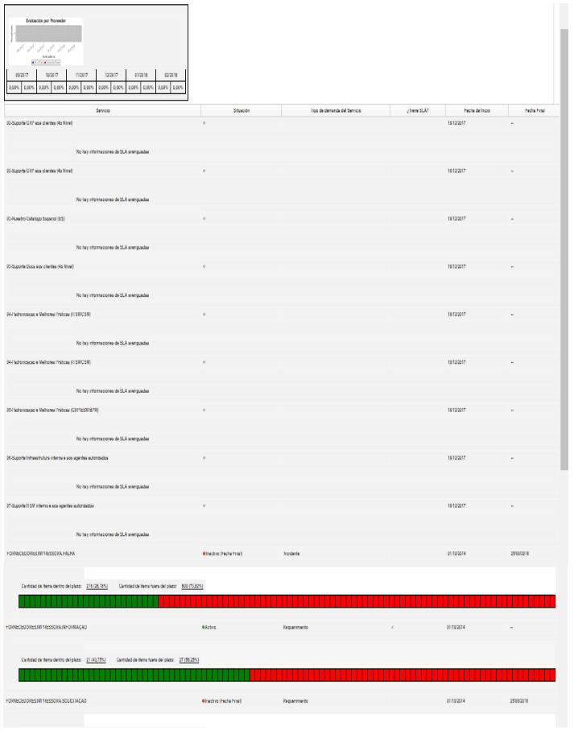

title: Evaluación del proveedor
Description: Esta función tiene como objetivo verificar el rendimiento del proveedor por servicio.

# Evaluación del proveedor

Esta función tiene como objetivo verificar el rendimiento del proveedor por
servicio.

Cómo acceder
------------

1.  Acceda a la funcionalidad de evaluación de proveedores accediendo al menú
    principal **Procesos ITIL > Gestión de Nivel de Servicio > Evaluación por Proveedor**.

Condiciones previas
-------------------

1.  Tener el proveedor registrado (ver conocimiento [Registro y consulta del
    proveedor][1]);

2.  Tener un servicio registrado ( ver conocimiento [Registro de la actividad de
    servicio][2]).

Filtros
-------

1.  El siguiente filtro permite al usuario restringir la participación de
    elementos en el listado default de la funcionalidad, facilitando la
    localización de los elementos deseados:

    -   Consultar Proveedor.

2.  Se mostrará la pantalla de **Evaluación del Proveedor**, como se muestra en
    la siguiente figura:

**Figura 1 - Pantalla de evaluación de rendimiento del proveedor por servicio**

Listado de ítems
----------------

1.  El(Los) siguiente (s) campo (s) de registro está (n) disponible (s) para
    facilitar al usuario la identificación de los elementos deseados en el
    listado default de la funcionalidad: **Servicio, Situación, Tipo de demanda
    del Servicio, ¿Tiene SLA?, Fecha de Inicio** y **Fecha Fin**.

2.  Se generará el informe de rendimiento del proveedor por servicio, como se
    muestra en la figura siguiente:

**Figura 2 - Informe de evaluación del proveedor**

Completar los campos de registro
--------------------------------

1.  No se aplica.

[1]:/es-es/citsmart-platform-7/processes/portfolio-and-catalog/provider.html
[2]:/es-es/citsmart-platform-7/processes/portfolio-and-catalog/activity.html

!!! tip "About"

    <b>Product/Version:</b> CITSmart | 8.00 &nbsp;&nbsp;
    <b>Updated:</b>09/20/2019 – Anna Martins
