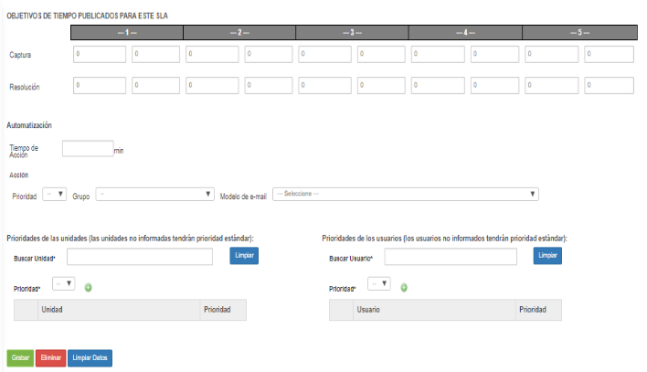
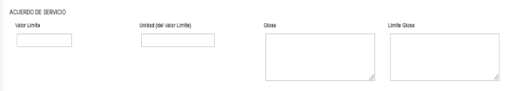

title: Registro y consulta de acuerdo de nivel de servicio general
Description: Esta funcionalidad permite registrar el acuerdo de nivel de servicio del tipo disponibilidad, tiempo (por fases) e información diversa capturada de otras fuentes.

# Registro y consulta de acuerdo de nivel de servicio general

Esta funcionalidad permite registrar el acuerdo de nivel de servicio del tipo
disponibilidad, tiempo (por fases) e información diversa capturada de otras
fuentes.

Cómo acceder
------------

1.  Acceda a la funcionalidad de acuerdo de nivel de servicio general a través
    de la navegación en el menú principal **Procesos ITIL > Gestión de
    Nivel de Servicio > Acuerdo de Nível de Servicio**.

Condiciones previas
-------------------

1.  Tener la prioridad registrada (ver conocimiento [Registro y consulta de
    prioridad][1]);

2.  Tener el grupo registrado (ver conocimiento [Registro y consulta de grupo][2]);

3.  Se han definido las plantillas de correo electrónico (ver
    conocimiento [Registro y consulta de la configuración del modelo de
    e-mail][3]);

4.  Tener la unidad registrada (ver conocimiento [Registro y consulta de
    unidad][4]);

5.  El usuario registrado (ver conocimiento [Registro y consulta de usuario][5]);

6.  Tener el requisito de acuerdo de nivel de servicio registrado (ver
    conocimiento [Registro y consulta de requisitos de acuerdo de nivel de
    servicio][6]).

Filtros
-------

1.  Los siguientes filtros permiten al usuario restringir la participación de
    ítems en el listado default de la funcionalidad, facilitando la localización
    de los ítems deseados, como se muestra en la figura siguiente:

    -   Título;

    -   Situación;

    -   Tipo de Acuerdo.

2.  En la pantalla Acuerdo de nivel de servicio general, haga clic en la
    ficha **Acuerdo de nivel de servicio** de consulta (General). La pantalla de
    consulta aparecerá como se muestra en la figura siguiente:

    
    
    **Figura 1 - Pantalla de consulta de acuerdo de nivel de servicio general**

3.  Realización de consulta de acuerdo de nivel de servicio;

    -   **Título**: introduzca el título del contrato de nivel de servicio que desea
    buscar;

    -   **Situación**: seleccione el estado del contrato de nivel de servicio;

    -   Una vez que el filtro está configurado, haga clic en el botón *Consultar*.
    Una vez hecho esto, el registro del acuerdo de nivel de servicio se mostrará
    de acuerdo con los datos reportados.

    -   Si desea enumerar todos los registros del acuerdo de nivel de servicio,
    simplemente haga clic en el botón *Consultar* directamente.

4.  Para cambiar los datos de registro de acuerdo con el acuerdo de nivel de
    servicio, basta con modificar la información de los campos deseados y hacer
    clic en el botón *Grabar* para guardar el cambio en la grabación, donde la
    fecha, la hora y el usuario se guardarán automáticamente auditoría futura.

Listado de ítems
----------------

1.  El(Los) siguiente (s) campo (s) de registro está (n) disponible (s) para
    facilitar al usuario la identificación de los elementos deseados en el
    listado default de la funcionalidad: **Título, Situación, Fecha de inicio,
    Fecha** y **Evaluar En**.

**Figura 2 - Pantalla de Ítems**

Completar los campos de registro
--------------------------------

1.  Se mostrará la pantalla de **Registro de Acuerdo de Nivel de Servicio
    General**, tal como se muestra en la siguiente figura:

    
    
    **Figura 3 - Pantalla de registro de acuerdo de nivel de servicio general**

2.  Rellene los campos según las instrucciones a continuación:

    a)  **Título del Acuerdo**: informe del título del acuerdo de nivel de servicio;

    b)  **Tipo de acuerdo**: seleccione el tipo de acuerdo de nivel de servicio;

       -   **Disponibilidad**: este tipo de acuerdo indica la disponibilidad del
    servicio, es decir, si es accesible durante un período de tiempo acordado.
    Por ejemplo: tener el proveedor de servicio monitoreando el sitio de la
    empresa cliente a tiempo completo para asegurarse de que los usuarios puedan
    acceder al contenido del sitio a tiempo completo;

       -   **Tiempo (por fases)**: este tipo de acuerdo vincula el tiempo de respuesta
    a una fase, es decir, en lugar de calcular por tiempo, el SLA se calculará
    por una fase que corresponda a un período acordado para el período de
    captura y período de tiempo ejecución;

       -   **Información diversa capturada de otras fuentes**: este tipo de acuerdo
    estipula los límites de la OS (Orden de servicio) al servicio elegido.

    c)  **Estacionalidad**: informe la época en que los servicios y acuerdo de nivel
    de servicio se desarrollarán de acuerdo con el negocio;

    d)  **Impacto**: informe el impacto que causa la ausencia del funcionamiento del
    servicio dentro del ambiente organizacional. Ejemplo: la red local para
    funcionar, el impacto en la organización es muy alto, ya que nadie accede a
    los servicios ofrecidos por los servidores;

    e)  **Urgencia**: informe la urgencia del restablecimiento del servicio dentro
    del ambiente organizacional. Ejemplo: siguiendo el ejemplo citado arriba, la
    urgencia de restauración del enlace de la red local es alta ya que la
    empresa es dependiente de la comunicación con los servidores para el
    almacenamiento de su información operacional perjudicando toda la
    productividad de la empresa en esta parada;

    f)  **¿Permite el cambio de Impacto y Urgencia en el registro de la solicitud
    ?**: defina si se permitirá el cambio del impacto y la urgencia en el
    registro de la solicitud de servicio;

    g)  **Situación**: informe la situación del acuerdo de nivel de servicio: Activo
    (en uso habilitado) o Inactivo (deshabilitado);

    h)  **Descripción del Acuerdo**: describa los detalles sobre el acuerdo de nivel
    de servicio;

    i)  **Ámbito (Alcances, metas y procesos) del Acuerdo**: describa una visión
    macro sobre el acuerdo de nivel de servicio;

    j)  **Fecha de inicio**: informe la fecha de inicio del acuerdo de nivel de
    servicio;

    k)  **Fecha Final**: informe la fecha futura para cerrar el acuerdo de nivel de
    servicio. La misma podrá ser informada en el momento del cierre del acuerdo;

    l) **Evaluar En**: informe la fecha en que se evaluará el acuerdo de nivel de
    servicio;

    m) **Contactos**: describa la información de contacto sobre el acuerdo de nivel
    de servicio;

    n) Si el tipo de acuerdo informado es **Disponibilidad**, indique el índice de
        disponibilidad del servicio:

    
    
    **Figura 4 - Registro de índice de disponibilidad**

     -   Informe el porcentaje de disponibilidad del servicio, es decir, si define el
    90% significa que a partir del 10% de indisponibilidad sobre el servicio el
    contrato podrá sufrir algún tipo de penalidad acordada sobre él.

    o)  Si el tipo de acuerdo informado es Tiempo (por fase), defina los plazos de SLA (acuerdo de nivel de servicio),       teniendo en cuenta la prioridad. La prioridad va de 1 a 5, siendo que el 1 es la prioridad más alta y 5 es la más baja:

    
   
    **Figura 5 - Registro de tiempo (por fase)**

     -   **Captura**: defina el tiempo de captura de la solicitud de servicio, según la prioridad;

     -   **Resolución**: defina el tiempo de resolución del servicio, según la prioridad;

     -   **Tiempo de Acción**: informe el tiempo para la ejecución de la solicitud de servicio;

     -   **Prioridad**: informe la prioridad del servicio;

     -   **Grupo**: informe al grupo ejecutor del servicio;

     -   **Modelo de e-mail**: seleccione la plantilla de correo electrónico, que se enviará cuando la solicitud de             servicio no se cumpla con el plazo de SLA determinado.

    !!! info "IMPORTANTE"

        Después de los N minutos (informado en el tiempo de acción) y si no ha
        realizado ninguna acción en la solicitud del servicio vinculado a este SLA, el
        sistema asignará la prioridad y escalará el grupo para ejecutar la solicitud del
        servicio.

   -   Seleccione las unidades y asigne una prioridad para cada una;

       -   **Buscar unidad**: informe a la unidad que recibirá la prioridad;

           -   **Prioridad**: indique la prioridad del servicio para la unidad;

           -   Hecho esto, haga clic en el icono para agregar la información de
                prioridad de la unidad;

           -   Si desea remover alguna información de prioridad de la unidad
                que se ha agregado, simplemente haga clic en el icono  .

         -   Seleccione los usuarios y asigne una prioridad a cada uno;

               -   **Buscar usuario**: informe al usuario;

               -   **Prioridad**: indique la prioridad del servicio para el
                   usuario;

               -   Hecho esto, haga clic en el icono  para agregar la información de
                   prioridad del usuario;  
                   Si desea remover alguna información de prioridad del usuario que
                   se ha agregado, simplemente haga clic en el icono .

   p)  Si el tipo de acuerdo informado es Informaciones diversas capturadas de otras fuentes, informe los datos de acuerdo de servicio:

   
   
   **Figura 6 - Registro de información múltiple capturada de otras fuentes**

   -   **Valor límite**: introduzca el valor límite de glosa. Este valor puede ser
    un porcentaje de atención o cantidad de eventos. Ejemplo: el servicio debe
    alcanzar mensualmente un 99,7% de disponibilidad o puede ocurrir en el mes
    hasta 4 incidentes causados por la organización contratada. El excedente de
    este límite será penalizado con el valor especificado en el campo Límite de
    Glosa;

   -   **Unidad (del valor límite)**: informe a la unidad del valor límite de
    glosa. Ejemplo: porcentaje o cantidad de eventos;

   -   **Glosa**: informe los detalles de lo que fue acordado referente a la glosa.
    Ejemplo: La disponibilidad de uso para los servicios críticos debe ser de
    24x7;

   -   **Límite Glosa**: informe los porcentajes a ser pagados sobre el valor del
    contrato en el caso del incumplimiento del acuerdo. Ejemplo: 0,5% de glosa
    para cada décima de error en el servicio o 0,2% para cada fallo de
    notificación superior a la meta hasta 10 ocurrencias, 0,5% hasta 20
    ocurrencias, etc.

  3.  Después de informar los datos, haga clic en el botón *Grabar* para
    registrar, donde la fecha, hora y usuario se guardarán automáticamente para
    una futura auditoría.

Verificando el historial de auditoría del acuerdo de nivel de servicio
----------------------------------------------------------------------

1.  Después de buscar, seleccione el registro deseado. Una vez hecho esto, se
    dirigirá a la pantalla de registro mostrando el contenido del registro
    seleccionado:

   -   La relación entre el acuerdo de nivel de servicio y los contratos de
    clientes se proporciona en la ficha Contratos del Cliente;

   -   La relación entre el acuerdo de nivel de servicio y el acuerdo de nivel
    operativo se proporciona en la guía Acuerdo de Nivel Operativo;

   -   La ficha Contratos de terceros es la asociación entre el contrato de nivel
    de servicio con contratos de terceros;

   -   El historial de los cambios realizados en el registro del acuerdo de nivel
    de servicio se muestra en la ficha Historial, como se muestra en la figura
    siguiente:

**Figura 7 - Pantalla de historial de auditoría**

[1]:/es-es/citsmart-platform-7/processes/portfolio-and-catalog/priority-register.html
[2]:/es-es/citsmart-platform-7/initial-settings/access-settings/user/group.html
[3]:/es-es/citsmart-platform-7/plataform-administration/email-settings/configure-email-template.html
[4]:/es-es/citsmart-platform-7/plataform-administration/region-and-language/register-unit.html
[5]:/es-es/citsmart-platform-7/initial-settings/access-settings/user/user-register.html
[6]:/es-es/citsmart-platform-7/processes/service-level/sla-requiriment.html

!!! tip "About"

    <b>Product/Version:</b> CITSmart | 8.00 &nbsp;&nbsp;
    <b>Updated:</b>09/20/2019 – Anna Martins

