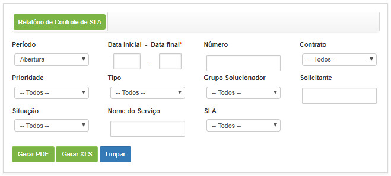
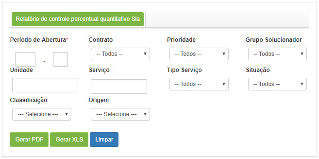

title:  Geração de relatórios - Gerência de Níveis de Serviço
Description: Esse relatório tem o objetivo de apresentar os prazos de atendimento das solicitações de serviços.. 
# Geração de relatórios - Gerência de Níveis de Serviço

Gerando relatório de controle de SLA
---------------------------------------

*Esse relatório tem o objetivo de apresentar os prazos de atendimento das solicitações de serviços*.

*Como acessar*

1. Acesse a funcionalidade de Relatório de Controle de SLA através da navegação no menu principal 
**Relatórios > Gerência de Níveis de Serviço > Controle SLA**.

*Filtros*

1. Os seguintes filtros possibilitam ao usuário restringir a participação de itens na listagem padrão da funcionalidade, 
facilitando a localização dos itens desejados:

    - **Período**: informe o período de abertura das solicitações de serviço que deseja verificar o SLA;
    - **Data inicial - Data final**: informe a data inicial e data final referente ao período selecionado;
    - **Número**: informe o número da solicitação de serviço que deseja verificar o SLA;
    - **Contrato**: informe o contrato que deseja verificar o SLA das suas respectivas solicitações de serviços;
    - **Prioridade**: informe a prioridade para verificar o SLA das solicitações de serviço referentes;
    - **Tipo**: informe o tipo da solicitação de serviço que deseja verificar o SLA;
    - **Grupo Solucionador**: informe o grupo executor da solicitação de serviço que deseja verificar o SLA;
    - **Solicitante**: informe o solicitante da solicitação de serviço que deseja verificar o SLA;
    - **Situação**: informe a situação da solicitação de serviço que deseja verificar o SLA;
    - **Nome do Serviço**: informe o nome do serviço que foi solicitado que deseja verificar o SLA;
    - **SLA**: informe o prazo de execução da solicitação de serviço.
    
2. Será apresentada a tela de **Relatório de Controle de SLA**, conforme ilustrada na figura a seguir:

    
    
    **Figura 1 - Tela de geração de relatório de controle de SLA**
    
3. Defina os filtros conforme sua necessidade.

Gerando relatório de controle de SLA atrasado
-----------------------------------------------

*Esse relatório tem o objetivo de apresentar a quantidade de solicitações de serviços, por prioridade, que estão com o SLA fora 
do prazo e dentro do prazo*.

*Como acessar*

1. Acesse a funcionalidade de Relatório de Controle de SLA Atrasado através da navegação no menu principal 
**Relatórios > Gerência de Níveis de Serviço > Relatório de Controle SLA Atrasado**.

*Filtros*

1. Os seguintes filtros possibilitam ao usuário restringir a participação de itens na listagem padrão da funcionalidade, 
facilitando a localização dos itens desejados:

    - **Período de Abertura**: informe o período que deseja verificar a quantidade de solicitações de serviços com SLA fora e 
    dentro do prazo;
    - **Contrato**: informe o contrato que deseja verificar a quantidade de solicitações de serviços com SLA fora e dentro do
    prazo;
    - **Prioridade**: informe a prioridade que deseja verificar a quantidade de solicitações relacionadas a mesma que estão com
    o SLA fora e dentro do prazo;
    - **Grupo solucionador**: informe o grupo executor para verificar a quantidade de solicitações de serviços do mesmo que com 
    SLA fora e dentro do prazo;
    - **Unidade**: informe a unidade para verificar a quantidade de solicitações relacionados a mesma que estão com SLA fora e
    dentro do prazo;
    - **Serviço**: informe o serviço para verificar a quantidade de solicitações relacionadas ao mesmo que estão com SLA fora e
    dentro do prazo;
    - **Tipo de serviço**: informe o tipo de serviço para verificar a quantidade de solicitações referentes ao tipo selecionado
    com SLA fora e dentro do prazo;
    - **Situação**: informe a situação de solicitação para verificar a quantidade de solicitações referentes que estão com SLA
    fora e dentro do prazo;
    - **Classificação**: informe a classificação da solicitação para verificar a quantidade de solicitações referentes que estão
    com SLA fora e dentro do prazo;
    - **Origem**: informe a origem da solicitação para verificar a quantidade de solicitações referentes que estão com SLA fora
    e dentro do prazo.
    
2. Será apresentada a tela de **Relatório de Controle de SLA Atrasado**, conforme ilustrada na figura a seguir:

    
    
    **Figura 2 - Tela de geração de relatório de controle de SLA atrasado**
    
3. Defina os filtros conforme sua necessidade.

!!! tip "About"

    <b>Product/Version:</b> CITSmart | 7.00 &nbsp;&nbsp;
    <b>Updated:</b>08/02/2019 - Larissa Lourenço
    
