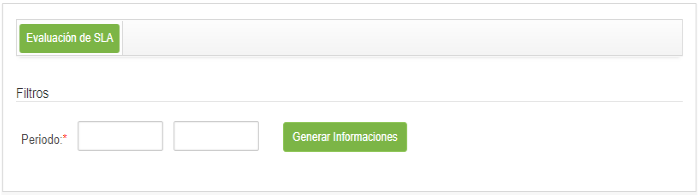

title: Avaliação de SLA
Description:Esta funcionalidade tem por objetivo gerar informações de acordo de nível de serviço, onde as mesmas auxiliarão na confecção de plano de qualidade.

# Avaliação de SLA

Esta funcionalidade tem por objetivo gerar informações de acordo de nível de
serviço, onde as mesmas auxiliarão na confecção de plano de qualidade.

Como acessar
------------

1.  Acesse a funcionalidade de Avaliação de SLA através da navegação no menu
    principal **Processos ITIL \> Gerência de Níveis de
    Serviço \> Avaliação de SLA**.

Pré-condições
-------------

1.  Não se aplica.

Filtros
-------

1.  O seguinte filtro possibilita ao usuário restringir a participação de itens
    na listagem padrão da funcionalidade, facilitando a localização dos itens
    desejados:

    -   Período.

1.  Será apresentada a tela de Geração de Informações de SLA, conforme ilustrada
    na figura a seguir:

    

    **Figura 1 - Tela de geração de informações de SLA**

1.  Informe o período desejado e clique no botão *Gerar Informações*;

2.  Será exibida as informações do SLA conforme o período informado.

Listagem de itens
-----------------

1.  Não se aplica.

Preenchimento dos campos cadastrais
-----------------------------------

1.  Não se aplica.

!!! tip "About"

    <b>Product/Version:</b> CITSmart | 8.00 &nbsp;&nbsp;
    <b>Updated:</b>07/12/2019 – Anna Martins
