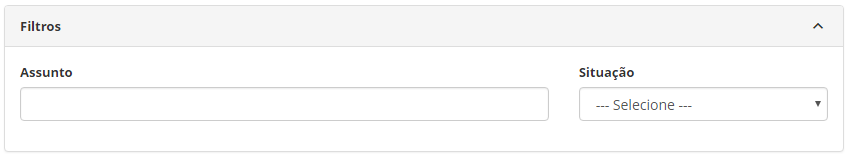
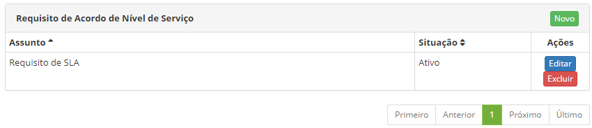
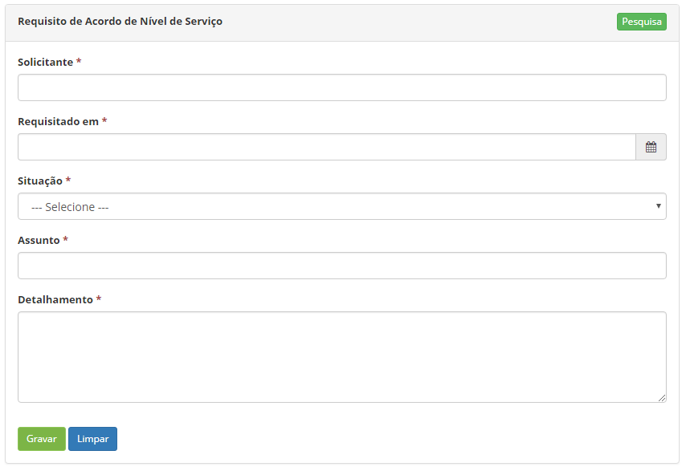

title: Cadastro e pesquisa de requisito de acordo de nível de serviço
Description:Esta funcionalidade tem por objetivo registrar os planos de melhoria que visa implementar melhorias ao serviço de TI.

# Cadastro e pesquisa de requisito de acordo de nível de serviço

Esta funcionalidade tem o objetivo de registrar os requisitos de acordo de nível
de serviço para serem utilizados em outras rotinas do sistema.

Como acessar
------------

1.  Acesse a funcionalidade de **Requisito de Acordo de Nível de
    Serviço** através da navegação no menu principal **Processos
    ITIL > Gerência de Nível de Serviço > Requisição de Nível de
    Serviço**.

Pré-condições
-------------

1.  Ter o colaborador cadastrado (ver conhecimento [Cadastro e Pesquisa de
    Colaborador][1]).

Filtros
-------

1.  Os seguintes filtros possibilitam ao usuário restringir a participação de
    itens na listagem padrão da funcionalidade, facilitando a localização dos
    itens desejados, conforme ilustrado na figura abaixo:

    -  Assunto;

    -  Situação.

    
    
    **Figura 1 - Tela de pesquisa de requisito de Acordo de Nível de Serviço**

2.  Para realizar a busca de um registro de requisito de acordo de nível de
    serviço, informe o assunto e/ou situação do mesmo. Após isso, será exibido o
    registro conforme o filtro informado.

Listagem de itens
-----------------

1.  Os seguintes campos cadastrais estão disponíveis ao usuário para facilitar a
    identificação dos itens desejados na listagem padrão da
    funcionalidade:  Assunto e Situação.

2.  Existem botões de ação disponíveis ao usuário em relação a cada item da
    listagem, são eles: *Editar* e *Excluir*.

    

    **Figura 2 - Tela de listagem de requisito de Acordo de Nível de Serviço**

3.  Para alterar os dados do registro de requisito de acordo de nível de
    serviço, clique no botão *Editar*. Feito isso, será direcionado para a tela
    de cadastro exibindo o conteúdo do registro;

4.  Caso queira criar um SLA a partir do requisito, basta clicar no botão *Criar
    SLA* a partir deste Requisito.

Preenchimento dos campos cadastrais
-----------------------------------

1.  Será apresentada a tela de **Requisito de Acordo de Nível de Serviço**;

2.  Clique no botão *Novo*. Feito isso, será apresentada a tela de **Cadastro de
    Requisito de Acordo de Nível de Serviço**, conforme ilustrada na figura a
    seguir:

    

    **Figura 3 - Tela de cadastro de requisito de Acordo de Nível de Serviço**

1.  Preencha os campos conforme orientações abaixo:

    -   **Solicitante**: informe o solicitante do requisito;

    -   **Requisitado em**: informe a data em que foi solicitado o requisito de
    acordo de nível de serviço;

    -   **Situação**: informe a situação do requisito de acordo de nível de serviço;

    -   **Assunto**: informe o assunto do requisito de acordo de nível de serviço;

    -   **Detalhamento**: informe os detalhes do requisito de acordo de nível de
    serviço.

1.  Após os dados informados, clique no botão *Gravar* para efetuar o registro,
    onde a data, hora e usuário serão gravados automaticamente para uma futura
    auditoria.

[1]:/pt-br/citsmart-platform-7/processes/tickets/ticket-management.html

!!! tip "About"

    <b>Product/Version:</b> CITSmart | 8.00 &nbsp;&nbsp;
    <b>Updated:</b>07/12/2019 – Anna Martins
