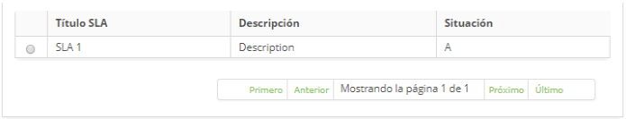

title: Registro y consulta del tiempo de atención
Description: La funcionalidad de tiempo de respuesta permite registrar el tiempo de respuesta del tipo *Global* el cliente.

# Registro y consulta del tiempo de atención

La funcionalidad de tiempo de respuesta permite registrar el tiempo de respuesta
del tipo *Global* (se aplica a todos los servicios), el cliente (se aplica a los
servicios de un contrato) e Incidente/Solicitud/Procedimiento (se aplica a un
servicio específico).

### Condiciones previas

1.  Tener definido el portafolio de servicios para aplicar el tiempo de atención
    a los servicios (ver conocimientos [Registro del portafolio de
    servicios][1], [Registro de servicios][2], [Configuración de los atributos
    de servicio][3]).

### Cómo acceder

1.  Acceda a la funcionalidad de Tiempo de respuesta a través de la navegación
    en el menú principal **Procesos ITIL > Gestión de Niveles de
    Servicio > Tiempo de Servicio**.

### Filtros

1.  El siguiente filtro permite al usuario restringir la participación de
    elementos en el listado default de la funcionalidad, facilitando la
    localización de los elementos deseados:

    -   **Título SLA**

2.  En la pantalla de **Tiempo de servicio**, haga clic en la
    pestaña **Búsqueda**, aparecerá la pantalla de **Consultar** como se muestra
    en la figura siguiente:

**Figura 1 - Pantalla de búsqueda de tiempo de respuesta**

### Listado de ítems

1.  El(Los) siguiente (s) campo (s) de registro está (n) disponible (s) para
    facilitar al usuario la identificación de los elementos deseados en el
    listado default de la funcionalidad:** Título SLA,
    Descripción **y** Situación.**

    
    
    **Figura 2 - Pantalla de lista de tiempo de respuesta**

2.  Realizar la búsqueda del tiempo de atención;

     -  La consulta se realiza por tipo de atención (Global, Cliente e
        Incidente/Solicitud/Procedimiento). Seleccione el tipo de respuesta que
        desee, introduzca el título del registro y haga clic en el
        botón *Consultar*. Hecho esto, se mostrará el registro según el título
        informado;

    -   Si desea listar todos los registros de tiempo de respuesta de un tipo de
        respuesta, simplemente haga clic directamente en el botón *Consultar*,
        donde se mostrarán todos los registros correspondientes al tipo de
        respuesta seleccionado.

3.  Seleccione el registro de tiempo de respuesta deseado. Será dirigido a la
    pantalla de registro mostrando el contenido referente al registro
    seleccionado.

4.  Para cambiar los datos del registro de tiempo de respuesta, basta con
    modificar la información de los campos deseados y hacer clic en el
    botón *Grabar* para que se grabe el cambio realizado en el registro, donde
    la fecha, hora y usuario serán grabados automáticamente para una futura
    auditoría.

### Completar los campos de registro

1.  Se mostrará la pantalla de registro de **Tiempo de Atención**, como se
    muestra en la figura siguiente:

    
    
    **Figura 3 -Pantalla de registro de tiempo de atención**

2.  Rellene los campos según la siguiente orientación:

    -   Seleccione el tipo de tiempo de atención que desea crear: Global, Cliente o Incidente/Solicitud/Procedimiento;

        -   **Título**: informe el título del tiempo de atención;

        -   **Situación**: seleccione la situación del tiempo de atención: Activo (en uso corriente) o Inactivo (deshabilitado);

        -   **Impacto**: informe el impacto que causa la ausencia del funcionamiento del servicio dentro del ambiente organizacional;

        -   **Urgencia**: informe la urgencia del restablecimiento del servicio dentro del ambiente organizacional;

        -   **Cambio del Impacto/Urgencia**: defina si se permitirá la alteración del impacto y urgencia en el registro de solicitud de servicio;

        -   **Estacional**: marque esta opción si el tiempo de respuesta es temporal. Al marcar esta opción, el relleno del campo "Fecha final" se vuelve obligatorio;

        -   **Fecha inicio**: informe la fecha de inicio del tiempo de atención de servicios;

        -   **Fecha final**: informe una fecha futura para desactivar el tiempo de atención o informe la fecha en el momento que se deshabilita;

        -   **Evaluada en**: informe la fecha en la cual el tiempo de atención de servicios será evaluado;

        -   **Descripción**: describa los detalles sobre el tiempo de atención de servicios;

        -   **Alcance**: describa una visión macro sobre el tiempo de atención de servicios;

        -   **Contactos**: describa las informaciones de contacto referentes al tiempo de atención;

    -   Seleccione la prioridad para la definición del tiempo:

        -   **Captura**: defina el tiempo de captura de la solicitud del servicio, según la prioridad seleccionada;

        -   **Resolución**: defina el tiempo de resolución del servicio, según la prioridad seleccionada.

    !!! warning "ATENCIÓN"

        Defina el tiempo de atención de los servicios, teniendo en cuenta la
        prioridad. La prioridad se utiliza para identificar los tiempos requeridos
        para que se tomen las medidas apropiadas. La prioridad va de 1 a 5, siendo
        que el 1 es la prioridad más alta y 5 es la más baja.

    !!! warning "ATENCIÓN"

        Antes de rellenar los campos de la pestaña "Automatización" debe estar
        adecuadamente parametrizada, para ello se hace necesario realizar los pasos
        contenidos en el conocimiento [¿Cómo habilitar la regla de escalabilidad de
        las solicitudes de servicio?][], con excepción del parámetro "190 - Activa
        el funcionamiento de las reglas de programación" (Ej: S o N - Default:'N')
        "que debe ser igual a 'N' en este contexto.

3.  Defina los datos de la automatización:

    -   **Grupo**: informe al grupo ejecutor del servicio.

    -   **Prioridad**: informe la prioridad de ejecución del servicio;

    -   **Modelo de E-mail**: seleccione la plantilla de correo electrónico que
        se enviará cuando la solicitud del servicio no se cumpla en el tiempo de
        respuesta determinado.

    -   **Tiempo de Acción**: informe el tiempo para la ejecución de la
        solicitud del servicio;

    !!! note "NOTA"

        Después de los N minutos (informado en el tiempo de acción) y si no ha
        realizado ninguna acción en la solicitud del servicio vinculado a este
        tiempo de atención, el sistema asignará la prioridad y escalará el grupo
        para ejecutar la solicitud del servicio.

    -   En el cuadro de Incidente/Solicitud/Procedimiento, seleccione los servicios para aplicar la configuración, teniendo en cuenta el tipo de tiempo de respuesta seleccionado:

        -   **Global**: permite seleccionar todos los contratos, como desee, para
            aplicar la configuración del tiempo de atención en los servicios de los
            mismos, como se muestra en la figura siguiente:

         
    
         **Figura 4 - Aplicación del tiempo de servicios de los contratos**

        -   **Cliente**: permite seleccionar sólo un contrato para dejar de aplicar la
            configuración del tiempo de servicio en del mismo, como se muestra en la
            figura siguiente:

         
         
         **Figura 5 - Aplicación del tiempo de servicio de un cliente (contrato)**

        -   **Incidente/Solicitud/Procedimiento**: permite seleccionar solamente un
            servicio para aplicar la configuración del tiempo de atención, como ejemplo
            ilustrado en la figura abajo:

        
        
        **Figura 6 - Aplicación del tiempo de atención al servicio de solicitud/incidente**

    4.  Si el tipo de tiempo de atención seleccionado es cliente o Incidente/Solicitud/Procedimiento, relacione las unidades y los colaboradores;

        
        
        **Figura 7 - Relaciones de Unidad y colaborador**

    -   Introduzca la unidad y asigne una prioridad;

        -   **Unidad**: informe la unidad deseada;

        -   **Prioridad**: indique la prioridad del servicio para la unidad;

        -   Haga clic en el botón *Incluir* para realizar la operación.

    -   Informe al colaborador y asigne una prioridad;

        -   **Empleado**: informe al colaborador;

        -   **Prioridad**: indique la prioridad del servicio para el colaborador;

        -   **Crítico**: indique si el colaborador es del tipo "crítico" al negocio, o sea, que debe tener la atención del servicio con prioridad alta.

        -   Haga clic en el botón *Incluir* para realizar la operación.

5.  Después del registro de los datos, haga clic en el botón *Grabar* para
    efectuar el registro, donde la fecha, hora y usuario serán grabados
    automáticamente para una futura auditoría.

[1]:/es-es/citsmart-platform-7/processes/portfolio-and-catalog/register.html
[2]:/es-es/citsmart-platform-7/processes/portfolio-and-catalog/services.html
[3]:/es-es/citsmart-platform-7/processes/portfolio-and-catalog/configure-service-attribute.html

!!! tip "About"

    <b>Product/Version:</b> CITSmart | 8.00 &nbsp;&nbsp;
    <b>Updated:</b>09/20/2019 – Anna Martins
