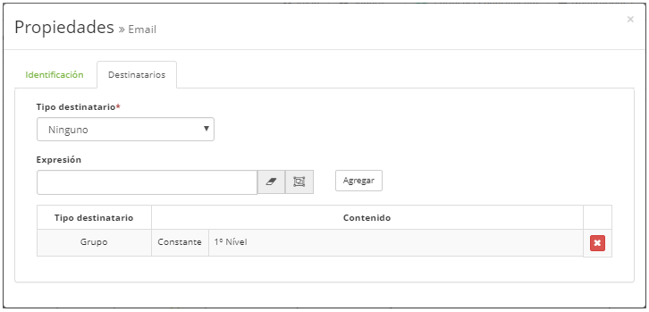
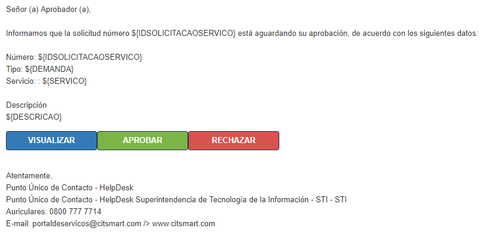
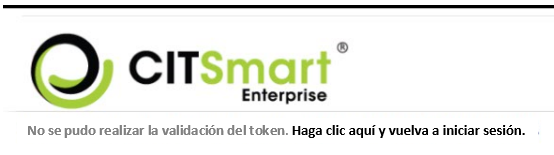

title: Aprobación de la solicitud vía e-mail

Description: Esta funcionalidad tiene por objeto aprobar o rechazar la solicitud de un ticket a través del e-mail, sin la necesidad de que el administrador esté registrado.

# Aprobación de la solicitud vía e-mail

Esta funcionalidad tiene por objeto aprobar o rechazar la solicitud de un ticket
a través del e-mail, sin la necesidad de que el administrador esté registrado.

Condiciones previas
-------------------

1.  Introduzca el contenido debajo del parámetros (ver conocimiento [Reglas de
    parametrización - sistema][1]):

    -   Parámetro 33: URL para acceder al sistema;

    -   Parámetro 370: deberá estar establecido en 'Sí';

2.  Tener al menos un usuario/grupo registrado (ver conocimiento [Registro y
    consulta de usuario][2]), [Registro y consulta de grupo][3]);

3.  Saber dibujar flujo de aprobación de solicitud vía e-mail registrada. En
    este flujo deberá existir la tarea "Aprobación" y el diseño para envío de
    e-mail (para más detalles, ver la sección "Pasos para configurar correo
    electrónico en el flujo");

4.  Registrar el modelo de e-mail con el modelo "Aguardando Aprobación" que se
    adjunta;

5.  El servidor de correo electrónico debe estar configurado correctamente (ver
    conocimiento [Reglas de parametrización - e-mail][4])

Cómo acceder
------------

1.  Acceda a la funcionalidad a través de la navegación en el menú
    principal **Sistema > Mantenimiento de Flujos**.

Pasos para configurar e-mail en el flujo
----------------------------------------

1.  Seleccione el flujo de aprobación de solicitud;

2.  En el flujo de aprobación de solicitud haga clic en el icono , para
    configurar;

3.  En la ficha Identificación, el nombre y el modelo de correo electrónico que
    se va a utilizar (Para registrar el modelo de correo electrónico, compruebe
    la siguiente sección);

    !!! warning "ATENCIÓN"

        No cambiar la plantilla de correo de creación (vinculada a el portafolio)
        para la plantilla de aprobación.

4.  Configurar, en la pestaña Destinatarios, los tipos destinatarios
    (grupo/usuario) del e-mail a ser enviado;

    !!! warning "ATENCIÓN"

        El sistema no busca destinatarios vía "Expresión".

     
    
    **Figura 1 - Pantalla de configuración de destinatario**

    !!! warning "ATENCIÓN"

        En caso de que el destinatario sea "grupo", es necesario vincular el envío
        del correo electrónico a los usuarios del grupo seleccionado (Acceso y
        Permiso > Grupo).

        En el grupo aprobador, el usuario coloca para recibir e-mail, "otros
        usuarios", debe ser observado que ese usuario talvez no podrá aprobar la
        solicitud, pues, la condición para eso es que el usuario esté en el grupo
        aprobador y no solamente siendo informado de que existe una aprobación.

Configuración del e-mail de notificación de aprobación
------------------------------------------------------

1.  Acceda a la funcionalidad a través del menú **Sistema > Ajustes >
    Plantilla de correo electrónico**;

2.  Se mostrará la pantalla de registro de modelo de correo electrónico;

3.  Registrar el correo electrónico de notificación de aprobación.

    !!! warning " ATENCIÓN "

        Este e-mail es hecho por HTML.

        El modelo de notificación de aprobación por correo electrónico que se
        utilizará está disponible en el anexo.

        Para más detalles sobre cómo transferir el modelo HTLM al registrar una
        nueva notificación, vea el conocimiento [Registro y consulta de la
        configuración del modelo de e-mail][1])

4.  Después de traspasar el modelo HTML al registro de la notificación,
    verifique las siguientes directrices:

    -   href = "{TOKEN (serviceRequestIncident, \$ {IDSOLICITACAOSERVICO}, VIEW,
    50)};

    -   serviceRequestIncident = Direccionamiento de la interfaz - aquel campo no
    puede ser cambiado por el usuario;

    -   \$ {IDSOLICITACAOSERVICO} = Clave para incrementar el número de la solicitud
    de servicio - aquel campo no puede ser alterado por el usuario;

    -   VIEW - llama al comando para abrir la solicitud - aquel campo no puede ser
    alterado por el usuario;

    -   MM (50) - Tiempo de expiración del token en Minutos - este campo puede ser
    cambiado por el usuario;

5.  Realizada las instrucciones anteriores, el modelo de e-mail estará listo,
    conforme la figura abajo:

     
    
    **Figura 2 - Ejemplo del e-mail**

6.  El usuario hace clic en *Visualizar*:

    -   Permite observar los detalles de la solicitud;

7.  Si el usuario hace clic en *Aprobar*:

    -   Permite la aprobación de la solicitud y un cuadro de diálogo confirmando que
    la aprobación es generada;

8.  Si el usuario hace clic en *Rechazar*;

    -   Permite el rechazo de la solicitud y se genera un cuadro de diálogo que
    confirma la desaprobación.

!!! warning "ATENCIÓN"

     Al enviar el e-mail, esa etiqueta será sustituida por un enlace directo a
     la solicitud, válido por 8 horas, por ejemplo. Después de 8 horas, quien
     hace clic en el enlace se redirige a una página de error del sistema (figura
     3).

 

**Figura 3 - Mensaje de error**

Adjunto
------

[Dowload - Aprobación][5]

[1]:/es-es/citsmart-platform-7/plataform-administration/parameters-list/parametrization-system.html
[2]:/es-es/citsmart-platform-7/initial-settings/access-settings/user/user-register.html
[3]:/es-es/citsmart-platform-7/initial-settings/access-settings/user/group.html
[4]:/es-es/citsmart-platform-7/plataform-administration/parameters-list/parametrization-email.html
[5]:/es-es/docs/citsmart-platform-7/processes/tickets/images/aguardandoaprovacao-email.docx

!!! tip "About"

    <b>Product/Version:</b> CITSmart | 8.00 &nbsp;&nbsp;
    <b>Updated:</b>09/18/2019 – Anna Martins
