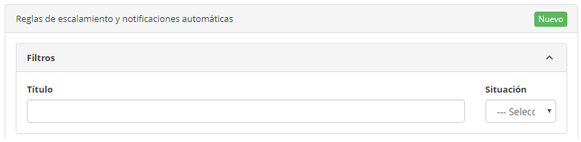
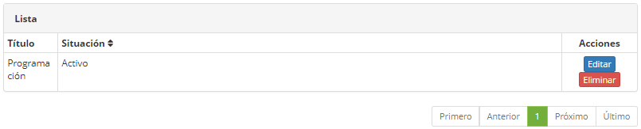
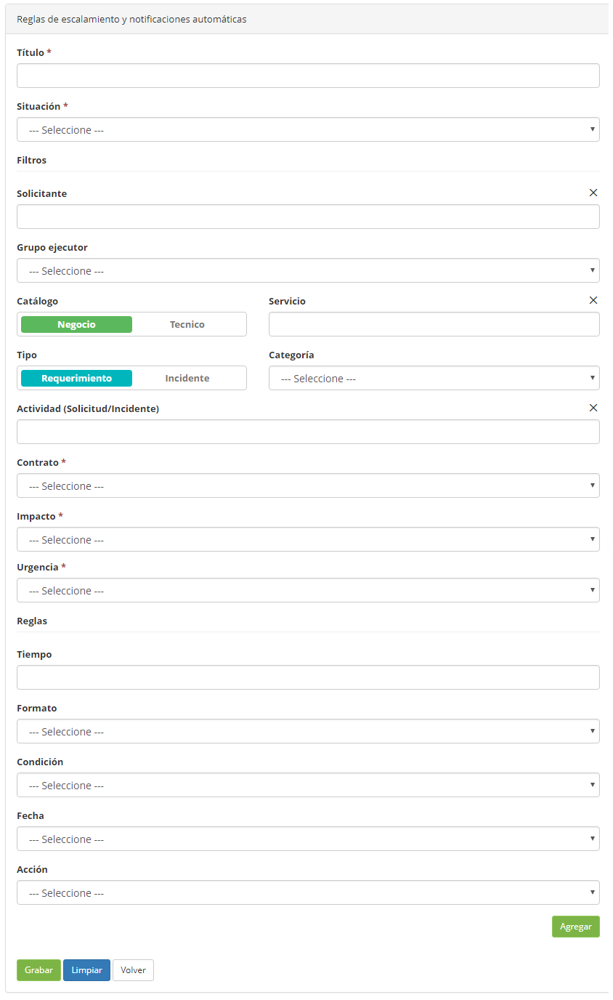

title: Registro e consulta de reglas de escalonamiento de un ticket
Description: Registro e consulta de reglas de escalonamiento de un ticket

# Registro e consulta de reglas de escalonamiento de un ticket

Cómo acceder
------------

1.  Acceda al menú principal **Procesos ITIL > Gestión de Ticket > Reglas de
    escalonamiento**.

Condiciones previas
-------------------

1.  En el archivo citsmart.cfg, ha configurado la
    propiedad **START_MONITORA_INCIDENTES** que indica el
    parámetro **TRUE** (ver conocimiento [Manual de instalación on-premise
    (ITSM)][1]);

2.  Introduzca el contenido debajo del parámetro (ver conocimiento [Reglas de
    parametrización - ticket][2]):

      -   Parámetro 190: con el valor S

3.  Tener el contrato registrado (ver conocimiento [Registro y consulta de
    contrato][3]);

4.  Tener el colaborador registrado (ver conocimiento [Registro y consulta de
    colaborador][4]);

5.  Tener el grupo registrado (ver conocimiento [Registro y consulta de grupo][5]);

6.  Tener el portafolio de servicios definida (ver conocimiento [Registro del
    portafolio de servicios][6]).

Filtros
-------

1.  Los siguientes filtros posibilitan al usuario restringir la participación de
    ítems en el listado default de la funcionalidad, facilitando la localización
    de los ítems deseados:

      -   Título;

      -   Situación.

   
   
   **Figura 1 - Pantalla de consulta de regla de escalonamiento**

2.  Realice la consulta del registro de reglas de escalonamiento, indicando el
    nombre de la regla, el filtro *Situación* puede ser usado para refinar aún
    más la consulta.

Listado de ítens
----------------

1.  El(Los) siguiente (s) campo (s) de registro está (n) disponible (s) para
    facilitar al usuario la identificación de los elementos deseados en el
    listado default de la funcionalidad: **Título** y **Situación**.

2.  Hay botones de acción disponibles para el usuario en relación con cada
    elemento de la lista, que son: *Editar* y *Eliminar*.

   
   
   **Figura 2 - Pantalla de lista de elementos**

3.  Después de la búsqueda, seleccione el registro deseado haciendo clic en el
    botón *Editar*. Hecho esto, será dirigido a pantalla de registro mostrando
    el contenido referente al registro seleccionado.

Completar los campos de registro
--------------------------------

1.  Al hacer clic en el botón *Nuevo*, se muestra la pantalla de registro de
    las** Reglas de escalonamiento y notificaciones automáticas**, como se
    muestra en la siguiente figura:

   
   
   **Figura 3 - Pantalla de registro de reglas de escalonamiento**

2.  Rellene los campos según la siguiente orientación:

      -   **Título:** introduzca el nombre en la nueva regla de escalonamiento;

      -   **Situación**: informe la situación de la regla (activo o inactivo);

      -   **Solicitante**: informe al solicitante de la regla;

      -   **Grupo ejecutor**: informe el nombre del grupo ejecutor;

      -   **Catálogo**: seleccione el tipo de catálogo (negocio o técnico);

      -   **Servicio**: informe el servicio del catálogo;

      -   **Tipo**: informe un tipo de servicio (solicitud o incidente);

      -   **Categoría**: seleccione un tipo de categoría;

      -   **Actividad (Solicitud/Incidente)**: introduzca el nombre del tipo de
    servicio (solicitud o incidente);

      -   **Contrato**: seleccione el contrato a ser vinculado;

      -   **Impacto**: informe el nivel de impacto (Bajo, Medio o Alto);

      -   **Urgencia**: informe el nivel de urgencia (Bajo, Medio o Alto);

   -   Reglas

       -   **Tiempo**: escribir la cantidad de tiempo referente a la regla;

       -   **Formato**: elegir se refiere a minutos (tiempo de la regla) o porcentual (referente al tiempo del SLA);

       -   **Condición**: informe la condición (antes o después);

       -   **Fecha**: seleccione la fecha de referencia (fecha de creación, fecha de la  última ocurrencia o fecha límite);

       -   **Acción**: informe el tipo de acción.

3.  Haga clic en *Agregar* y la nueva regla de escalonamiento se mostrará en una
    nueva lista para chequear, si la regla es correcta, haga clic en *Grabar*.

[1]:/es-es/citsmart-platform-7/get-started/installation.html
[2]:/es-es/citsmart-platform-7/plataform-administration/parameters-list/parametrizaion-ticket.html
[3]:/es-es/citsmart-platform-7/additional-features/contract-management/use/register-contract.html
[4]:/es-es/citsmart-platform-7/initial-settings/access-settings/user/employee.html
[5]:/es-es/citsmart-platform-7/initial-settings/access-settings/user/group.html
[6]:/es-es/citsmart-platform-7/processes/portfolio-and-catalog/register.html

!!! tip "About"

    <b>Product/Version:</b> CITSmart | 8.00 &nbsp;&nbsp;
    <b>Updated:</b>09/19/2019 – Anna Martins
