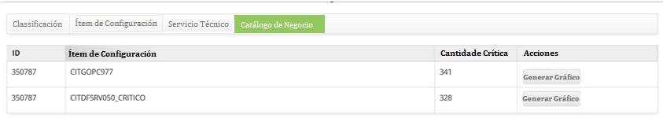

title: Análisis de tendencia de eventos
Description: Esta funcionalidad tiene como objetivo generar gráfico de Análisis de Tendencia de Eventos por Servicio de Negocio en determinado período, a fin de realizar un análisis de los eventos.

# Análisis de tendencia de eventos

Esta funcionalidad tiene como objetivo generar gráfico de Análisis de Tendencia
de Eventos por Servicio de Negocio en determinado período, a fin de realizar un
análisis de los eventos. El análisis de tendencias consiste en la utilización de
datos para la proyección de resultados futuros.

!!! warning "ATENCIÓN"

    Esta funcionalidad sólo se puede utilizar en instancias en las que el
    cliente también ha implementado el módulo de Eventos.

Cómo acceder
------------

1.  Acceda a la funcionalidad de análisis de tendencias de eventos a través de
    la navegación en el menú principal **Procesos ITIL > Gestión de
    Requerimiento e Incidente > Análisis de Tendencias**.

2.  Después de acceder a la funcionalidad, aparecerá la pantalla Análisis de
    Tendencias, haga clic en la pestaña *Eventos*, que permitirá el análisis de
    tendencia de eventos.

Condiciones previas
-------------------

1.  Tener un contrato registrado y activo (ver conocimiento [Registro y consulta
    de contrato][]);

2.  Tener una solicitud de servicio registrada (ver conocimiento [Gestión de
    ticket (servicios)][]) y estar vinculada al contrato;

3.  Configurar la conexión de CITSmart Event Monitor (ver conocimiento [Conexión
    CITSmart Event Monitor][]);

4.  Configurar e instalar la herramienta de supervisión (ver
    conocimiento [Manual de instalación del componente CITSmart Inventory][]).

Filtros
-------

1.  Los siguientes filtros permiten al usuario restringir la participación de
    ítems en el listado default de la funcionalidad, facilitando la localización
    de los ítems deseados, como se muestra en la figura siguiente:

   
   
   **Figura 1 - Pantalla de análisis de tendencia de eventos**

2.  Llene los campos de acuerdo con las siguientes directrices:

    -   **EVM - CITSmart Event Mnoitor Conexión: **Conexión del Citsmart Event
    Monitor: informe la conexión del Citsmart Event Monitor;

    -   **Eventos Globais: **seleccione la opción deseada;

    -   **Clasificación: **informe la clasificación del evento que desea analizar;

    -   **Herramienta de Monitoración - Conexión: **informe a la herramienta de
    monitoreo;

    -   **Ítem de Configuración Padre:** informe el ítem de configuración padre;

    -   **Ítem de Configuración Gestionado: **introduzca el ítem de configuración
    administrado;

    -   **Grupo de categoría de ocurrencia: **seleccione el grupo de categorías de
    eventos.

    -   **Categoría de ocurrencia: **seleccione la categoría de ocurrencia de
    eventos;

    -   **Cantidad Crítica: **informe la cantidad crítica;

    -   **Período de ocurrencia:** informe el período deseado, con la fecha de
        inicio y fecha final de ocurrencia de evento.

Listado de ítems
----------------

1.  El(Los) siguiente (s) campo (s) de registro está (n) disponible (s) para
    facilitar al usuario la identificación de los ítems deseados en el listado
    default de la funcionalidad. Hay un botón de acción disponible para el
    usuario en relación con cada elemento de la lista, es: *Generar gráfico.*

2.  Después de completar los filtros, haga clic en el botón *Consultar*. Hecho
    esto, el sistema filtrar y totalizar los eventos que atiendan a los filtros
    seleccionados y generará cuatro guías de resultados, siendo:

    -   **Clasificación: **en esta guía se presentan las ocurrencias de eventos por
    clasificación

    -   **Ítem de Configuración: **en esta guía se muestran las ocurrencias de
    eventos por ítem de configuración.

    -   **Servicio Técnico: **en esta guía se presentan las ocurrencias de eventos
    por servicio técnico.

    -   **Catálogo de Negocios: **en esta guía se presentan las ocurrencias de
    eventos por servicios de negocios.

    -   Pantalla Classificación:

        -   **Classificación** y **Cantidade Crítica**.

    
    
    **Figura 2 - Pantalla de lista de eventos - pantalla Clasificación**

    -   Pantalla Ítem de Configuración:

        -   **ID, Ítem de Configuración** y **Cantidad Crítica**.

    
    
    **Figura 3 - Pantalla de lista de eventos - pantalla Ítem de Configuración**

    -   Pantalla Servicio Técnico:

        -   **ID, Ítem de Configuración** y **Cantidad Crítica**.

    
    
    **Figura 4 - Pantalla de lista de eventos - pantalla Servicio Técnico**

    -   Pantalla Catálogo de Negócio:

        -   **ID, Ítem de Configuración** y **Cantidad Crítica**.

    
    
    **Figura 5 - Pantalla de lista de eventos - pantalla Catálogo de Negocio**

3.  En cada guía de resultados contendrá un botón para la generación del gráfico
    de análisis de tendencias, el cual presenta las fechas que comprenden el
    período informado en los filtros y el número cuantitativo de ocurrencias de
    eventos en aquella determinada fecha. Por lo tanto, si desea generar el
    gráfico para el análisis de tendencia de los eventos por clasificación, IC,
    servicio técnico y/o servicio de negocio, basta con hacer clic en el
    botón *Generar gráfico*.

[1]:/es-es/citsmart-platform-7/additional-features/contract-management/use/register-contract.html
[2]:/es-es/citsmart-platform-7/processes/tickets/ticket-management.html
[3]:/es-es/citsmart-platform-7/additional-features/add-ons/event-monitor-connection.html
[4]:/es-es/citsmart-platform-7/additional-features/add-ons/inventory-installation.html

!!! tip "About"

    <b>Product/Version:</b> CITSmart | 8.00 &nbsp;&nbsp;
    <b>Updated:</b>07/10/2019 – Anna Martins
