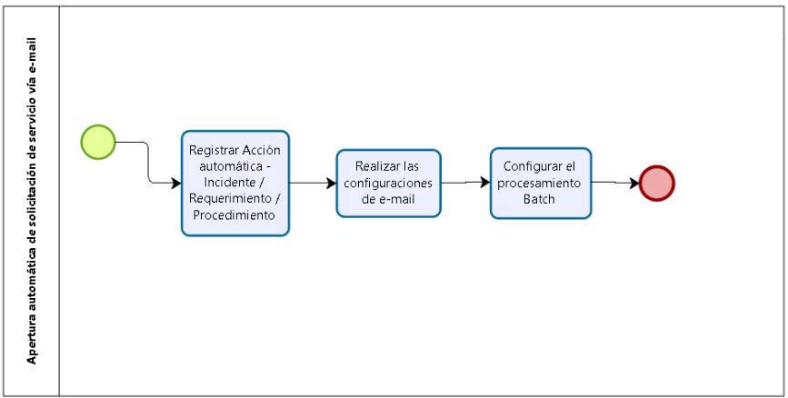

title: Pasos para la apertura automática de la solicitud de servicio por correo
letrónico
Description: Este conocimiento tiene por objetivo orientar en cuanto a la apertura automática de solicitud de servicio vía e-mail, agilizando el proceso de apertura de solicitudes de servicio recibida por el usuario.

# Pasos para la apertura automática de la solicitud de servicio por correo eletrónico

Este conocimiento tiene por objetivo orientar en cuanto a la apertura automática
de solicitud de servicio vía e-mail, agilizando el proceso de apertura de
solicitudes de servicio recibida por el usuario.

**Figura 1 - Diagrama de POP para la apertura automática de la solicitud de
servicio por correo electrónico**

Condiciones previas
-------------------

1.  El servicio deberá poseer un SLA del Tipo Tiempo asignado a él.

Detalles de las actividades
---------------------------

### Registro de template de acción automática - Incident/socilitud/procedimiento

1.  Registro de plantillas de Acción automática -
    Incidente/Solicitud/Procedimiento (ver conocimiento [Registro y consulta de
    acciónes automáticas][1]), pues será utilizado como plantilla para la apertura
    de la solicitud de servicio.

### Realizar la configuraciones de e-mail

1.  Realizar las configuraciones de correo electrónico (ver conocimiento [Manual
    de configuración de acción automática vía e-mail][2]), Este registro se
    utilizará para vincular el template registrado.

### Realizar las configuraciones del procesamiento batch**

1.  Realizar las configuraciones del proceso batch (ver conocimiento [Registro y
    consulta de procesamiento batch][3]);

2.  Este registro informa a cada cuánto tiempo el sistema lee la lectura de los
    e-mails.

!!! note "NOTA"

    Es necesario colocar en el campo Contenido la siguiente información
    'br.com.centralit.citcorpore.quartz.job.JobConfiguraciónAberturaAutomaticaViaEmail'
    (sin comillas). Este es el comando que ejecuta el Job deseado para la acción
    de apertura automática vía e-mail.

Informaciones adicionales
-------------------------

1.  Después de realizar la configuración, el sistema disparará el trabajo en el
    horario deseado;

2.  Los e-mails que se encuentren en la caja sin marcación de lectura, serán
    leídos y de ellos serán abiertos Solicitudes de Servicios;

3.  El sistema marca automáticamente el e-mail como leído para que no haya
    duplicación de registro (Ver conocimiento [Reglas sobre la apertura
    automática de la solicitud de servicio vía e-mail][4]);

4.  Si el sistema identifica que el colaborador es usuario del sistema, a través
    del correo electrónico del remitente y el usuario está en un grupo vinculado
    al mismo contrato que la plantilla fue creado (Acciones Automáticas -
    Incidentes/Solicitudes/Procedimientos), entonces la solicitud de servicio
    será creada con el solicitante del e-mail;

5.  Si el sistema no identifica al solicitante, entonces el sistema asignará la
    solicitud de servicio, al usuario informado en el registro de Acción
    Automática Incidente/Solicitud/Procedimiento.

[1]:/es-es/citsmart-platform-7/plataform-administration/configuring-automatic-actions/automatic-actions.html
[2]:/es-es/citsmart-platform-7/plataform-administration/configuring-automatic-actions/automatic-action-email.html
[3]:/es-es/citsmart-platform-7/plataform-administration/configuring-automatic-actions/batch-processing.html
[4]:/es-es/citsmart-platform-7/processes/tickets/rules-open-ticket.html

!!! tip "About"

    <b>Product/Version:</b> CITSmart | 8.00 &nbsp;&nbsp;
    <b>Updated:</b>09/19/2019 – Anna Martins
