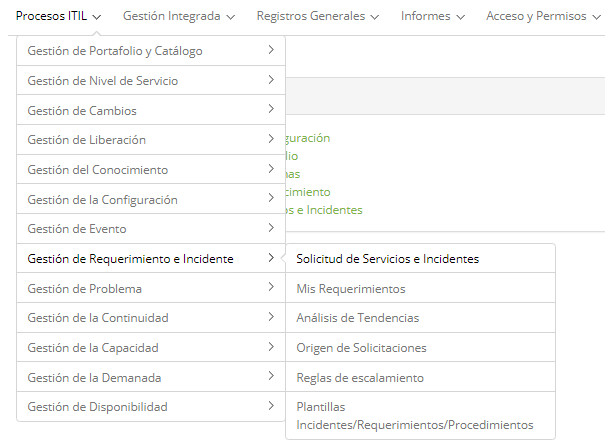

title:  Módulo Solicitudes de Servicio e Incidentes
Description: Cumplimiento de Solicitudes de Servicio es responsable de administrar el ciclo de vida de todas las solicitudes de servicios. 
# Módulo Solicitudes de Servicio e Incidentes

Objetivos del módulo
---------------------

Cumplimiento de solicitudes de servicio
---------------------------

Según ITIL, el proceso de Cumplimiento de Solicitudes de Servicio es responsable de administrar el ciclo de vida de todas las solicitudes de servicios efectuadas por los usuarios y busca mantener la satisfacción de los mismos por medio del tratamiento eficiente y profesional de todas las solicitudes de servicio, así como proporciona un canal para que los usuarios soliciten y reciban servicios estandarizados, con los controles de acceso y calidad definidos. Este proceso también provee información para usuarios y clientes sobre la disponibilidad de servicios y procedimientos para obtenerlos, además de ayudar con informaciones generales, quejas o comentarios.

Las actividades de este proceso varían de acuerdo con lo que se está solicitando. Las solicitudes de servicio se tratan mediante un proceso específico.

Gestión de incidentes
-----------------------------

La Gestión de Incidentes es el proceso responsable de gestionar todo el ciclo de vida de los incidentes. Los incidentes pueden ser informados por el equipo técnico, por herramientas de detección de eventos - sistemas de monitoreo y alarmismo - por los usuarios y por proveedores.

La Gestión de Incidentes tiene como objetivo restaurar la operación normal del servicio de manera rápida y garantizar de esta forma los mejores niveles de calidad y disponibilidad del servicio.

Donde están sus funcionalidades
---------------------------------

Acceder el menú principal de **Procesos ITIL > Gestión de Solicitudes e Incidentes**.

**Figura 1 - Menú del Módulo de Gestión de Solicitudes e Incidentes**

Principal funcionalidad (en destaque)
---------------------------------------

En la sección Véase también es posible acceder a la (s) funcionalidad (es) principal (es) de este módulo, para obtener un conocimiento más detallado.

!!! info "IMPORTANTE"

    De la versión 7.1.0.8 en adelante, el CITSmart Enterprise ITSM ya no presenta en esta funcionalidad el icono "Gráficos", pues se trata de una opción poderosa que merece mucha atención en el consumo de recursos computacionales, se decidió por su transferencia a dentro de la opción Smart Decision para que allí el Administrador pueda configurar de manera prudente el permiso de acceso a cada tipo de gráfico gerencial, conforme el usuario conectado.
    
!!! abstract "SEPA MAS"

    Dependiendo de su permiso de acceso, es posible realizar una serie de acciones en las solicitudes (solicitudes de servicio e incidentes) existentes, siendo: visualizar la descripción de la solicitud de servicio, reclasificar la información de la solicitud, delegar la solicitud a otra persona o grupo, suspender la solicitud, volver a habilitar la solicitud que fue suspendida para la atención, cambiar el SLA (tiempo de atención) de la solicitud, crear sub-solicitudes, mostrar sub-solicitudes, crear solicitud relacionada, programar actividad referente a la solicitud para ser ejecutada (atendida) en la solicitud una fecha programada; Imprimir solicitud, cancelar la solicitud, ejecutar la atención de la solicitud y entre otras.
    
Véase también
-------------

- [Gestión de ticket (servicios)](/es-es/citsmart-platform-7/processes/tickets/ticket-management.html).

!!! tip "About"

    <b>Product/Version:</b> CITSmart | 7.00 &nbsp;&nbsp;
    <b>Updated:</b>07/29/2019 - Anna Martins
