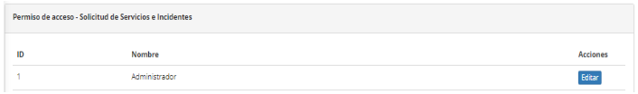
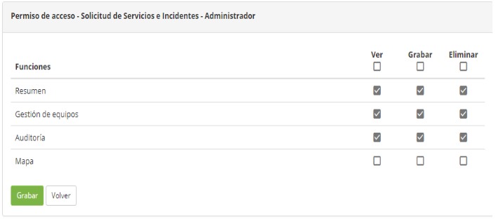

title: Permiso de acceso de gestión de tickets
Description: La funcionalidad de Permiso de acceso permite definir quién tendrá acceso a las funciones de la pantalla de Gestión de solicitudes e incidentes y qué tipo de acceso está permitido (lectura, escritura y/o exclusión).

# Permiso de acceso de gestión de tickets

La funcionalidad de Permiso de acceso permite definir quién tendrá acceso a las
funciones de la pantalla de Gestión de solicitudes e incidentes y qué tipo de
acceso está permitido (lectura, escritura y/o exclusión).

Cómo acceder
------------

1.  Acceda a la funcionalidad de permiso de acceso de administración de
    solicitudes e incidentes mediante la navegación en el menú
    principal **Acceso y Permisos > Gestión Solicitudes/Incidentes**.

Condiciones previas
-------------------

1.  Tener el perfil de Acceso registrado (ver conocimiento [Registro y consulta
    de perfil de acceso][1]).

Filtros
-------

1.  No se aplica.

Listado de ítems
----------------

1.  El(Los) siguiente (s) campo (s) de registro está (n) disponible (s) para
    facilitar al usuario la identificación de los elementos deseados en el
    listado default de la funcionalidad: **ID** y **Nombre**.

2.  Hay un botón de acción disponible para el usuario en relación con cada
    elemento del listado, es él: *Editar*.

3.  Se mostrará la pantalla para definir el permiso de acceso a las
    características de la pantalla de **Gestión de solicitudes e incidentes** en
    la que se muestran los perfiles de acceso ya registrados en el sistema. La
    figura siguiente ilustra esta pantalla:

   
   
   **Figura 1 - Pantalla de permiso de acceso - Gestión de solicitudes e incidentes**

4.  Haga clic en el botón *Editar* del perfil de acceso para el que definirá el
    tipo de acceso a las características de la pantalla de administración de
    solicitudes e incidentes. Hecho esto, se presentarán las funcionalidades de
    la Gestión de Solicitudes e Incidentes, como se muestra en la figura
    siguiente:

   
   
   **Figura 2 - Definición del tipo de acceso**

5.  Para cada funcionalidad de la Gestión de Solicitudes e Incidentes,
    seleccione las acciones (ver, grabar y/o borrar) que el perfil puede
    realizar;

6.  Después de definir el permiso de acceso, haga clic en el botón *Grabar* para
    registrarlo, donde la fecha, hora y usuario se guardarán automáticamente
    para una futura auditoría.

Completar los campos de registro
--------------------------------

1.  No se aplica

[1]:/es-es/citsmart-platform-7/initial-settings/access-settings/profile/user-profile.html

!!! tip "About"

    <b>Product/Version:</b> CITSmart | 8.00 &nbsp;&nbsp;
    <b>Updated:</b>09/20/2019 – Anna Martins
