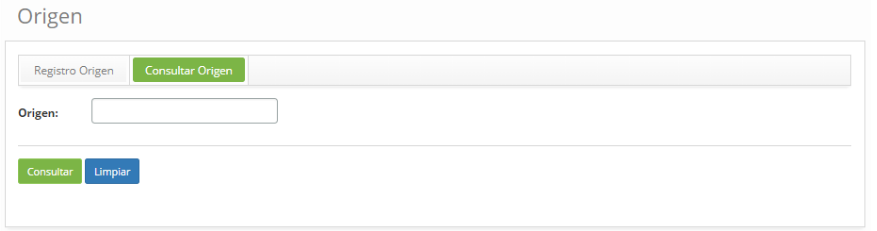
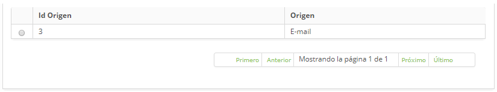
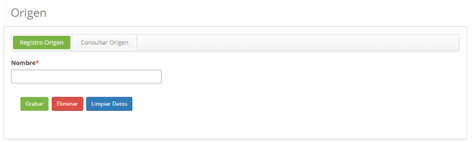

title: Registro y consulta del origen de los tickets
Description: Esta funcionalidad tiene el objetivo de registrar diversos tipos de equipos o áreas que pueden generar un ticket.

# Registro y consulta del origen de los tickets

Esta funcionalidad tiene el objetivo de registrar diversos tipos de equipos o
áreas que pueden generar un ticket.

Cómo acceder
------------

1.  Acceder a la funcionalidad de Origen de Tickets a través de la navegación
    del menú principal **Procesos ITIL** > **Gestión de Ticket** > **Origen de
    Tickets**.

Condiciones previas
-------------------

1.  No se aplica.

Filtros
-------

1.  El siguiente filtro permite al usuario restringir la participación de
    elementos en el listado default de la funcionalidad, facilitando la
    localización de los elementos deseados:

   -   Origen.

2.  En la pantalla de **Origen**, haga clic en la ficha **Consultar Origen**,
    aparecerá la pantalla de búsqueda como se muestra en la figura siguiente:

   
   
   **Figura 1 - Pantalla de consulta de origen**

3.  Realice la búsqueda de origen;

-   Introduzca el nombre del origen que desee buscar y haga clic en el
    botón *Consultar*. Después de eso, se mostrará el registro del origen según
    el nombre informado.

-   Si desea listar todos los registros de origen, simplemente haga clic
    directamente en el botón *Consultar*.

Listado de ítems
----------------

1.  El(Los) siguiente (s) campo (s) de registro está (n) disponible (s) para
    facilitar al usuario la identificación de los elementos deseados en el
    listado default de la funcionalidad: **ID Origen** y **Origen**, como se
    muestra a continuación:

   
   
   **Figura 2 - Pantalla de Ítems**

2.  Después de la búsqueda, seleccione el registro deseado. Hecho esto, será
    dirigido a la pestaña de registro mostrando el contenido referente al
    registro seleccionado.

3.  Para cambiar los datos del registro de origen, basta con modificar la
    información de los campos deseados y hacer clic en el botón *Grabar* para
    que se grabe el cambio realizado en el registro, donde la fecha, hora y
    usuario serán grabados automáticamente para una futura auditoría.

Completar los campos de registro
--------------------------------

1.  En la pantalla de **Origen**, haga clic en la ficha **Registro Origen**, se
    mostrará la pantalla de **Registro de Origen de Tickets**, como se muestra
    en la figura siguiente:

   
   
   **Figura 3 - Pantalla de registro de origen**

2.  Introduzca el nombre del origen de las solicitudes de servicio y haga clic
    en el botón *Grabar* para registrarlo, donde la fecha, hora y usuario se
    guardarán automáticamente para una futura auditoría.

!!! tip "About"

    <b>Product/Version:</b> CITSmart | 8.00 &nbsp;&nbsp;
    <b>Updated:</b>09/19/2019 – Anna Martins
