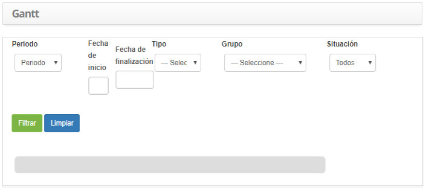
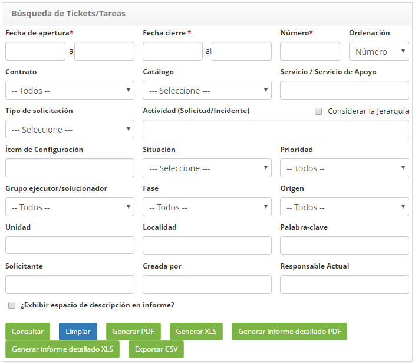
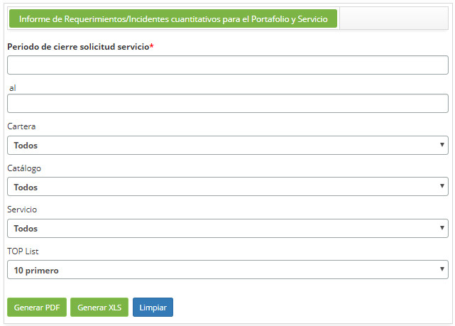

title: Generación de informes – Gestión de incidents y solicitudes de servicios
Description: Generación de informes – Gestión de incidents y solicitudes de servicios

# Generación de informes – Gestión de incidents y solicitudes de servicios

Generando informe de causas y soluciones
----------------------------------------

Este informes tiene como objetivo de mostrar las causas y soluciones de las
solicitudes de servicios.

### Cómo acceder

1.  Acceda a la funcionalidad de Control de Causas y Soluciones a través de la
    navegación en el menú principal **Informes > Gestión
    de Incidentes/Solicitudes > Control de Causas y Soluciones**.

### Filtros

1.  Los siguientes filtros posibilitan al usuario restringir la participación de
    ítems en el listado default de la funcionalidad, facilitando la localización
    de los ítems deseados:

    -   **Período de Cierre**: informe el período de cierre deseado;

    -   **Contrato**: informe el contrato deseado;

    -   **Tipo**: seleccione el tipo de servicio;

    -   **Situación**: seleccione la situación de las solicitudes de servicio;

    -   **Nombre Solicitud/Incidente**: introduzca el nombre del servicio. Elija un
    servicio específico o deje en blanco para todos los servicios;

    -   **Solicitud/Incidente**: se enumeran todos los servicios elegidos en el campo anterior, "Nombre de solicitud/incidente";

        -   Si desea retirar algún servicio, basta con seleccionarlo y hacer clic en
            el botón *Eliminar*. Pero si desea retirar todos los servicios,
            simplemente haga clic directamente en el botón *Eliminar todo*.

    -   **Seleccionar grupo**: se muestra una lista de grupos activos referentes al contrato seleccionado, donde permite seleccionar el (los) grupo(s) deseado(s);

        -   Seleccione el grupo deseado y haga clic en el botón *Añadir*, el mismo
            se agregará en el campo Grupo (s). Pero si desea agregar todos los
            grupos, simplemente haga clic directamente en el botón *Agregar todos*;

        -   Si desea retirar algún grupo, basta con seleccionarlo y hacer clic en el
            botón *Eliminar*. Pero si desea retirar todos los grupos, simplemente
            haga clic directamente en el botón *Eliminar todo*.

    -   **Seleccionar Causa**: se muestra una lista de causas, donde permite seleccionar la (s) causa (s) deseada (s);

        -   Para enumerar ítems sin causa, marque la opción "**Listar ítems sin
            causa**";

        -   Seleccione la causa deseada y haga clic en el botón *Añadir*, se
            agregará en el campo Causa. Pero si desea añadir todas las causas,
            simplemente haga clic directamente en el botón *Agregar todos*;

        -   Si desea retirar alguna causa, basta con seleccionarla y hacer clic en
            el botón *Eliminar*. Pero si desea retirar todas las causas, simplemente
            haga clic directamente en el botón *Eliminar todo*.

    -   **Seleccione Solución**: se muestra una lista de soluciones, donde permite seleccionar la (s) solución (ones) deseada (s);

        -   Para enumerar ítems sin solución, marque la opción "**Listar ítems sin
            causa**";

        -   Seleccione la solución deseada y haga clic en el botón *Añadir*, se
            agregará en el campo Solución. Pero si desea agregar todas las
            soluciones, simplemente haga clic directamente en el botón *Agregar
            todos*;

        -   Si desea retirar alguna solución, basta con seleccionarla y hacer clic
            en el botón *Eliminar*. Pero si desea retirar todas las soluciones,
            simplemente haga clic directamente en el botón *Eliminar todo*.

2.  Se mostrará la pantalla de Informe de **Control de Causas y Soluciones**,
    como se presenta en la siguiente figura:

    
    
    **Figura 1 - Pantalla de generación del Informe de control de causas y soluciones**

3.  Defina los filtros según su necesidad.

4.  Para generar informes gráficos, haga clic en el botón* Generar gráfico
    PDF* para generar el informe en formato PDF y/o en el botón *Generar gráfico
    XLS* para generar el informe en formato Excel;

5.  Para generar informes con información detallada, haga clic en el
    botón *Generar informe analítico PDF* para generar el informe detallado en
    formato PDF y/o en el botón *Generar informe analítico XLS* para generar el
    informe detallado en formato Excel.

Generando el informe de gantt
-----------------------------

Este informe tiene el objetivo de presentar los incidentes y solicitudes de
servicio en el gráfico de Gantt.

### Cómo acceder

1.  Acceder a la funcionalidad de Gantt a través da navegación en el menú
    principal **Informes > Gestión de Incidentes/Solicitudes > Gantt**.

### Filtros

1.  Los siguientes filtros posibilitan al usuario restringir la participación de
    ítems en el listado default de la funcionalidad, facilitando la localización
    de los ítems deseados:

    -   **Período**: informe el período que desea visualizar las solicitudes;

    -   **Fecha inicial**: informe la fecha inicial del período seleccionado;

    -   **Fecha final**: informe la fecha final correspondiente al período
    seleccionado;

    -   **Tipo**: seleccione el tipo de servicio;

    -   **Grupo**: informe al grupo para ver sus solicitudes específicas;

    -   **Situación**: informe la situación de la solicitud que desea ver.

2.  Se mostrará la pantalla de Informe de Gantt, como se presenta en la
    siguiente figura:

    
    
    **Figura 2 - Pantalla de generación de informes de Gantt**

3.  Defina los filtros según su necesidad;

4.  Haga clic en el botón *Filtrar* para generar el gráfico de Gantt, según el
    filtro elegido.

Generando informe de carga horaria trabajada
--------------------------------------------

Este informe tiene el objetivo de presentar el cálculo de la cantidad de horas
trabajadas por cada colaborador y/o por grupo.

### Cómo acceder

1.  Acceder a la funcionalidad de carga horaria trabajada a través de la
    navegación en el menú principal **Informes > Gestión de
    Incidentes/Solicitudes > Informes de Carga Horaria Trabajada**.

### Filtros

1.  Los siguientes filtros posibilitan al usuario restringir la participación de
    ítems en el listado default de la funcionalidad, facilitando la localización
    de los ítems deseados:

    -   **Tipo**: informe el período que desea visualizar;

    -   **Fecha de inicio**: introduzca la fecha de inicio del período seleccionado;

    -   **Fecha Fin**: informe la fecha de fin para el período seleccionado;

    -   **Contrato**: informe el contrato que desea verificar la carga horaria
    trabajada;

    -   **Grupo**: informe al grupo que desea verificar la carga horaria trabajada;

    -   **Tipo de usuario**: introduzca el tipo de informe, usuario o grupo. El
    informe del tipo usuario mostrará la carga horaria trabajada de cada
    colaborador e Informe del tipo grupo mostrará la carga horaria trabajada por
    el grupo.

2.  Se mostrará la pantalla de Informe de carga horaria trabajada, como se
    presenta en la siguiente figura:

    
    
    **Figura 3 - Pantalla de generación de informes de carga horaria trabajada**

3.  Defina los filtros según su necesidad.

!!! info "IMPORTANTE"

     Cuando una persona "captura" una solicitud o hace clic en "grabar y mantener
     tarea", el tiempo comienza a contabilizarse para esa persona, ya que se
     almacenan las informaciones de fecha, hora y usuario, parando sólo cuando la
     solicitud se detiene, completada o cuando otra persona captura esta
     solicitud.

Generando informe cuantitativo
------------------------------

Este informe tiene el objetivo de presentar la cantidad de solicitudes de
servicio de acuerdo con la situación informada.

### Cómo acceder

1.  Acceda a la funcionalidad de Informe Cuantitativo a través de la navegación
    en el menú principal **Informes > Gestión de Incidentes/Solicitudes > Cuantitativo**.

### Filtros

1.  Los siguientes filtros posibilitan al usuario restringir la participación de
    ítems en el listado default de la funcionalidad, facilitando la localización
    de los ítems deseados:

    -   **Tipo**: informe el período deseado;

    -   **Fecha de inicio**: introduzca la fecha de inicio del período seleccionado;

    -   **Fecha Fin**: informe la fecha de fin para el período seleccionado;

    -   **Contrato**: informe el contrato referente a la solicitud/incidente que
    desea generar el informe cuantitativo, si es necesario;

    -   **Situación**: informe la situación relativa a la solicitud/incidente que
    desea generar el informe cuantitativo, si es necesario;

    -   **Tipo de usuario**: introduzca el tipo de usuario para comprobar la
    cantidad de solicitudes/incidentes que han sido registrados por el mismo:

    -   **Usuario Vip**: usuario que ha definido la prioridad 1 en el acuerdo de
    nivel de servicio;

    -   **Usuario normal**: usuario que tiene la prioridad predeterminada
    establecida.

2.  Se mostrará la pantalla de **Informe Cuantitativo**, como se presenta en la
    siguiente figura:

    
    
    **Figura 4 - Pantalla de generación del informe cuantitativo de incidentes/solicitudes**

3.  Defina los filtros según su necesidad.

Generando informe cuantitativo completado por servicios (sintético)
-------------------------------------------------------------------

Este informe tiene por objeto presentar la cantidad de servicios concluidos.

### Cómo acceder

1.  Acceder a la funcionalidad de Informe Cuantitativo por Servicios Concluidos
    (Sintético) a través de la navegación en el menú principal **Informes
    > Gestión de Incidentes/Solicitudes > Cuantitativo Completado por
    Servicio (Sintético)**.

### Filtros

1.  Los siguientes filtros posibilitan al usuario restringir la participación de
    ítems en el listado default de la funcionalidad, facilitando la localización
    de los ítems deseados:

    -   **Período de cierre**: informe el período deseado;

    -   **Contrato**: informe el contrato referente al servicio que desea generar el
    informe cuantitativo;

    -   **TOP Lista**: introduzca la cantidad de registros que desea ver en el
    informe.

2.  Se mostrará la pantalla de **Informe Cuantitativo de Servicios Concluidos
    (Sintético)**, como se presenta en la figura siguiente:

    
    
    **Figura 5 - Pantalla de generación de informes cuantitativos de servicios finalizados**

3.  Defina los filtros según su necesidad.

Generando informe cuantitativo completado por servicios (analítico)
-------------------------------------------------------------------

### Cómo acceder

1.  Acceda a la funcionalidad de Informe Cuantitativo de Servicios concluidos
    (analítico) a través de la navegación en el menú
    principal **Informes > Gestión de
    Incidentes/Solicitudes > Cuantitativo Completado por Servicios
    (Analítico)**.

### Filtros

1.  Los siguientes filtros posibilitan al usuario restringir la participación de
    ítems en el listado default de la funcionalidad, facilitando la localización
    de los ítems deseados:

    -   **Período de cierre**: informe el período deseado;

    -   **Contrato**: seleccione el contrato;

    -   **Tipo**: seleccione el tipo de servicio;

    -   **TOP Lista**: introduzca la cantidad de registros que desea ver en el
    informe.

2.  Se mostrará la pantalla de Informe Cuantitativo de Servicios Concluidos
    (Analítico), como se presenta en la siguiente figura:

    
    
    **Figura 6 - Pantalla de generación de informe cuantitativo de servicio**

3.  Defina los filtros según su necesidad.

Generando informe de encuesta de satisfacción
---------------------------------------------

Este informe tiene el objetivo de presentar las informaciones sobre la encuesta
de satisfacción en relación al atendimiento de las solicitudes de servicios.

### Cómo acceder

1.  Acceda a la funcionalidad del informe de encuesta de satisfacción mediante
    la navegación en el menú principal **Informes > Gestión de
    Incidentes/Solicitudes > Encuesta de Satisfacción**.

### Condiciones previas

1.  Tener ticket/tarea abiertos y cerrados que posean la encuesta de
    satisfacción vinculada.

### Filtros

1.  Los siguientes filtros posibilitan al usuario restringir la participación de
    ítems en el listado default de la funcionalidad, facilitando la localización
    de los ítems deseados:

    -   **¿En base a qué fecha?**: seleccione el criterio de búsqueda del período de
    la solicitud, es decir, si el período es de apertura o de cierre;

    -   **Período**: introducir el período de la encuesta de satisfacción referente
    a la atención del servicio solicitado;

    -   **Evaluación**: informe el criterio de evaluación para verificar las
    solicitudes de servicios relacionadas al mismo;

    -   **TOP List**: informe la cantidad de registros que desea ver en el informe;

    -   **Número**: informe el número de la solicitud de servicio que desea
    verificar la evaluación de su atendimiento;

    -   **Contrato**: informe el contrato que desea verificar la evaluación de la
    atención de sus servicios solicitados;

    -   **Solicitante**: informe el nombre de la persona que hizo la solicitud de
    servicio para verificar la evaluación de su atención.

2.  Se mostrará la pantalla de **Informe de Encuesta de Satisfacción**, como se
    presenta en la siguiente figura:

    
    
    **Figura 7 - Pantalla de generación de informe de encuesta de satisfacción**

3.  Defina los filtros según su necesidad.

4.  Seleccione la forma de elaboración del informe. Para ello, haga clic
    en *Generar PDF*, *Generar XLS* o *Exportar CSV*.

Generando informe de solicitud de servicio
------------------------------------------

Este informe tiene el objetivo de presentar el historial de los registros de
solicitudes de servicios.

### Cómo acceder

1.  Acceder a la funcionalidad de búsqueda de solicitudes/incidentes mediante la
    navegación en el menú principal **Informes > Gestión
    Incidentes/Solicitudes > Consulta Solicitudes/Incidentes**.

### Filtros

1.  Los siguientes filtros posibilitan al usuario restringir la participación de
    ítems en el listado default de la funcionalidad, facilitando la localización
    de los ítems deseados:

    -   **Fecha de apertura**: informe el período que desea comprobar los registros
    de solicitud de servicio;

    -   **Fecha de cierre**: informe el período de cierre de la solicitud de
    servicio para verificar las solicitudes que se han cerrado en un período
    determinado;

    -   **Número**: informe el número de identificación de la solicitud de servicio
    si desea verificar una solicitud específica;

    -   **Ordenación**: informe el orden en que se presentarán las solicitudes;

    -   **Contrato**: informe el contrato para verificar las solicitudes de
    servicios relacionadas al contratro;

    -   **Catálogo**: introduzca el tipo de catálogo de servicios;

    -   **Servicio/Servicio de Apoyo**: informe al servicio si desea verificar las
    solicitudes referentes a ese servicio;

    -   **Tipo de solicitud**: informe el tipo de solicitud para la verificación de
    las solicitudes;

    -   **Actividad (Solicitud/Incidente)**: informe al servicio si desea verificar
    las solicitudes referentes a esa actividad;

    -   **Considerar Jerarquía**: marque este campo si quiere considerar la
    jerarquía del servicio;

    -   **Ítem de Configuración**: informe el ítem de configuración si desea
    verificar las solicitudes de servicios relacionadas al mismo;

    -   **Situación**: informe una situación si desea verificar las solicitudes de
    servicios referentes;

    -   **Prioridad**: informe la prioridad si desea verificar las solicitudes de
    servicios referentes;

    -   **Grupo Solucionador**: informe al grupo ejecutor si desea verificar las
    solicitudes de servicios que fueron dirigidas al mismo;

    -   **Fase**: informe la fase de la solicitud si desea verificar las solicitudes
    de servicios que se encuentren en la fase determinada;

    -   **Origen**: informe el origen de la solicitud si quería verificar las
    solicitudes de servicios relacionadas;

    -   **Unidad**: informe la unidad deseada para verificar las solicitudes de
    servicios relacionadas con la misma;

    -   **Localidad**: informe a la localidad para verificar las solicitudes de
    servicios relacionadas con la misma;

    -   **Palabra clave**: introduzca la palabra clave para comprobar las
    solicitudes de servicios relacionadas con la misma;

    -   **Solicitante**: informe al solicitante de servicios para verificar sus
    solicitudes;

    -   **Creado por**: informe al responsable que hizo el registro de solicitud
    para verificar las solicitudes de servicios que fueron registradas por el
    mismo;

    -   **Responsable actual**: informe responsable por la atención de la solicitud
    para verificar las solicitudes de servicios que fueron atendidas por el
    mismo;

    -   **Ver Campo Descripción en Informes**: marque este campo si desea que el
    contenido del campo "Descripción" de la solicitud de servicio aparezca en el
    informe.

2.  Se mostrará la pantalla de generación de informes de solicitudes de
    servicio, tal como se presenta en la siguiente figura:

    
    
    **Figura 8 - Pantalla de generación de informes de solicitudes de servicio**

3.  Defina los filtros según su necesidad.

4.  Después de los filtros definidos, haga clic en el botón *Buscar*. Hecho
    esto, se mostrarán las solicitudes;

   !!! info "IMPORTANTE"

      La cantidad de solicitudes enumeradas por página se refiere a la cantidad
      configurada en el parámetro "261 - Cantidad de Registros devueltos en la
      Búsqueda Avanzada"

5.  En las solicitudes presentadas en la lista, es posible realizar las
    siguientes acciones: consultar el historial de la solicitud/incidente, ver
    solicitud/incidente, ver anexos y reabrir solicitud de servicio/incidente;

6.  Si desea generar el informe con información resumida de la búsqueda que se
    realizó, haga clic en el botón *Generar XLS* para generar el informe en
    formato Excel;

7.  Si desea generar el informe con la información detallada de la búsqueda que
    se realizó, haga clic en el botón *Generar informe detallado PDF* para
    generar el informe detallado en formato PDF y/o en el botón *Generar informe
    detallado XLS* para generar el informe detallado en formato Excel.

Gerando informe de solicitud por ejecutante
-------------------------------------------

Este informe tiene el objetivo de presentar las solicitudes de servicio por
ejecutante.

### Cómo acceder

1.  Acceda a la funcionalidad de Solicitud por Ejecutante a través de la
    navegación en el menú principal **Informes > Gestión de
    Incidentes/Solicitudes > Solicitud por Ejecutante.**

### Filtros

1.  Los siguientes filtros posibilitan al usuario restringir la participación de
    ítems en el listado default de la funcionalidad, facilitando la localización
    de los ítems deseados:

    -   **Período de Cierre**: informe el período deseado;

    -   **Numero**: informe el número de solicitud;

    -   **Ejecutado por**: informe al responsable del servicio de la solicitud;

    -   **Contrato**: seleccione el contrato;

    -   **TOP List**: informar la cantidad de registros que desea ver en el informe.

2.  Se mostrará la pantalla de **Generación de Informe de Solicitudes por
    Ejecutante**, como se presenta en la siguiente figura:

    
    
    **Figura 9 - Pantalla de generación de informes de solicitud por ejecución**

3.  Defina los filtros según su necesidad.

Generando informe de aprobación de solicitud
--------------------------------------------

Este informe tiene el objetivo de presentar las solicitudes de servicios que
fueron aprobadas y las que no fueron aprobadas.

### Cómo acceder

1.  Acceda a la funcionalidad de búsqueda de aprobación de solicitudes mediante
    la navegación en el menú principal **Informes > Gestión de
    Incidentes/Solicitudes > Consulta de Aprobación Solicitudes**.

### Filtros

1.  Los siguientes filtros posibilitan al usuario restringir la participación de
    ítems en el listado default de la funcionalidad, facilitando la localización
    de los ítems deseados:

    -   **Tipo**: informe el período deseado;

    -   **Fecha de inicio**: introduzca la fecha de inicio del período seleccionado;

    -   **Fecha Fin**: informe la fecha de fin para el período seleccionado;

    -   **Contrato**: informe el contrato que desea verificar las aprobaciones de
    las solicitudes relacionadas al mismo;

    -   **Registros**: informe el tipo de registro (aprobados o no aprobados) de las
    solicitudes que desea verificar;

    -   **TOP Lista**: introduzca la cantidad de registros que desea ver en el
    informe.

2.  Se mostrará la pantalla de** Generación de Informe de Aprobación de
    Solicitudes**, como se presenta en la siguiente figura:

    
    
    **Figura 10 - Pantalla de generación de informes de aprobación de solicitudes**

3.  Defina los filtros según su necesidad.

Generando informe de ejecución de solicitud
-------------------------------------------

Este informe tiene el objetivo de presentar a los responsables de ejecutar las
solicitudes de servicios.

### Cómo acceder

1.  Acceda a la funcionalidad de Informe de ejecución de solicitudes mediante la
    navegación en el menú principal **Infomes > Gestión
    de Incidentes/Solicitudes > Informe Solicitación de Ejecución**.

### Filtros

1.  Los siguientes filtros posibilitan al usuario restringir la participación de
    ítems en el listado default de la funcionalidad, facilitando la localización
    de los ítems deseados:

    -   **Período de apertura**: informe el período de apertura que desea verificar
    las solicitudes de servicios;

    -   **Número**: introduzca el número de identificación de la solicitud que desea
    comprobar;

    -   **Ejecutado por**: busque y seleccione el responsable de atender solicitudes
    de servicios para verificación;

    -   **Contrato**: informe el contrato que desea verificar las solicitudes de
    servicios;

    -   **Grupo aprobador**: informe al grupo aprobador para verificar las
    solicitudes que fueron aprobadas por el grupo;

    -   **TOP Lista**: introduzca la cantidad de registros que desea ver en el
    informe.

2.  Se mostrará la pantalla de **Generación de Informes de Ejecución de
    Solicitudes**, tal como se presenta en la siguiente figura:

    
    
    **Figura 11 - Pantalla de generación de informes de ejecución de solicitudes**

3.  Defina los filtros según su necesidad.

Generando informe solicitudes reabiertas
----------------------------------------

Este informe tiene el objetivo de presentar todas las solicitudes que se han
reabierto en un período determinado.

### Cómo acceder

1.  Acceda a la funcionalidad de Informe de solicitudes Reabiertas mediante la
    navegación en el menú principal **Informe > Gestión de
    Incidentes/Solicitudes > Solicitud Reabierta**.

### Filtros

1.  Los siguientes filtros posibilitan al usuario restringir la participación de
    ítems en el listado default de la funcionalidad, facilitando la localización
    de los ítems deseados:

    -   **Fecha de reapertura**: informe el período en que la solicitud de servicio
    ha sido reabierta;

    -   **Fecha de Cierre**: informe el período que la solicitud de servicio ha
    finalizado;

    -   **Contrato**: informe el contrato referente a la solicitud de servicio;

    -   **Grupo**: informe al grupo responsable de ejecutar la solicitud de
    servicio;

    -   **Situación**: informe la situación de las solicitudes de servicio
    reabiertas que desea comprobar;

    -   **Tipo de servicio**: introduzca el tipo de servicio que desea comprobar;

    -   **TOP Lista**: introduzca la cantidad de registros que desea ver en el
    informe.

2.  Se mostrará la pantalla de **Generación de Informe de Solicitudes
    Reabiertas**, como se presenta en la figura siguiente:

    
    
    **Figura 12 - Pantalla de generación de informes solicitudes reabiertas**

3.  Defina los filtros según su necesidad.

Gerando informe top 10 solicitudes/incidentes
---------------------------------------------

Este informe tiene el objetivo de presentar el Top 10 de Solicitudes/Incidentes
de acuerdo con los filtros elegidos por el usuario.

### Cómo acceder

1.  Acceda a la funcionalidad de Informe Top 10 de Solicitudes/Incidentes a
    través de la navegación en el menú principal **Informes > Gestión de
    Incidentes/Solicitudes > Informe Top 10 Solicitudes/Incidentes**.

### Filtros

1.  Los siguientes filtros posibilitan al usuario restringir la participación de
    ítems en el listado default de la funcionalidad, facilitando la localización
    de los ítems deseados:

    -   **Informe**: seleccione el tipo de informe que desee:

        -   Informe Top 10 solicitantes que más abrieron llamados;

        -   Informe Top 10 grupos solucionadores que más resolvieron solicitudes/incidentes;

        -   Informe Top 10 diez solicitudes/incidentes ás solicitadas;

        -   Informe Top 10 unidades que más abrieron solicitudes/incidentes;

        -   Informe Top 10 localidades que más abrieron solicitudes/incidentes.

    -   **Top List**: seleccione la cantidad de datos que desea devolver en el
    informe;

    !!! info "IMPORTANTE"

        Cuando el usuario desea realizar un análisis de todas las solicitudes
        estableciendo el valor "Todos" para el filtro "Top List", puede haber
        diferencia entre el número de solicitudes del "Informe Top10 localidades que
        más abrieron solicitudes/incidentes" con el número que fue encontrado en los
        otros informes, debido a la no obligatoriedad de una solicitud de estar
        vinculada a una localidad.

    -   **Período**: informe la fecha de inicio y fecha de finalización;

     !!! info "IMPORTANTE"

        El campo "fecha de finalización" se utilizará para filtrar el período del
        "Informe Top 10 de grupos solucionadores que más resolvieron
        Solicitudes/Incidentes", por lo que podría ser diferente al número de
        solicitudes abiertas en el período.

    -   **Contrato**: seleccione el contrato;

    -   **Servicio**: informe al servicio ejecutado;

    -   **Solicitante**: seleccione el solicitante del servicio;

    -   **Unidad**: seleccione la unidad del contrato;

    -   **Situación**: seleccione la situación de la solicitud de servicio;

    -   **Tipo de servicio**: seleccione el tipo de servicio, que puede ser
    Incidente y/o Solicitud;

    -   **Origen del contacto**: seleccione el origen del contacto de la solicitud
    de servicio;

    -   **Prioridad**: seleccione la prioridad de ejecución;

     !!! note "NOTA"

        El sistema mostrará todas las unidades y servicios activos relacionados con
        el contrato seleccionado.

    -   Seleccione un tipo de visualización para el informe, que puede ser "Vista
    Previa", "Breve" y "Analítica".

2.  Se mostrará la pantalla de **Generación de Informe Top 10 de
    Solicitudes/Incidentes**, como se presenta en la siguiente figura:

    
    
    **Figura 13 - Pantalla de generación de informe Top 10 solicitudes/Incidentes**

3.  Defina los filtros según su necesidad.

Generando informe de la solicitud/incidente por servicio
--------------------------------------------------------

Este informe tiene el objetivo de presentar la cantidad de solicitud e incidente
que se solicitó referente al servicio del catálogo del portafolio.

### Cómo acceder

1.  Acceda a la funcionalidad de Informe de Solicitud/Incidente por servicio a
    través de la navegación en el menú principal **Informes > Gestión de
    Solicitudes/Incidentes > Informe Cuantitativo de Solicitudes/Incidentes
    para el Portafólio y Servicio**.

### Filtros

1.  Los siguientes filtros posibilitan al usuario restringir la participación de
    ítems en el listado default de la funcionalidad, facilitando la localización
    de los ítems deseados:

    -   **Período de cierre solicitud servicio**: informe el período de cierre de
    solicitud de servicio;

    -   **Portafolio**: seleccione el portafolio para verificar las solicitudes de
    los servicios del mismo;

    -   **Catálogo**: seleccione el tipo de catálogo. Si el tipo escogido es
    "Negocio", se presentará solamente los servicios de negocio y si el tipo
    elegido es "Técnico", serán presentados solamente los servicios de apoyo;

    -   **Servicio**: seleccione el servicio que desea comprobar. Si ha informado el
    catálogo, los servicios se presentarán de acuerdo con el tipo seleccionado;

    -   **TOP Lista**: seleccione la cantidad de datos que desea devolver en el
    informe.

2.  Se mostrará la pantalla de Generación de Informe de Solicitud/Incidente por
    Portafolio y Servicio, como se presenta en la figura siguiente:

    
    
    **Figura 14 - Pantalla de generación de informes de solicitudes
solicitudes/incidentes por servicio**

3.  Defina los filtros según su necesidad.

!!! tip "About"

    <b>Product/Version:</b> CITSmart | 7.00 &nbsp;&nbsp;
    <b>Updated:</b>09/20/2019 - Anna Martins
