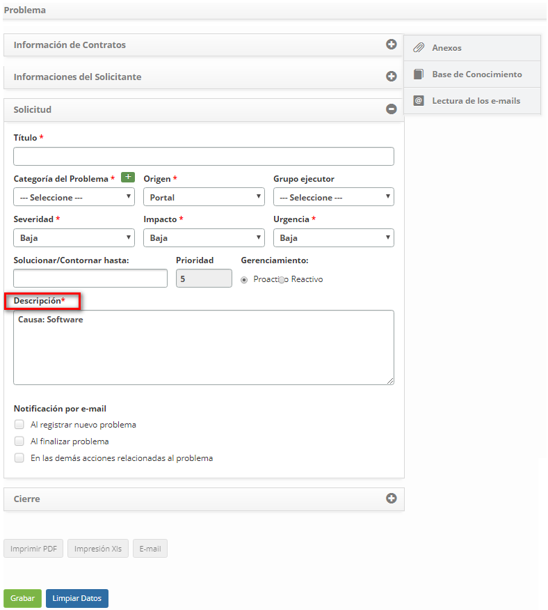

title: Análisis de tendencias de solicitudes de servicio

Description: Esta funcionalidad tiene como objetivo realizar un análisis de las solicitudes, basado en la cantidad crítica, para identificar qué ítems influencian en un lanzamiento de una nueva solicitud.

# Análisis de tendencias de solicitudes de servicio

Esta funcionalidad tiene como objetivo realizar un análisis de las solicitudes,
basado en la cantidad crítica, para identificar qué ítems influencian en un
lanzamiento de una nueva solicitud.

Cómo acceder
------------

1.  Acceder al menú principal **Procesos ITIL > Gestión de
    Ticket > Análisis de Tendencias**, pantalla Solicitudes de Servicio.

Condiciones previas
-------------------

1.  Tener un contrato registrado y activo (ver conocimiento [Registro y consulta
    de contrato][1]);

2.  Tener una solicitud de servicio registrada (ver conocimiento [Gestión de
    ticket (servicios)][2]) sección Registro de ticket) y estar vinculada al contrato (ver
    conocimiento [Configuración de los atributos de servicio][3]) sección Vinculando contratos al servicio)

Filtros
-------

1.  Los siguientes filtros posibilitan al usuario restringir la participación de
    ítems en el listado default de la funcionalidad, facilitando la localización
    de los ítems deseados:

    -   Período de apertura;

    -   Contrato;

    -   Tipo de solicitación;

    -   Nombre del servicio;

    -   Grupo Ejecutor;

    -   Solicitante;

    -   Urgencia;
    
    -   Impacto;

    -   Ítem de configuración;

    -   Causa;

    -   Cantidad Crític.

     
    
     **Figura 1 - Pantalla de análisis de tendencia de solicitudes de servicio**

2.  Llene los filtros según su necesidad:

    -   **Período de apertura**: informar el período del registro de solicitudes de
        servicio;

    -   **Contrato**: informar el contrato para verificar las solicitudes de
        servicio referentes al mismo;

    -   **Tipo de solicitación**: seleccionar el tipo de solicitud que desea
        comprobar;

    -   **Nombre del Servicio**: informar al servicio para verificar la cantidad
        de solicitudes referentes al mismo;

    -   **Grupo ejecutor**: seleccionar el grupo ejecutor para verificar las
        solicitudes de servicio que se han asignado al mismo;

    -   **Solicitante**: informar el nombre del usuario solicitante para
        verificar las solicitudes de servicio solicitadas por el mismo;

    -   **Urgencia**: seleccionar el grado de urgencia para verificar las
        solicitudes de servicio referentes al mismo;

    -   **Impacto**: seleccionar el grado del impacto para verificar las
        solicitudes de servicio referentes al mismo;

    -   **Ítem de configuración**: indicar el ítem de configuración para
        comprobar las solicitudes de servicios relacionadas con el mismo;

    -   **Causa**: informar la causa para verificar las solicitudes de servicio
        ocasionadas por la misma;

    -   **Cantidad Crítica**: informar el número crítico de solicitudes de
        servicios que merecen atención y análisis.

3.  Después de los filtros informados, haga clic en el botón *Consultar*.

Listado de ítems
----------------

1.  El(Los) siguiente(s) campo(s) de registro está(n) disponible(s) para facilitar al usuario la identificación de los ítems deseados     el listado default de la funcionalidad: **ID, Servicio** y **Cantidad Crítica**.

2.  Hay botones de acción disponibles para el usuario en relación con cada ítem
    de la lista, que son: *Generar gráfico* y *Crear problema*.

3.  El sistema irá filtrar y totalizar la cantidad de solicitudes que atienden a
    los filtros seleccionados y generará tres guías de resultados, como se
    muestra en la figura siguiente:

    
    
    **Figura 2 - Resultados para el análisis de tendencias**

    !!! warning "ATENCIÓN"

        Se mostrarán en cada guía (Servicio, Causa e Ítem de Configuración), la
        cantidad crítica de solicitudes, igual o superior a la cantidad crítica
        mínima informada en el filtro.
        
4.  En cada ficha se mostrarán los resultados referentes a cada tipo (servicio,
    causa y ítem de configuración) y en cada ítem se mostrarán dos botones, uno
    para **Generar Gráfico** (como se muestra en la figura anterior) el cual
    presenta las fechas que comprenden el período informado y el número de
    ocurrencias en esa fecha, y otro para **Crear Problema**, donde será
    exhibida la pantalla de registro de problema para registrar la información
    necesaria del problema.

    
    
    **Figura 3 - Gráfico Gantt de análisis de tendencias de solicitud de servicio**

    -  Al optar por registrar un problema desde el **Servicio**, se mostrará la
    pantalla de registro de problema con el campo "Descripción" alimentado con
    el nombre del servicio correspondiente;

    
    
    **Figura 4 - Pantalla Crear problema - pantalla Servicio**

    -  Al optar por registrar un problema a partir de la **Causa**, se mostrará la
    pantalla de registro de problema con los campos "Descripción" y "causa"
    alimentados con la descripción de la causa correspondiente;

    
    
    **Figura 5 - Pantalla Crear problema - pantalla Causa**

    -  Al optar por registrar un problema desde el **Ítem de Configuración**, se
    mostrará la pantalla de registro de problema con el campo "Descripción"
    alimentado con información del ítem de configuración correspondiente.

    
    
    **Figura 6 - Pantalla Crear problema - pantalla Ítem de Configuración**

Completar los campos de registro
--------------------------------

1.  No se aplica.

Véase también
-------------

-   [Análisis de tendencia de eventos][4].

[1]:/es-es/citsmart-platform-7/additional-features/contract-management/use/register-contract.html
[2]:/es-es/citsmart-platform-7/processes/tickets/ticket-management.html
[3]:/es-es/citsmart-platform-7/processes/portfolio-and-catalog/configure-service-attribute.html
[4]:/es-es/citsmart-platform-7/processes/tickets/event-trends.html

!!! tip "About"

    <b>Product/Version:</b> CITSmart | 8.00 &nbsp;&nbsp;
    <b>Updated:</b>09/18/2019 – Anna Martins
