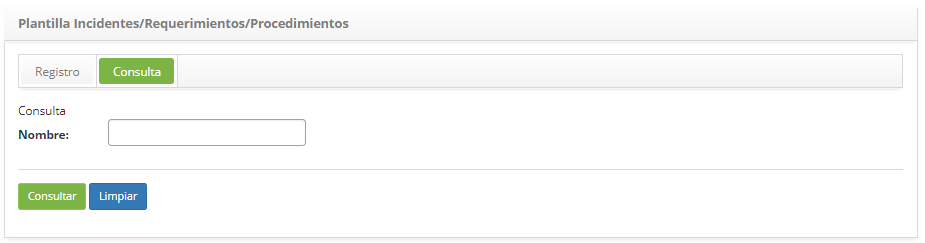

title: Registro y consuta de plantillas de incidents/solicitudes/procedimientos
Description: Esta funcionalidad tiene por objetivo registrar una plantilla para facilitar la apertura de una nueva solicitud.

# Registro y consuta de plantillas de incidents/solicitudes/procedimientos

Esta funcionalidad tiene por objetivo registrar una plantilla para facilitar la
apertura de una nueva solicitud.

Cómo acceder
------------

1.  Acceder a la funcionalidad de Plantillas de
    Incidentes/Solicitud/Procedimentos a través de la navegación en el menú
    principal **Procesos ITIL > Gestión de Ticket > Plantillas
    Incidentes/Solicitudes/Procedimentos**.

Condiciones previas
-------------------

1.  Tener acceso a la funcionalidad de Plantillas
    Incidentes/Solicitudes/Procedimientos (ver conocimiento [Registro y consulta
    de perfil de acceso[1]);

2.  Tener el grupo registrado (ver conocimiento [Registro y consulta de grupo][2]);

3.  Tener el contrato registrado (ver conocimiento [Registro y consulta de
    contrato][3]);

4.  Tener la unidad registrada (ver conocimiento [Registro y consulta de
    unidad][4]);

5.  Tener el grupo vinculado al contrato (ver conocimiento [¿Cómo relacionar el
    grupo al contrato?][5]);

6.  Tener la unidad vinculada al contrato (ver conocimiento [¿Cómo relacionar la
    unidad al contrato?][6]);

7.  Tener el portafolio con el servicio y las actividades de solicitud e
    incidente registrados (ver conocimientos [Registro del portafolio de
    servicios][7], [Registro de servicios][8], [Configuración de los atributos de
    servicio][9]);

8.  Tener el tiempo de atención de las actividades de solicitud e incidente
    definidas (ver conocimiento [Registro y consulta del tiempo de atención][10]);

9.  Tener el contrato vinculado al servicio (ver conocimiento [Configuración de
    los atributos de servicio][11]);

10. Tener las actividades de solicitud e incidente vinculadas al contrato del
    servicio (ver conocimiento [Configuraciones de los atributos del contrato
    del servicio][12]);

11. Introduzca el contenido debajo del parámetro (ver conocimiento [Reglas de
    parametrización - Ticket][13]):

      -   Parámetro 9: definir el grupo de 1º nivel para la atención de la solicitud.

12.  El solicitante debe estar incluido en el grupo que está vinculado al
    contrato para que sea posible registrar la solicitud.

Filtros
-------

1.  El siguiente filtro permite al usuario restringir la participación de
    elementos en el listado default de la funcionalidad, facilitando la
    localización de los elementos deseados:

  -   Nombre

   
   
   **Figura 1 - Pantalla de consulta de plantillas incidentes/solicitudes/procedimientos**

2.  Realiza la búsqueda dela plantilla;

   -   Introduzca el nombre de la plantilla que desea buscar y haga clic en el
    botón *Consultar*. Después de eso, se mostrará el registro de la plantilla
    según el nombre informado;

   -   Si desea listar todos los registros de plantilla, simplemente haga clic
    directamente en el botón *Consultar*;

Listado de ítems
----------------

1.  El(Los) siguiente (s) campo (s) de registro está (n) disponible (s) para
    facilitar al usuario la identificación de los elementos deseados en el
    listado default de la funcionalidad: **Nombre**.
   
   
   
   **Figura 2 - Pantalla de la lista de plantillas incidentes/solicitudes/procedimientos**

2.  Despues de la búsqueda, selccione el registro deseado. Hechos esto, será
    redireccionado para una nueva pestaña de registro mostrando el contenido
    referente al registro seleccionado.

3.  Para cambiar los datos del registro de plantilla, basta con modificar la
    información de los campos deseados y hacer clic en el botón *Grabar* para
    que se grabe el cambio realizado en el registro, donde la fecha, hora y
    usuario serán grabados automáticamente para una futura auditoría;

Completar los campos de registro
--------------------------------

1.  Se mostrará la pantalla de registro de Plantillas de
    Incidentes/Solicitud/Procedimientos, como se muestra en la figura siguiente:

   
   
   **Figura 3 - Pantalla de registro de plantillas**

2.  Complete los campos según la siguiente orientación:

    -   **Nombre**: informe el nombre del Incidente, Solicitud o Procedimiento;

    -   **Solicitante**: informe el nombre del solicitante, es decir, el nombre de
    la persona que está solicitando la apertura de incidente o solicitud de
    servicio;

    -   **E-mail**: informe el e-mail del solicitante;

    -   **Origen Contacto**: informe el origen de la solicitud;

    -   **Catálogo**: este campo será establecido por el sistema después de informar
    al solicitante y el contrato. En caso de que el contrato seleccionado sea
    del tipo "contrato", se mostrará en este campo la información del Catálogo
    de Servicios de "Negocio" y si el contrato seleccionado es del tipo
    "contrato de apoyo" o "acuerdo de nivel operacional", se mostrará en este
    campo la información del Catálogo de Servicios "Técnico";

    -   **Servicio**: informe al servicio del catálogo de servicios. Si el catálogo
    de servicios es de "negocio", se pondrán a disposición en este campo los
    servicios de negocio para selección, pero si el catálogo de servicios es
    "técnico", estarán disponibles en este campo los servicios de apoyo /
    técnico para selección;

    -   **Servicio categoría de uso**: marque este campo, si decide buscar los
    servicios por categoría;

    -   **Categoría del Servicio**: si ha optado por la búsqueda de servicios por
    categoría, introduzca la categoría de servicio deseada. La categoría del
    servicio identificará la naturaleza del servicio, colocándolo dentro de
    grupos similares de actuación, situándolo en la jerarquía de su categoría;

    -   **Tipo de solicitación**: informe el tipo de solicitud, si es una apertura de incidente, solicitud de servicio o procedimiento;

        -   **Incidente**: si la situación presentada es una interrupción no
            planificada, una reducción en la calidad del servicio o el fallo de
            algún ítem de configuración que aún no haya impactado en un servicio de
            TI. Ejemplo: El vínculo de red está fuera, la red es lenta, el servidor
            inaccesible, etc.

        -   **Solicitud**: se refiere a las solicitudes de demandas realizadas por
            los usuarios dentro del ambiente de la Tecnología de la Información.
            Pueden ser desde solicitudes de acceso hasta sugerencias de mejora a
            bajo costo. Ejemplo: solicitud de acceso a la red para un nuevo usuario,
            solicitud de configuración de algún equipo, solicitud para agregar algún
            software en la estación de trabajo, etc.

        -   **Procedimento**: se refiere al procedimiento de continuidad del
            servicio de TI en caso de incidencia crítica.

    -   **Incidente/Solicitud/Procedimiento**: informe el servicio que se realizará;

    -   **Contrato**: informe el contrato para el cual se hará la solicitud;

    -   **Unidad**: informe a la unidad del solicitante;

    -   **Urgencia**: indique la velocidad en la cual el servicio necesita ser
    realizado;

    -   **Impacto**: indique el impacto en el negocio;

    -   **Descripción**: informe la descripción de la solicitud. La descripción debe
    ser objetiva, incluyendo toda la información necesaria para la atención de
    la solicitud;

    -   **Ítem Configuración**: introduzca el item de configuración correspondiente
    a la solicitud.

3.  Después de los datos informados, haga clic en el botón *Grabar* para
    efectuar el registro, donde la fecha, hora y usuario se guardarán
    automáticamente para una futura auditoría.

[1]:/es-es/citsmart-platform-7/initial-settings/access-settings/profile/user-profile.html
[2]:/es-es/citsmart-platform-7/initial-settings/access-settings/user/group.html
[3]:/es-es/citsmart-platform-7/additional-features/contract-management/use/register-contract.html
[4]:/es-es/citsmart-platform-7/plataform-administration/region-and-language/register-unit.html
[5]:/en-us/citsmart-platform-7/processes/tickets/relate-group.html
[6]:/en-us/citsmart-platform-7/processes/tickets/relate-unit.html
[7]:/es-es/citsmart-platform-7/processes/portfolio-and-catalog/register.html
[8]:/es-es/citsmart-platform-7/processes/portfolio-and-catalog/services.html
[9]:/es-es/citsmart-platform-7/processes/portfolio-and-catalog/configure-service-attribute.html
[10]:/es-es/citsmart-platform-7/processes/service-level/time-attendance.html
[11]:/es-es/citsmart-platform-7/processes/portfolio-and-catalog/configure-service-attribute.html
[12]:/es-es/citsmart-platform-7/processes/portfolio-and-catalog/contract-attributes.html
[13]:/es-es/citsmart-platform-7/plataform-administration/parameters-list/parametrizaion-ticket.html

!!! tip "About"

    <b>Product/Version:</b> CITSmart | 8.00 &nbsp;&nbsp;
    <b>Updated:</b>09/19/2019 – Anna Martins
