title: Gestión de ticket (servicios)
Description: Este conocimiento tiene por objetivo elucidar de forma clara y didáctica la funcionalidad ticket como un todo, explicando concisamente sus opciones.

# Gestión de ticket (servicios)

Este conocimiento tiene por objetivo elucidar de forma clara y didáctica la
funcionalidad ticket como un todo, explicando concisamente sus opciones.

La siguiente pantalla muestra la pantalla principal del módulo tickets:

   
    
   **Figura 1 - Pantalla de gestión de tickets**

-   **1: Campo de consulta** - permite buscar los tickets;

-   **2: Botón de menu** - muestra los ítems de menú de la pantalla de
    administración;

-   **3: Tickets** - se presentan los registros de solicitudes de servicios e
    incidentes para atención y gestión;

-   **4: Auditoría** - presenta los registros generados en las diversas acciones
    relacionadas a los tickets;

-   **5: Resumen** - muestra la cantidad de tickets por diversos ítems;

-   **6: Consulta avanzada** - permite realizar una consulta con más recursos de
    los tickets;

-   **7: Agenda** - permite visualizar la agenda de actividades periódicas, en
    la cual se verifica las actividades referentes a los tickets que fueron
    programados para ser atendidos en una fecha determinada;

-   **8: Actualización automática** - recurso para, cuando se activa, actualizar
    la lista de tickets de forma automática. El tiempo de actualización
    automática de la lista de ticket es de 30 segundos. Actualmente, este tiempo
    no se puede cambiar;

-   **9: Actualización manual** - recurso utilizado para actualizar la lista de
    tickets;

-   **10: Informes** - permite acceder a informes de tipo global, es decir,
    aquellos no vinculados a un ticket específico, pudiendo analizar todos (en
    la creación del informe vía opción Informes Smart esta característica es
    definida);

-   **11: Opciones** - presenta la funcionalidad de "Suspensión/Reactivación"
    (que permite suspender todos los tickets con status "En curso" de un
    determinado grupo ejecutor y reactivar los mismos) y la funcionalidad de
    "Cambiar columnas" (que permite cambiar la disposición de las columnas en la
    lista de tickets; el conjunto de columnas definidas permanece incluso
    después de cerrar la sesión del usuario);

-   **12: Listado** - filtra la vista de ticket por lista;

-   **13: Por assistente** - filtra el modo de visualización de ticket por
    empleado en modo Kanban;

-   **14: Por situación** - filtra la vista de ticket por situación SLA. Para
    que esta opción sea visible es necesario habilitar el permiso de acceso para
    el usuario entrante, marque el ítem "Gestión del equipo". (ver
    conocimiento [Permiso de acceso de Gestión de Tickets][1])

-   **15: Por estado del flujo** - filtra la vista de ticket por estado del
    flujo;

-   **16**: Haga clic para capturar y ser responsable del ticket;

-   **17**: Haga clic para mostrar toda la información básica referente al ticket,
    no siendo posible en esa pantalla realizar cualquier tipo de cambio en los
    datos;

-   **18**: Haga clic para mostrar sólo la descripción del ticket;

-   **19**: Haga clic para poner a disposición la funcionalidad de Mensaje, que
    permite el intercambio de mensajes entre el solicitante del ticket y el
    responsable de su resolución;

-   **20**: Haga clic para acceder a informes de tipo específico, es decir, aquellos
    vinculados al ticket actual (en la creación del informe vía opción Informes
    Smart esta característica está definida);

    !!! note "NOTA"

        La visualización de estos informes depende de la configuración (registro) de
        informes específicos en la función Informes > Informes Smart > Generador de
        informes Smart (ver conocimiento [Generador de informes Smart][2]).

-   **21**: Haga clic para mostrar el flujo referente al ticket, siendo posible
    entonces observar la posición del usuario dentro del mismo;

-   **22**: Haga clic para abrir otras acciones, como - Delegar, Suspender,
    Cambiar SLA, Reclasificar, Crear sub-solicitudes, Mostrar sub-solicitudes,
    Programar actividad, Crear solicitud relacionada e Imprimir solicitud.

-   **23: Solicitud** - listado de registros de tickets;

-   **24: Botón de Opciones** - al ser accionado presenta el botón paro registro
    de nuevos tickets y el botón paro registro de ticket vía template.

La siguiente lista muestra las 28 posibles operaciones de esta pantalla, en
orden alfabético:

1.  Administrar el atendimiento de los equipos por el cuadro Kanban

2.  Aprobar

3.  Buscar (rápida y avanzada)

4.  Cambiar el SLA

5.  Cancelar

6.  Captura

7.  Cerrar

8.  Delegar

9.  Direccionar

10. Imprimir

11. Programar actividades

12. Reabrir

13. Reactivar

14. Reclasificar

15. Realizar la auditoría

16. Registro

17. Registro (vía lectura de correo electrónico)

18. Registrar (vía plantilla)

19. Registrar una ocurrencia (instancia)

20. Registrar la ejecución

21. Suspender

22. Suspender y reactivar de forma múltiple

23. Vincular a un cambio

24. Vincular a una liberación

25. Vincular a un problema

26. Vincular a un proyecto

27. Vincular a un sub- ticket

28. Vincular a un ticket relacionado

Las demás secciones de este conocimiento explican con detalle las orientaciones
de uso de estas operaciones a través de los menús, enlaces y botones disponibles
en la pantalla.

Las secciones están dispuestas en el orden de disposición en la pantalla para
facilitar el autodesarrollo.

Registro de ticket
------------------

### Cómo acceder

1.  Acceder al menú principal **Procesos ITIL > Gestión de
    Ticket > Solicitud de Servicios e Incidentes**.

### Condiciones previas

1.  Tener permiso para registrar el ticket (ver conocimiento [Registro y
    consulta de grupo][3]);

2.  Tener el colaborador registrado (ver conocimiento [Registro y consulta de
    colaborador][4]);

3.  Tener el grupo registrado (ver conocimiento [Registro y consulta de grupo][3]);

4.  Tener el contrato registrado (ver conocimiento [Registro y consulta de
    contrato][5]);

5.  Tener la unidad registrada (ver conocimiento [Registro y consulta de
    unidad][6]);

6.  Tener el usuario vinculado a la unidad;

7.  Tener el usuario vinculado al grupo;

8.  Tener el grupo vinculado al contrato (ver conocimiento [¿Cómo relacionar el
    grupo al contrato?][7]);

9.  Tener la unidad vinculada al contrato (ver conocimiento [¿Cómo relacionar la
    unidad al contrato?][8]);

10. Tener el portafolio con el servicio y las actividades de tickets registrados
    (ver conocimientos [Registro del portafolio de servicios][9], [Registro de
    servicios][10], [Configuración de los atributos de servicio][11]);

11. Tener el tiempo de atención de las actividades de tickets definidas (ver
    conocimiento [Registro y consulta del tiempo de atención][12]);

12. Tener el contrato vinculado al servicio (ver conocimiento [Configuración de
    los atributos de servicio][11]);

13. Tener las actividades de tickets vinculadas al contrato del servicio (ver
    conocimiento [Configuraciones de los atributos del contrato del servicio][13]);

14. El solicitante debe estar incluido en el grupo que está vinculado al
    contrato para que sea posible registrar el ticket;

15. Informe los contenidos abajo en los parámetros (ver conocimiento [Reglas de
    parametrización - ticket][14]):

    -   Parámetro 9;

    -   Parámetro 40;

    -   Parámetro 41;

    -   Parámetro 260: default 1-Lista sin restricción;

    -   Parámetro 343: default: "S".

### Filtros (consulta rápida)

1.  El siguiente filtro permite al usuario restringir la participación de ítems
    en el listado default de la funcionalidad, facilitando la localización de
    los ítems deseados:

    -   Encuentra aquí - en el campo de consulta, se permite la consulta por número,
    descripción de la tarea y responsable por la atención;

    
    
    **Figura 2 - Pantalla de consulta**

2.  Si desea realizar la consulta utilizando otros filtros, simplemente haga
    clic en el icono   del campo de consulta. Se mostrará una pantalla con
    varios filtros, posibilitando de esa forma el refinamiento de la consulta.
    La siguiente figura muestra estos filtros:

    
    
    **Figura 3 - Pantalla de consulta rápida expandida**

    -   **Número**: informar el número de identificación del ticket, si desea
    verificar un ticket específico;

    -   **Solicitante**: informar al solicitante de servicios para verificar sus
    tickets;

    -   **Tipo de Solicitud**: informar el tipo de ticket para verificación de los
    tickets;

    -   **Situación**: informar la situación para verificar los tickets referentes;

    -   **Contrato**: informar el contrato para verificar los tickets relacionados
    con el mismo;

    -   **Grupo ejecutor**: informar al grupo ejecutor para verificar los tickets
    que fueron dirigidos al mismo;

    -   **Tarea Actual**: informar el tipo de tarea para verificar los tickets
    relacionados con la misma;

    -   **Responsable**: informar al responsable por la atención de los tickets para
    verificar los tickets que fueron atendidas por el mismo;

    -   **Status SLA**: informar la situación del SLA para verificar los tickets
    referentes a la situación seleccionada;

    -   **Ordenar por**: permite definir el orden en que se presentarán los tickets;

    -   **Ver**: informar la forma de visualización del ticket de acuerdo con las
    acciones disponibles al eventual responsable del ticket, tales como:
    ejecución y apenas visualización;

    -   **Visualización**: permite filtrar el ticket de las solicitudes consideradas
    críticas y solicitudes abiertas por el chat;

    -   **Exhibir sub-Solicitudes**: si está marcado con *Sí*, el resultado de la
    búsqueda también traerá los sub-tickets de cada elemento del resultado.

!!! warning "ATENCIÓN"

    La eficacia de la consulta depende del seguimiento de algunas reglas de
    permiso por el filtro, tales como: ejecución, delegación, seguimiento,
    visualización, grupos de usuarios, vínculo con contrato, unidades y
    colaborador conectado.

### Listado de ítens

1.  El(Los) siguiente (s) campo (s) de registro está (n) disponible (s) para
    facilitar al usuario la identificación de los elementos deseados en el
    listado default de la funcionalidad: **Ticket, Prioridad, Servicio,
    Solicitación, Solicitante, Contrato, Creado por, Fecha creación,
    Tarea** y **Grupo actual**.

2.  Se mostrará la pantalla de **Gestión Ticket**. La figura siguiente ilustra
    este campo:

**Figura 4 - Pantalla de lista de tickets**

### Completar los campos de registro - registro de ticket

1.  Al acceder a la funcionalidad, se mostrará la pantalla de **Gestión de
    ticket**;

2.  Haga clic en el botón de opciones  situado en la esquina inferior derecha de
    la pantalla, luego haga clic en el botón de registro .

3.  Hecho esto, se presentará la pantalla de **Registro de ticket**, como se
    muestra en la figura siguiente:

    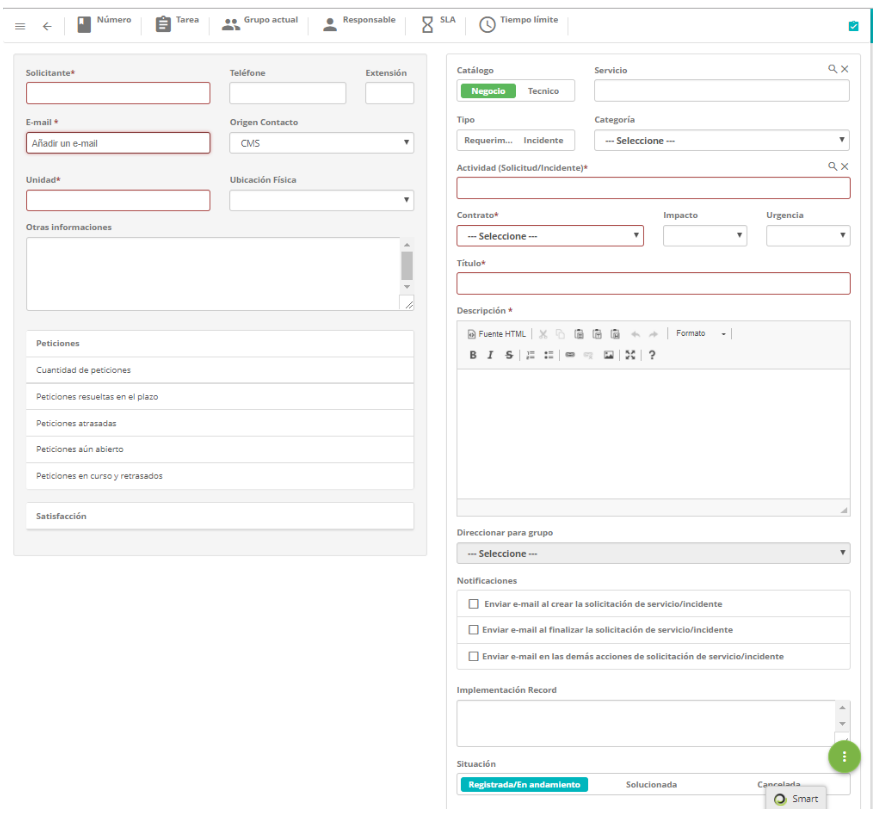
    
    **Figura 5 - Pantalla de registro de ticket**

4.  Complete los campos según las instrucciones descritas a continuación:

    a)  Registre la información del solicitante:

       -   **Solicitante**: informe el nombre del solicitante, es decir, el nombre de la persona que está solicitando la                  apertura del ticket.

    !!! warning "ATENCIÓN"

        Al informar al solicitante se muestra un resumen estadístico de los llamados
        de él (por situación), así como otro resumen estadístico de satisfacción
        (por tipo de respuesta) de los servicios ya solicitados por él. Por una
        cuestión de rendimiento y de preservación del lay-out de la pantalla, esos
        dos resúmenes son paginados, o sea, es posible avanzar/retroceder para
        visualizar toda la información.

      -   **Teléfono**: introduzca el número de teléfono del solicitante;

      -   **Extensión**: informe el número del interno del solicitante, si lo tiene;

      -   **E-mail**: informe el e-mail del solicitante;

      -   **Origen Contacto**: informe el origen del contacto para el registro del
       ticket;

      -   **Unidad**: seleccione la unidad en la que el solicitante está lleno;

      -   **Ubicación Física**: informe la ubicación del solicitante;

      -   **Otras informaciones**: describa las observaciones sobre el solicitante, si
    es necesario.

    !!! note "NOTA"

        Si existe un cuestionario (Satisfacción) vinculado a la actividad, el
        solicitante responderá a través del e-mail automático de encuesta de
        satisfacción.

     b)  Registre la información del ticket:

-   **Catálogo**: seleccione el catálogo de servicios;

-   **Servicio**: introduzca el servicio correspondiente al catálogo de
    servicios seleccionado. Si el catálogo de servicios es "**Negocio**", se
    pondrán a disposición en este campo los servicios de negocio para selección,
    pero si el catálogo de servicios es "**Técnico**", estarán disponibles en
    este campo los servicios de apoyo/técnico para selección;

-   **Tipo**: seleccione el tipo de ticket, si es una apertura de incidente o
    solicitud de servicio;

    -   **Incidente**: si la situación presentada es una interrupción no
        planificada, una reducción en la calidad del servicio o el fallo de
        algún ítem de configuración que aún no haya impactado en un servicio de
        TI. Por ejemplo, el vínculo de red está fuera de alcance, la red está
        lenta, el servidor inaccesible, etc.

    -   **Solicitud de servicio**: se refiere a las solicitudes de demandas
        realizadas por los usuarios dentro del ambiente de la Tecnología de la
        Información. Pueden ser desde solicitudes de acceso hasta sugerencias de
        mejora a bajo costo. Por ejemplo: solicitud de acceso a la red para un
        nuevo usuario, solicitud de configuración de algún equipo, solicitud
        para agregar algún software en la estación de trabajo, etc.

-   **Categoría**: informe la categoría de servicio para facilitar la consulta
    de la actividad (solicitud de servicio/incidente). La categoría identificará
    la naturaleza de la actividad, colocándolo dentro de grupos similares de
    actuación, situándolo en la jerarquía de su categoría;

-   **Actividad (Solicitud/Incidente)**: informe la actividad que se realizará
    referente al tipo de ticket. Si la actividad informada tiene un "Script de
    Orientación" asociado, el mismo aparecerá en la
    pestaña **"Scripts"** representada por el icono   situado en la esquina
    superior derecha de la pantalla;

-   **Contrato**: después de informar la actividad (solicitud/incidente), se
    mostrará el contrato para el cual se hará la apertura de incidente o
    solicitud de servicio;

-   **Urgencia**: después de informar la actividad (solicitud/incidente), se
    mostrará la información de la urgencia que indica la velocidad en la cual el
    servicio necesita ser realizado;

-   **Impacto**: después de informar la actividad (solicitud/incidente), se
    mostrará la información de impacto del servicio al negocio;

    !!! warning "ATENCIÓN"

        Después de informar la actividad del ticket, se establecerá el tiempo
        previsto para atender la solicitud, conforme configurado en el registro del
        tiempo de atención vinculado a la actividad. El tiempo de atención se
        contabilizará de acuerdo con lo que se definió en el calendario vinculado a
        la unidad, pero si la unidad no tiene un calendario vinculado, se
        contabilizará según el calendario vinculado al servicio. Sin embargo, al
        terminar el tiempo previsto de atendimiento se contabiliza el retraso en
        tiempo corrido, siendo desconsiderado el calendario.

-   **Título**: informe el título del ticket;

-   **Descripción**: informe la descripción del ticket. La descripción debe ser
    objetiva, incluyendo toda la información necesaria para la atención de la
    misma;

-   **Direccionar para grupo**: informe al grupo para el cual se le asignará el
    ticket. Si no informa al grupo, el ticket se dirigirá al grupo definido en
    el flujo de solicitud/incidente. Si no se establece el grupo en el flujo, el
    ticket se dirigirá al grupo definido en el registro del vínculo de la
    actividad de solicitud/incidente al contrato. Pero si el grupo no está
    definido en el registro del vínculo de la actividad al contrato, el ticket
    será dirigido al grupo definido en el parámetro "**ID Grupo Nivel 1**"(para
    que ese campo esté activado es necesario configurar la funcionalidad - ver
    conocimiento [Mantenimiento del flujo de trabajo][15], sección Implementando la
    funcionalidad delegar em el flujo sobre la actividad)

-   **Notificaciones**: marque las opciones de envío de notificación sobre el
    ticket para ser enviadas al solicitante;

-   **Registro de Ejecución**: no es necesario el llenado de este campo, pues el
    mismo es indicado para el técnico que atender el ticket y describirá sobre
    la ejecución de su actividad.

-   **Situación**: seleccione la opción que se ajusta al estado actual del
    ticket:** Registrada/En andamiento.

5.  Después de los datos informados, haga clic en el botón de opciones  y luego
    haga clic en el botón de grabación  para efectuar el registro, donde la
    fecha, hora y usuario serán grabados automáticamente para una futura
    auditoría.

Posibles vínculos al ticket
---------------------------

1.  Para informar los datos complementarios del ticket (solicitud o incidente),
    marque la opción de captura o visualización de éste, posteriormente, haga
    clic en el botón de menú . Se mostrarán los ítems, como se presenta en la
    figura siguiente:

    
    
    **Figura 6 - Registro de ticket - menú lateral**

    -   Para agregar archivos al ticket, simplemente haga clic en **Adjuntos**.

    -   Para relacionar un problema con el ticket, haga clic en **Problema**.

    -   Para relacionar una solicitud de cambio al ticket, haga clic en **Cambio**.

    -   Para relacionar uno registro de liberación al ticket, haga clic
     en **Liberación**.

    -   Para relacionar un IC al ticket, haga clic en **Ítems de configuración**.

    -   Para relacionar un proyecto al ticket, haga clic en **Proyecto**.

    -   Para relacionar un conocimiento al ticket, haga clic en **Conocimiento**.

!!! warning "ATENCIÓN"

    Los conocimientos relacionados con el registro del ticket de actividad de
    solicitud/incidente del servicio se mostrarán en el Smart Portal, si la
    actividad de solicitud/incidente está disponible en el mismo.

Vinculación de ítems de configuración del solicitante
-----------------------------------------------------

### Condiciones previas

1.  Tener al menos un ítem de configuración registrado (ver
    conocimiento [Gestión de ítems de configuración][16]).

### Vinculación de un item de configuración del solicitante

1.  Consulte el ticket deseado, presione sobre el mismo y luego haga clic en el
    icono ;

2.  Se mostrará la pantalla de registro del determinado ticket. Haga clic en el
    botón de menú  y después de ello, haga clic en los **ítems de Configuración
    (IC) del Solicitante**;

3.  Se mostrará la pantalla de ítems de configuración del solicitante, conforme
    la figura siguiente:

    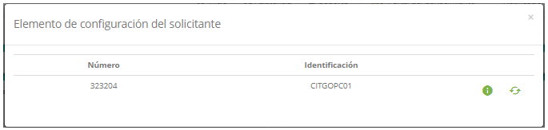
    
    **Figura 7 - ítems de configuración del solicitante**

1.  Puede ver la información sobre este IC haciendo clic en el icono . Para
    vincular el IC, basta con hacer clic en para realizar la operación.

Vinculando sub-tickets
----------------------

1.  Consulte el ticket deseado, presione sobre el mismo y luego haga clic en el
    icono ;

2.  Se mostrará la pantalla de registro del determinado ticket. Haga clic en el
    botón de menú  y después de ello, haga clic en **Sub-solicitud**;

3.  Se mostrará la pantalla de** Sub-tickets**, haga clic en el botón *Buscar
    solicitudes* y aparecerá una lista de los tickets registrados, como se
    muestra a continuación:

    
    
    **Figura 8 - Pantalla de vinculación de sub-tickets**

4.  Seleccione el ticket deseado y haga clic en *Vincular solicitudes* para
    realizar la operación.

Vinculando adjuntos
-------------------

1.  Consulte el ticket deseado, presione sobre el mismo y luego haga clic en el
    icono ;

2.  Se mostrará la pantalla de registro del determinado ticket. Haga clic en el
    botón de menú  y después de ello, haga clic en **Adjuntos**;

3.  Se mostrará la pantalla de **Adjuntos**, vincule el archivo deseado,
    conforme la figura abajo:

**Figura 9 - Pantalla de vinculación de adjuntos**

Verificación de las actividades periódicas
------------------------------------------

1.  Consulte el ticket deseado, presione sobre el mismo y luego haga clic en el
    icono ;

2.  Se mostrará la pantalla de registro del determinado ticket. Haga clic en el
    botón de menú  y después de eso, haga clic en **Agenda**;

3.  Se mostrará la pantalla de **Agenda de Actividades**. La misma se muestra en
    formato de calendario, donde se pueden ver las actividades. La figura
    siguiente ilustra esta pantalla:

    
    
    **Figura 10 - Agenda de actividades**

-   **Grupo de Actividades**: seleccione el grupo ejecutor de actividades
    periódicas para visualizar sus tareas programadas;

-   **Grupo Consulta**: seleccione la administración que desea ver a sus
    actividades de las que se han programado.

-   Las actividades se pueden ver mensualmente, semanalmente o diariamente. Para
    definir el tipo de visualización, haga clic en uno de los botones ubicados
    arriba del calendario: **Mensual, Semanal** o **Diaria**;

Vinculación de problemas
------------------------

### Condiciones previas

1.  Tener al menos un problema registrado (ver conocimiento [Registro del
    problema][17]).

### Filtros

1.  El siguiente filtro permite al usuario restringir la participación de ítems
    en el listado default de la funcionalidad, facilitando la localización de
    los ítems deseados:

    -   Consulta Problema

    
    
    **Figura 11 - Pantalla de consulta de problemas relacionados**

2.  En el campo **Consulta Problema**, se permite la consulta por el título de
    problema previamente catastrados;

3.  Si desea eliminar el vínculo del problema con el ticket, simplemente haga
    clic en el icono   del mismo.

### Listado de itens

1.  Los siguientes campos de registro están disponibles para facilitar al
    usuario la identificación de los ítems deseados en el listado default de la
    funcionalidad: **ID** y **Título**;

2.  Hay botones de acción disponibles para el usuario en relación con cada ítem
    del listado, que son: *Eliminar*.

### Vinculación de problemas

1.  Consulte el ticket deseado, presione sobre el mismo y luego haga clic en el
    icono ;

2.  Se mostrará la pantalla de registro del determinado ticket. Haga clic en el
    botón de menú  y después de eso, en el ítem de **Problema**;

3.  Se mostrará la pantalla de **Problemas relacionados**, haga clic en el
    botón *Registrar Problema* y aparecerá la pantalla de registro de problema,
    como se presenta en la figura siguiente:

    
    
    **Figura 12 - Pantalla de registro de problemas**

4.  Complete los campos con la información necesaria y haga clic en el
    botón *Graba*r para registrar.

Vinculando solicitudes de cambio
--------------------------------

### Condiciones previas

1.  Tener al menos una solicitud de cambio registrada (ver
    conocimiento [Registro de solicitud de cambio][18]).

### Filtros

1.  El siguiente filtro permite al usuario restringir la participación de ítems
    en el listado default de la funcionalidad, facilitando la localización de
    los ítems deseados:

    -   Consulta Cambio

    
    
    **Figura 13 - Pantalla de consulta de cambios relacionados**

2.  En el campo **Consulta Cambio**, se permite la consulta por el número del
    cambio previamente registrado;

3.  Si desea eliminar el vínculo de la solicitud de cambio con el ticket,
    simplemente haga clic en el icono  .

### Listado de itens

1.  Los siguientes campos catastrales están disponibles para facilitar al
    usuario la identificación de los ítems deseados en el listado default de la
    funcionalidad: **Número del cambio** y **Título**;

2.  Hay botones de acción disponibles para el usuario en relación con cada ítem
    del listado, que son: *Eliminar*.

### Vinculación de cambios

1.  Consulte el ticket deseado, presione sobre el mismo y luego haga clic en el
    icono ;

2.  Se mostrará la pantalla de registro del determinado ticket. Haga clic en el
    botón de menú  y después de eso, haga clic en el ítem de **Cambio**;

3.  Se mostrará la pantalla de **Cambios relacionados**, haga clic en el
    botón *Registrar Cambio* y aparecerá la pantalla de registro de registro del
    cambio, como se muestra en la figura siguiente:

    
    
    **Figura 14 - Pantalla de registro de registro de cambio**

4.  Complete los campos con la información necesaria y haga clic en el
    botón *Grabar* para registrar.

Vinculación de registro de liberación
-------------------------------------

### Condiciones previas

1.  Tener al menos una registro de liberación registrada (ver
    conocimiento [Registro y consulta de liberaciones][19]).

### Filtros

1.  Los siguientes filtros posibilitan al usuario restringir la participación de
    ítems en el listado default de la funcionalidad, facilitando la localización
    de los ítems deseados:

    -   Consulta Liberación

    
    
    **Figura 15 - Pantalla de consulta de liberaciones relacionada**

2.  En el campo **Consulta Liberación**, se permite la consulta por el título de
    la liberación o por su número. Se buscan las liberaciones anteriormente
    registradas;

3.  Si desea eliminar el vínculo de lo registro de liberación con el ticket,
    simplemente haga clic en el icono   del mismo.

### Vinculación de la liberación

1.  Consulte el ticket deseado, presione sobre el mismo y luego haga clic en el
    icono  .

2.  Se mostrará la pantalla de registro del determinado ticket. Haga clic en el
    botón de menú   y después de eso, haga clic en el ítem de **Liberación**.

3.  Se mostrará la pantalla de **Liberaciones relacionadas**, haga clic en el
    botón *Registrar nueva liberación* y aparecerá la pantalla de cadastro de
    registro de liberación, como se muestra en la figura siguiente:

    
    
    **Figura 16 - Pantalla de catastro de registro de liberación**

4.  Complete los campos con la información necesaria y haga clic en el
    botón *Grabar* para registrar.

Vinculación de item de configuración relacionada
------------------------------------------------

### Condiciones previas

1.  Tener al menos un ítem de configuración registrado (ver
    conocimiento [Gestión de ítems de configuración][20]).

### Filtros

1.  Los siguientes filtros posibilitan al usuario restringir la participación de
    ítems en el listado default de la funcionalidad, facilitando la localización
    de los ítems deseados:

    -   Identificación

    -   Grupo

    -   Fecha de inicio

    -   Fecha de final

    -   Estado

    -   Criticidad del servicio

    -   Mostrar ítems hijos

    
    
    **Figura 17 - Pantalla de consulta de ítems de configuración relacionados**

2.  Realice la consulta del ítem de configuración:

-   Si desea listar todos los ítems de configuración, simplemente haga clic
    directamente en el botón *Consulta*.

### Listado de ítems

1.  El(Los) siguiente (s) campo (s) de registro está (n) disponible (s) para
    facilitar al usuario la identificación de los elementos deseados en el
    listado default de la funcionalidad: **ID** e **Identificación**;

2.  Hay botones de acción disponibles para el usuario en relación con cada ítem
    del listado, que son: *Ver* y *Seleccione*.

**Figura 18 - Pantalla de lista de ítems de configuración relacionados**

### Vinculación del item de configuración relacionada

1.  Consulte el ticket deseado, presione sobre el mismo y luego haga clic en el
    icono ;

2.  Se mostrará la pantalla de registro del determinado ticket. Haga clic en el
    botón de menú  y después de eso, haga clic en ítem de **Ítem de
    Configuración (IC) Relacionado**;

3.  Aparecerá la pantalla de **Ítems de Configuración Relacionados**, haga clic
    en el botón *Búsqueda de ítems de configuración* y aparecerá la pantalla de
    consulta de ítems de configuración relacionados;

4.  Realice la consulta y seleccione el ítem de configuración deseado y haga
    clic en el botón *Seleccione* para realizar la vinculación;

5.  Si desea eliminar el vínculo del ítem de configuración con el ticket,
    simplemente haga clic en el icono  del mismo.

Vinculación proyecto
--------------------

### Condiciones previas

1.  Tener permiso para ejecutar la solicitud de servicio. (ver
    conocimiento Registro y consulta de grupo][3]);

2.  Tener al menos un proyecto registrado. (ver conocimiento [Registro y gestión
    de proyectos][21]).

### Filtros

1.  El siguiente filtro permite al usuario restringir la participación de ítems
    en el listado default de la funcionalidad, facilitando la localización de
    los ítems deseados:

    -   Proyecto

    
    
    **Figura 19 - Pantalla de consulta de proyectos**

2.  Para mostrar los proyectos disponibles, basta con hacer clic sobre el
    filtro.

### Lista de ítems

1.  Los siguientes campos de registro están disponibles para facilitar el
    usuario la identificación de los ítems deseados en el listado default de la
    funcionalidad: **ID Proyecto, Nombre del Proyecto, Nombre del
    Gestor** y **Proceso** (véase la figura anterior).

### Vinculación del proyecto

1.  Consulte el ticket deseado, presione sobre el mismo y luego haga clic en el
    icono  ;

2.  Se mostrará la pantalla de registro del determinado ticket. Haga clic en el
    botón de menú  y después de eso, haga clic en el ítem **Proyectos**;

3.  Se mostrará la pantalla **Proyectos**, haga clic en el puntero sobre el
    filtro. Hecho esto, se mostrará una lista de los proyectos disponibles;

4.  Seleccione el proyecto deseado para efectuar la vinculación del mismo al
    ticket;

5.  Si desea eliminar el vínculo del proyecto al ticket, simplemente haga clic
    en el icono   del mismo.

Vinculando conocimiento
-----------------------

### Condiciones previas

1.  Tener al menos un conocimiento registrado. (ver conocimiento [Gestión de
    conocimiento][22]).

### Filtros

1.  Los siguientes filtros posibilitan al usuario restringir la participación de
    ítems en el listado default de la funcionalidad, facilitando la localización
    de los ítems deseados:

    -   Título;

    -   Contenido;

    
    
    **Figura 20 - Pantalla de consulta de conocimientos**

2.  Realice la consulta del conocimiento deseado.

### Listado de ítems

1.  El(Los) siguiente (s) campo (s) de registro está (n) disponible (s) para
    facilitar al usuario la identificación de los elementos deseados en el
    listado default de la
    funcionalidad:: **ID**, **Título**, **Versión**, **Publicado** y **Archivado**.

**Figura 21 - Pantalla de listado de conocimientos**

### Vinculación del conocimiento

1.  Consulte el ticket deseado, presione sobre el mismo y luego haga clic en el
    icono ;

2.  Se mostrará la pantalla de registro del determinado ticket. Haga clic en el
    botón de menú  y después de eso, haga clic en **Conocimiento**;

3.  Se mostrará la pantalla de **Conocimiento**, haga clic en el botón
    de *Consulta de Conocimientos*. Se abrirá la pantalla de consulta de la base
    de conocimiento;

4.  Consulte y seleccione el conocimiento deseado para efectuar la vinculación
    del mismo al ticket;

5.  Si desea eliminar el vínculo del conocimiento al ticket, basta con hacer
    clic en el icono   del mismo.

Vinculando e-mails leídos
-------------------------

### Condiciones previas

1.  Tener permiso para registrar el ticket (ver conocimiento [Registro y
    consulta de grupo][3]);

2.  Tener el colaborador registrado (ver conocimiento [Registro y consulta de
    colaborador][4]);

3.  Tener el grupo registrado (ver conocimiento [Registro y consulta de grupo][3]);

4.  Tener el contrato registrado (ver conocimiento [Registro y consulta de
    contrato][5]);

5.  Tener la unidad registrada (ver conocimiento [Registro y consulta de
    unidad][8]);

6.  Tener el grupo vinculado al contrato (ver conocimiento [¿Cómo relacionar el
    grupo al contrato?][7]);

7.  Tener la unidad vinculada al contrato (ver conocimiento [¿Cómo relacionar la
    unidad al contrato?][8]);

8.  Tener el portafolio con el servicio y las actividades de solicitud e
    incidente registrados (ver conocimientos [Registro del portafolio de
    servicios][9], [Registro de servicios][10], [Configuración de los atributos de
    servicio][11]);

9.  Tener el tiempo de atención de las actividades de solicitud e incidente
    definidas (ver conocimiento [Registro y consulta del tiempo de atención][12]);

10. Tener el contrato vinculado al servicio (ver conocimiento [Configuración de
    los atributos de servicio][11]);

11. Tener las actividades de solicitud e incidente vinculadas al contrato del
    servicio. (ver conocimiento [Configuraciones de los atributos del contrato
    del servicio][13]);

12. Configurar el parámetro 9 (ver conocimento [Reglas de parametrización -
    ticket][14]);

13. El solicitante debe estar incluido en el grupo que está vinculado al
    contrato para que sea posible registrar el ticket;

14. Configurar los parámetros 23,24,25,26,27,28 y 72 (ver conocimiento [Reglas
    de parametrización - E-mail][25]).

### Vinculación de lecturas de e-mail

!!! info "INFORMACIÓN"

    La lectura de correo electrónico sólo se realizará si los parámetros están
    configurados correctamente.

1.  Consulte el ticket deseado, presione sobre el mismo y luego haga clic en el
    icono ;

2.  Se mostrará la pantalla de registro del determinado ticket. Haga clic en el
    botón de menú  y después de eso, haga clic en el ítem de **Lectura de los
    e-mails**;

3.  Se mostrará una pantalla para verificar los e-mails recibidos, como se
    muestra en la figura siguiente:

     
     
     **Figura 22 - Pantalla de lectura de e-mails**

4.  Haga clic en el botón *Comprobar correo electrónico*. Se mostrarán los
    correos electrónicos, como se muestra en la figura siguiente:

    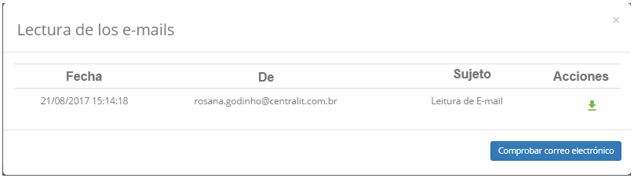
    
    **Figura 23 - Lectura de e-mails**

5.  Haga clic en el icono  del correo electrónico para crear el ticket basada en
    el mismo. Hecho esto, se presentará la pantalla de registro de ticket;

6.  Si el remitente del e-mail elegido es un colaborador registrado en el
    sistema, después de hacer clic en el icono , los campos para llenar
    información del solicitante serán completados por el sistema. Pero si el
    remitente no es un colaborador registrado en el sistema, deberá llenar los
    campos con la información necesaria;

7.  Si el remitente es o no un colaborador registrado en el sistema, el campo
    Descripción se rellenará con el contenido del e-mail, como se muestra en la
    figura siguiente:

    
    
    **Figura 24 - Pantalla de registro de ticket**

8.  Registre las demás informaciones del ticket, haga clic en el botón de
    opciones  y luego haga clic en el botón grabar  para     efectuar el registro, donde la fecha, hora y usuario se guardarán automáticamente para una futura auditoría.

Captura de ticket
-----------------

### Condiciones previas

1.  Tener permiso para ejecutar el ticket (ver conocimiento [Registro y consulta
    de grupo][3]).

### Capturando ticket

1.  Se mostrará la pantalla de Gestión de Ticket;

2.  Consulte el ticket deseado, presione sobre el mismo y luego haga clic en el
    icono ;

3.  Se mostrará la pantalla para confirmar la captura del ticket, es decir, para
    confirmar que es el responsable de la ejecución de lo ticket, como se
    muestra en la siguiente figura:

    
    
    **Figura 25 - Confirmación de la captura del ticket**

4.  Confirme la captura del ticket. Después de eso, aparecerá la pantalla de
    registro del ticket para verificar su información.

!!! warning "ATENCIÓN"

    Una vez capturado el ticket, pasa a ser posible ejecutar la vinculación de
    él con varios otros ítems: ítems de configuración del solicitante,
    solicitudes relacionadas, sub-solicitudes, anexos, agenda, problema, cambio,
    liberación, ítems de configuración relacionados, proyecto , conocimiento y
    lecturas de e-mails (ver la figura 6), según lo explicado en las siguientes
    secciones.

Registro de la ejecución del ticket
-----------------------------------

### Condiciones previas

1.  Tener permiso para ejecutar el ticket (ver conocimiento [Registro y consulta
    de grupo][3]);

2.  Tener la causa de incidentes registradas (ver conocimiento [Registro y
    consulta de causas de incidentes][26]);

3.  Tener la categoría de solución catastrada (ver conocimiento [Registro y
    consulta de la categoría de la solución][27]).

### Registro de la ejecución del ticket

1.  Se mostrará la pantalla de **Gestión de Ticket**;

2.  Consulte el ticket deseado, presione sobre el mismo y luego haga clic en el
    icono ;

3.  Se mostrará la pantalla de registro del determinado ticket. Registre la
    información necesaria referente a la ejecución del mismo;

    
    
    **Figura 26 - Registro de la ejecución del ticket**

    -   Si ha finalizado la solicitud, cambie la situación de la misma a
    "*Solucionada*", simplemente haga clic en la situación para cambiar. Después
    de eso, informe los datos sobre la solución que se realizó:

    -   Si el tipo de ticket es **Incidente**, complete los campos:

        -   **Causa**: seleccione la causa del incidente;

        -   **Solución Categoría**: seleccione la categoria de solución del
            incidente;

        -   **Detalles de la Causa**: describa los detalles da causa del
            incidente;

        -   **Solución Respuesta**: describa los detalles de la solución que fue
            realizada para el atención del incidente;

        -   **Grabar Solución/Respuesta en la Base de Conocimiento**: caso
            quiera grabar la "solución respuesta" en la base del conocimento,
            marque ese campo e informe el título del nuevo conocimiento;

        -   **Solución Temporal**: indique se la actividad realizada para el
            atención del incidente fue una solución temporaria.

    -   Se el tipo de ticket fuera **Solicitud**, llene el campo **Solución
        Respuesta**, describa lo que fue realizado para el atención del
        solicitud o de servicio.

    -   Para anexar un archivo referente a la ejecución de la solicitación, basta
    clicar en el icono del menú  y hacer clic en **Adjuntos**;

    -   Para registrar una ocurrencia referente la ejecución del ticket, hacer clic
    en el icone  localizado en la parte superior derecha de la pantalla.

4.  Después del registro de las informaciones sobre la ejecución de la actividad
    para atención del ticket, haga clic en el botón de opciones  a continuación,
    haga clic en el botón  para grabar y avanzar el flujo, donde el ticket será
    encaminado a la fase de validación y cierre. Pero si desea grabar sólo la
    información registrada sobre la ejecución del ticket y mantener la tarea
    actual, haga clic en el botón .

Si ha optado por "Guardar la Solución/Respuesta en la Base de
Conocimiento", al grabar el ticket, el conocimiento será creado y vinculado al
ticket.

Validación y cierre del ticket
------------------------------

### Condiciones previas

1.  Tener permiso para validar el ticket (ver conocimiento [Registro y consulta
    de grupo][3]).

### Validando el ticket

1.  Consulte el ticket deseado, presione sobre el mismo y luego haga clic en el
    icono ;

2.  Se mostrará la pantalla de registro del determinado ticket. Asegúrese de que
    se ha efectuado la atención del ticket de acuerdo con lo solicitado y
    registre la información necesaria sobre la validación del mismo;

    
    
    **Figura 27 - Registro del ticket**

3.  En el campo **Registro de ejecución**, describa la información sobre la
    ejecución de su actividad;

4.  Después de la validación de la atención del ticket, haga clic en el botón de
    opciones  y luego haga clic en el botón  para grabar y avanzar el flujo,
    donde el ticket será finalizado con éxito. Pero si desea grabar sólo la
    información registrada sobre la validación del ticket y mantener la tarea
    actual, haga clic en el botón  .

Registro de ocurrencia referente al ticket
------------------------------------------

### Condiciones previas

1.  Tener permiso para ejecutar el ticket (ver conocimiento [Registro y consulta
    de grupo][3]).

### Registro de mantenimiento referente al ticket

1.  Se mostrará la pantalla de **Gestión deTicket**. Consulte el ticket en el
    que registrar la ocurrencia, haga clic en el mismo y luego haga clic en el
    icono ;

2.  En el registro del ticket, haga clic en el icono  situado en la esquina
    superior derecha de la pantalla. Después de eso, se mostrarán las
    ocurrencias del ticket, como se muestra en la figura siguiente:

    
    
    **Figura 28 - Ocurrencias del ticket**

3.  Haga clic en *Añadir ocurrencia*. Hecho esto, aparecerá la pantalla de
    Ocurrencias, haga clic en la pestaño **Registro de Ocurrencias**;

    
    
    **Figura 29 - Pantalla de registro de ocurrencia**

4.  Complete los campos según la siguiente orientación:

     -   **Categoría**: informe la categoría de la ocurrencia. Si no se encuentra la
    categoría, es posible realizar un registro rápido a partir de esa pantalla,
    basta con hacer clic en el icono ;

     -   **Origen**: en el origen de la ocurrencia. Si no se encuentra el origen, es
    posible realizar un registro rápido a partir de esa pantalla, basta con
    hacer clic en el botón icono ;

     -   **Registrado por**: informe por quién se está registrando la ocurrencia;

     -   **Tiempo Gasto**: informe la cantidad de minutos gastados con la ocurrencia;

     -   **Descripción**: informe una breve descripción de la ocurrencia;

     -   **Histórico de eventos**: describa las ocurrencias;

     -   **Informaciones de Contacto**: describa la información de contacto;

     -   **Avisar Solicitante**: marque este campo si desea comunicar al solicitante
    el registro de la ocurrencia, siendo así, se enviará un e-mail de
    notificación de ocurrencia al solicitante utilizando el modelo de e-mail
    vinculado al parámetro que lo define.

5.  Después de los datos informados, haga clic en el botón *Grabar* para
    realizar la operación, como complemento de la operación, la fecha, hora y
    usuario serán grabados automáticamente para una futura auditoría.

Aprobación de ticket
--------------------

### Condiciones previas

1.  Tener permiso para aprobar el ticket (ver conocimiento [Registro y consulta
    de grupo][3]).

### Aprobando el ticket

!!! note "NOTA"

    En algunos casos, los tickets del tipo "Solicitud" pasan por una fase de
    aprobación para la ejecución de los mismos. Esto dependerá del flujo de
    trabajo del ticket, que está vinculado a la actividad de solicitud de
    servicio.

1.  Se mostrará la pantalla de Gestión de Ticket;

2.  Consulte el ticket que aprobará para la atención, haga clic en el mismo y
    luego haga clic en el icono .

3.  Se mostrará la pantalla de registro del determinado ticket. Compruebe el
    ticket y registre la información necesaria referente a la aprobación del
    mismo;

   
   
   **Figura 30 - Registro de aprobación del ticket**

   -   Marque una de las opciones de aprobación: **Aprobada** o **No aprobada**;

   -   En caso de haber marcado "Aprobado", describa las observaciones, si lo
    considera necesario;

   -   En caso de haber marcado "No aprobada", describa las observaciones, informe
    la justificación y el complemento de la justificación.

4.  Después del registro de la información sobre la aprobación del ticket, haga
    clic en el botón de opciones  y luego haga clic en el botón  para grabar y avanzar el flujo. Hecho esto, si el ticket ha sido aprobado, el mismo será
    encaminado a la fase de ejecución, o sea, para la atención del mismo. Pero si el ticket no se aprueba, se cerrará.

Cancelación de ticket
---------------------

### Condiciones previas

1.  Tener permiso para cancelar el ticket (ver conocimiento [Registro y consulta
    de grupo][3]).

### Cancelando el ticket

1.  Se mostrará la pantalla de Gestión de Ticket;

2.  Consulte el ticket deseado, presione sobre el mismo y luego haga clic en el
    icono ;

3.  Se mostrará la pantalla de registro del determinado ticket. Registre la
    información necesaria referente a la cancelación del mismo;

    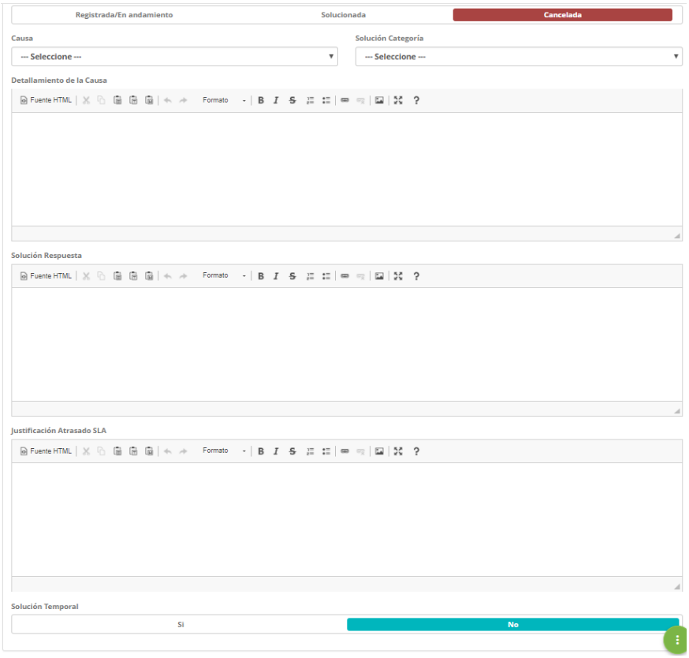
    
    **Figura 31 - Registro de la cancelación del ticket**

    -   Cambie la situación del ticket a "Cancelada", simplemente haga clic en la
    situación para cambiar;

    -   En el campo **Solución Respuesta**, describa el por qué de estar cancelando
    el ticket.

4.  Después del registro de la información de la cancelación del ticket, haga
    clic en el botón de opciones  y luego haga clic en el botón  para grabar y avanzar el flujo, donde el ticket será cancelado. Pero si desea grabar sólo la información registrada sobre la cancelación del ticket y mantener la tarea actual, haga clic en el botón .

Dirección del ticket
--------------------

### Condiciones previas

1.  Tener permiso para ejecutar el ticket (ver conocimiento [Registro y consulta
    de grupo][3]).

### Dirección del ticket para la atención

1.  Se mostrará la pantalla de **Gestión de Ticket**. Consulte el ticket
    deseado, presione sobre el mismo y luego haga clic en el icono ;

2.  Se mostrará la pantalla de registro del ticket con los campos completados,
    con el contenido referente al ticket seleccionado;

3.  En el campo **Direccionar para grupo**, seleccione el grupo para el cual se
    asignará el ticket para realizar la atención del mismo;

4.  Haga clic en el botón de opciones  y luego haga clic en el botón  para grabar y avanzar el flujo,donde el ticket será encaminado a la fase de atención. Pero
    si desea grabar sólo la información registrada sobre la validación del ticket y mantener la tarea actual, haga clic en el botón .

Delegación del ticket
---------------------

### Condiciones previas

1.  Tener permiso para delegar el ticket (ver conocimiento [Registro y consulta
    de grupo][3]);

2.  Para que esta opción sea visible es necesario su configuración en el flujo
    vinculado (ver conocimiento [Mantenimiento del flujo de trabajo][15], sección
    Implementando la funcionalidad delegar em el flujo sobre la actividad).

### Delegando un ticket

1.  Consulte el ticket que delegará, haga clic sobre el y luego haga clic en el
    icono de "opciones" y en Delegar, como se indica en la figura siguiente:

    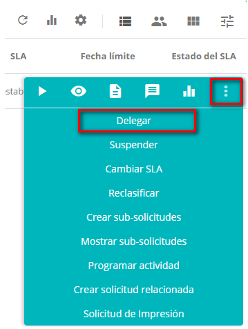
    
    **Figura 32 - Delegar el ticket**

2.  Se mostrará la pantalla de asignación, como se muestra en la figura
    siguiente:

    
    
    **Figura 33 - Pantalla de asignación**

3.  Informe al grupo o al usuario que desea delegar el ticket;

4.  Describa la justificación de la delegación del ticket.

    !!! info "IMPORTANTE"

        En el campo "Asignar al grupo", sólo estarán disponibles los grupos en
        los que pertenece. En el campo donde se informa al usuario, sólo estarán
        disponibles los miembros de los grupos en que pertenece.

5.  Después de informar los datos, haga clic en el botón *Grabar*. Hecho esto,
    aparecerá un mensaje preguntando a la delegación de la tarea, simplemente
    haga clic en *OK* para realizar la operación;

6.  El registro del ticket será actualizado, mostrando el nombre del grupo o
    usuario, al que se delegó el ticket, de acuerdo con el ejemplo ilustrado en
    la figura siguiente:

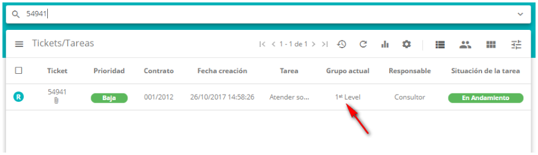

**Figura 34 - Ticket delegada**

Suspensión del ticket
---------------------

### Condiciones previas

1.  Tener permiso para suspender la solicitud de servicio (ver
    conocimiento [Registro y consulta de grupo][3]);

2.  Tener la justificación de suspensión de solicitud registrada (ver
    conocimiento [Registro y consulta de justificación de solicitud][28]).

### Suspendiendo el ticket

1.  Consulte el ticket que va a suspender, haga clic en el mismo y luego haga
    clic en el icono de "Opciones" y en *Suspender*, como se indica en la figura
    siguiente:

     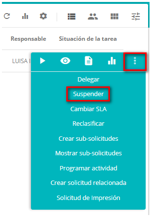
     
     **Figura 35 - Suspendiendo ticket**

2.  Se mostrará la pantalla de registro de la justificación de la suspensión del
    ticket;

    
    
    **Figura 36 - Registro de la justificación de la suspensión del ticket**

    -   **Justificación**: seleccione la justificación de suspensión del ticket;

    -   **Complemento de la justificación**: describa el complemento de la
    justificación seleccionada, si es necesario.

3.  Después de los datos informados, haga clic en el botón *Grabar* para
    realizar la operación, donde la fecha, hora y usuario serán grabados
    automáticamente para una futura auditoría;

4.  Después de la suspensión del ticket, el mismo será actualizado, cambiando la
    situación a "Suspendida", como ejemplo ilustrado en la figura abajo:

**Figura 37 - Ticket suspendida**

Suspensión y reactivación de múltiples tickets
----------------------------------------------

### Condiciones previas

1.  Tener permiso para realizar la suspensión y reactivación de múltiples
    tickets (ver conocimiento [Registro y consulta de grupo][3]);

2.  Tener el contrato registrado (ver conocimiento [Registro y consulta de
    contrato][5]);

3.  Tener el colaborador registrado (ver conocimiento [Registro y consulta de
    colaborador][4]);

4.  Tener el grupo registrado (ver conocimiento [Registro y consulta de grupo][3]);

5.  Tener la justificación de ticket registrada (ver conocimiento [Registro y
    consulta de justificación de solicitud][28]).

### Suspendiendo múltiples tickets

1.  Se mostrará la pantalla de Gestión de Ticket;

2.  Haga clic en el icono   y en *Suspensión/Reactivación*, como se indica en la
    figura siguiente:

    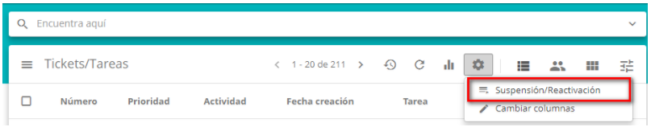
    
    **Figura 38 - Suspensión de tickets**

3.  Se mostrará la pantalla de **Suspensión de Múltiples Tickets**, como se
    muestra en la figura siguiente:

    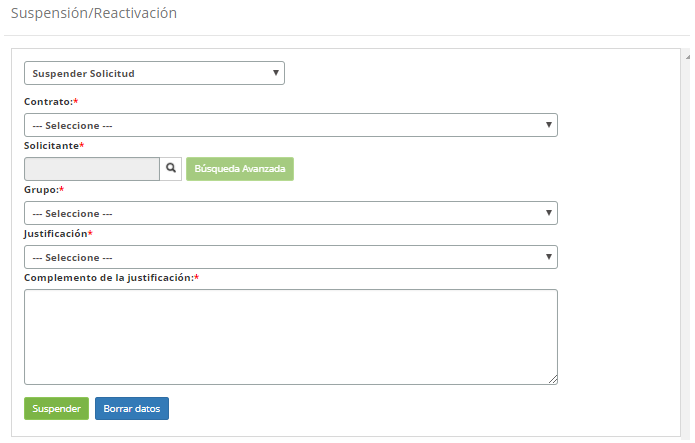
    
    **Figura 39 - Pantalla de suspensión de múltiples tickets**

4.  Todos los campos de esta pantalla en realidad son filtros, es decir, el
    usuario que va a suspender en masa filtra:

-   **Contrato**: seleccione el contrato (el sistema filtra por los contratos
    que el usuario registrado tiene permiso de acceso), en el cual se realizará
    la suspensión de los tickets;

-   **Solicitante**: informe al responsable de solicitar la suspensión de los
    tickets (este campo filtra los tickets que el solicitante está). Simplemente
    haga clic dentro del cuadro de texto e introduzca las iniciales del nombre
    del solicitante que se hará la consulta de los usuarios vinculados al
    contrato seleccionado. Otra forma de consulta es utilizar el botón *Búsqueda
    Avanzada*, que presentará una pantalla de consulta, donde podrá informar los
    datos necesarios para su consulta y después de informarlos, hacer clic
    en *Consultar* y seleccionar el colaborador, responsable de la suspensión de
    los tickets;

-   **Grupo**: seleccione el grupo responsable de la atención de los tickets que
    se suspenden. En este campo, sólo estarán disponibles los grupos de Service
    Desk activos a los que pertenece el solicitante.

    !!! warning "ATENCIÓN"

        Al registrar el grupo del cual el usuario es miembro (a través de la
        función Acceso y Permiso > Grupo), en el campo "Suspensión/Reactivación"
        seleccione el valor "No". El hecho de que el usuario seleccione "No" para
        este campo Suspensión/Reactivación de la pantalla de registro de grupo no
        influye en la aparición del botón "Suspensión/Reactivación" de la pantalla
        de ticket.

    -   **Justificación**: seleccione una justificación de la suspensión de los
    tickets;

    -   **Complemento de la justificación**: describa el complemento de la
    justificación seleccionada.

!!! warning "ATENCIÓN"

    El usuario registrado siempre es colocado como responsable de la suspeción
    o de la reactivación de los tickets.

5.  Después de los datos informados, haga clic en el botón *Suspender* para
    efectuar la operación, donde todas las solicitudes "en curso" del grupo
    ejecutor seleccionado serán suspendidas.

Reactivando múltiples tickets/tareas suspensas
----------------------------------------------

1.  En la pantalla de Gestión de Ticket, haga clic en el icono   y
    en *Suspensión/Reactivación*, como se indica en la figura siguiente:

    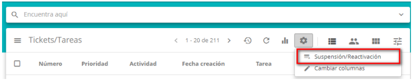
    
    **Figura 40 - Reactivación de tickets**

2.  Se mostrará la pantalla de **Suspensión/Reactivación de Múltiples Tickets**.
    Seleccione la opción "Reactivar Solicitud". Hecho esto, aparecerá la
    pantalla para reactivación de los tickets, como se muestra en la figura
    siguiente:

    
    
    **Figura 41 - Pantalla de reactivación de tickets suspendidos**

    -   **Contrato**: seleccione el contrato, en el cual se realizará la
    reactivación de los tickets suspendidos;

    -   **Solicitante**: informe el responsable de solicitar la reactivación de los
    tickets suspendidos. Simplemente haga clic dentro del cuadro de texto e
    introduzca las iniciales del nombre del solicitante que se hará la consulta
    de los usuarios vinculados al contrato seleccionado. Otra forma de consulta
    es utilizar el botón *Consulta Avanzada*, que presentará una pantalla de
    consulta, donde podrá informar los datos necesarios para su consulta y
    después de informarlos, hacer clic en *Consultar* y seleccionar el
    colaborador, responsable de la reactivación de los tickets suspendidos;

    -   **Grupo**: seleccione el grupo responsable de la atención de los tickets que
    están suspendidos. En este campo sólo estarán disponibles los grupos de
    Service Desk activos a los que pertenece el solicitante.

3.  Después de los datos informados, haga clic en el botón *Reactivar*, para
    efectuar la operación, donde todos los tickets del grupo ejecutor
    seleccionado que están suspendidos serán reactivados.

Reactivación de un ticket suspendido
------------------------------------

### Condiciones previas

1.  Tenga permiso para volver a habilitar el ticket suspendido (ver
    conocimiento [Registro y consulta de grupo][3]).

### Reactivando el ticket

1.  Se mostrará la pantalla de **Gestión de Ticket**;

2.  Consulte el ticket suspendido que se reactivará, haga clic en el mismo y
    luego haga clic en el icono de "opciones" y, a continuación, haga clic
    en *Reactivar*, como se muestra en la siguiente figura:

    
    
    **Figura 42 - Reactivación del ticket**

3.  Se mostrará un mensaje para confirmar la reactivación del ticket,
    simplemente haga clic en *Confirmar* para efectuar la operación.

Cambiando el SLA del ticket
---------------------------

### Condiciones previas

1.  Tener permiso para cambiar el SLA de lo ticket (ver conocimiento [Registro y
    consulta de grupo][3]);

2.  Tener la justificación de ticket registrada (ver conocimiento [Registro y
    consulta de justificación de solicitud][28]).

### Alterando la SLA

1.  Consulte el ticket que modificará el tiempo de atención, haga clic en el
    mismo y luego haga clic en el icono de opciones y en el *Cambiar SLA*, como
    se indica en la siguiente figura:

    
    
    **Figura 43 - Cambio de tiempo de atención**

2.  Se mostrará la pantalla para modificar el tiempo de respuesta del
    determinado ticket, como se muestra en la figura siguiente:

    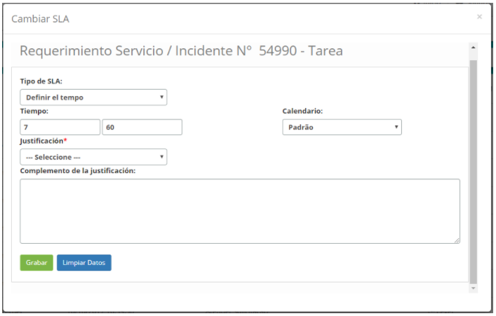
    
    **Figura 44 - Cambio de SLA del ticket**

    -   **Tipo de SLA**: establezca el tipo de acuerdo de nivel de servicio;

    -   **Tiempo**: defina la cantidad de horas que tardará en contestar el ticket;

    -   **Calendario**: informe el calendario que seguirá para contabilizar el
    tiempo de atención;

    -   **Justificación**: seleccione la justificación referente al cambio del
    tiempo de atención del ticket;

    -   **Complemento de la justificación**: describa los detalles de la
    justificación seleccionada, si es necesario.

3.  Después de los datos informados, haga clic en el botón *Grabar* para
    efectuar la operación, donde la fecha, hora y usuario serán grabados
    automáticamente para una futura auditoría.

Reclasificación del ticket
--------------------------

### Condiciones previas

1.  Pertenecer al grupo ejecutor del ticket;

2.  Tener permiso para "crear" en el flujo de la actividad de destino cuando la
    reclasificación incluye el cambio de la actividad y si es un escenario de
    flujos diferentes. En este mismo escenario, para mantener al responsable
    debe tener permiso para "ejecutar" en el flujo de la actividad de destino;

3.  No se permite delegar al ticket a un colaborador si su situación
    es **Resuelta**.

### Reclasificación del ticket

1.  Consulte el ticket que va a reclasificar, haga clic en el mismo y luego haga
    clic en el icono de opciones y en *Reclasificar*, como se indica en la
    figura siguiente:

    
    
    **Figura 45 - Reclasificar ticket**

1.  Se mostrará la pantalla de registro del determinado ticket;

2.  Reclasifique la información del servicio. Después de eso, haga clic en el
    botón de opciones  y luego haga clic en el botón de grabación  . Hecho esto, la solicitud será reclasificada.

!!! warning "ATENCIÓN"

     Después de efectuar la modificación de la información del ticket
     (incidente), se enviará un e-mail al solicitante notificando el cambio. Si
     este cambio es en la descripción del ticket, se mostrará en el correo
     electrónico de notificación (en destaque) el cambio en la descripción.
     Recordar que este correo electrónico de notificación sólo se enviará si ha
     habilitado el envío del mismo en el parámetro "231 - Habilitar el envío de
     correo electrónico cuando se edita un incidente (S o N - Default:
     S)". La reclasificación incluye una delegación implícita para el Grupo o
     el Asunto de destino, en versiones anteriores, el usuario tenía que:
     reclasificar, capturar la actividad y delegar a otro grupo.

Creación y visualización de sub-solicitud
-----------------------------------------

### Condiciones previas

1.  Tener permiso para registrar el ticket (ver conocimiento [Registro y
    consulta de grupo][3]);

2.  Tener el colaborador registrado (ver conocimiento [Registro y consulta de
    colaborador][4]);

3.  Tener la unidad registrada (ver conocimiento [Registro y consulta de
    unidad][6]).

### Creando la sub-solicitud

1.  Consulte el ticket del que creará un sub-ticket, haga clic en el mismo y
    luego haga clic en el icono de "opciones" y en *Crear sub-solicitudes*, como
    se indica en la figura siguiente:

    
    
    **Figura 46 - Crear sub-ticket**

2.  Se mostrará la pantalla de Creación de Sub-solicitud, como se presenta en la
    figura siguiente:

    
    
    **Figura 47 - Registro de sub-ticket**

3.  Complete los campos con la información del solicitante:

    -   **Solicitante**: informe el nombre del solicitante, es decir, el nombre de
    la persona que está solicitando el servicio referente al ticket;

    !!! info "IMPORTANTE"

        Si el solicitante ya tiene los datos personales (teléfono, e-mail y/o
        unidad) registrados en el sistema, después de informarle, los campos
        referentes a los datos serán completados con la respectiva información.

    -   **Teléfono**: informe el teléfono del solicitante de contacto;

    -   **E-mail**: informe el e-mail del solicitante para contacto;

    -   **Origen Contacto**: informe el origen del contacto para el registro del
    sub-ticket;

    -   **Unidad**: informe a la unidad del solicitante;

    -   **Ubicación física**: informe la ubicación del solicitante;

    -   **Otras informaciones**: describa las observaciones sobre el solicitante, si
    lo considera necesario.

    -   **Direccionar para grupo**: informe qué grupo desea dirigir el sub-ticket.

4.  Después de los datos informados, haga clic en el botón *Grabar* para
    realizar la operación, donde la fecha, hora y usuario serán grabados
    automáticamente para una futura auditoría.

### Visualizando sub-solicitudes

1.  Consulte el ticket que verá el sub-ticket, haga clic sobre el mismo y luego
    haga clic en el icono de "opciones" y en *Mostrar sub-solicitudes*, como se
    indica en la figura siguiente:

    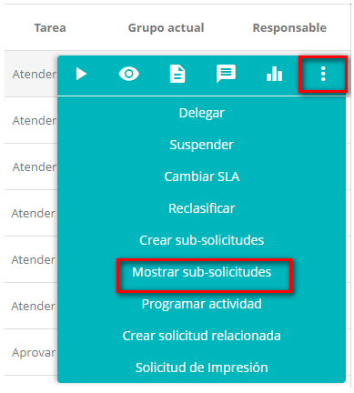
    
    **Figura 48 - Visualizar sub-ticket**

2.  Se mostrará una pantalla contenido de los sub-tickets, como el ejemplo
    ilustrado en la figura abajo:

**Figura 49 - Sub-ticket**

Agenda de actividad de ticket
-----------------------------

### Condiciones previas

1.  Tener los grupos de actividad periódica registrados para programar las
    actividades del ticket (ver conocimiento [Registro y consulta del grupo de
    actividad periódica][29]).

### Agendando actividad

1.  Consulte el ticket que desea programar una actividad, haga clic en el mismo
    y luego haga clic en el icono de opciones y en *Programar Actividad*, como
    se indica en la figura siguiente:

    
    
    **Figura 50 - Programar actividad referente al ticket**

2.  Se mostrará la pantalla de programación de actividades, haga clic en la
    pestaña *Programar actividad* y llene los campos, como se indica a
    continuación;

    
    
    **Figura 51 - Programación de actividades**

   -   **Grupo de Actividades (para el agendamiento)**: seleccione el grupo que
    será responsable de ejecutar la actividad;

   -   **Orientación Técnica**: describa la orientación técnica necesaria para la
    ejecución de la actividad;

   -   **Agendar para**: informe la fecha y hora, período en que se programará la
    actividad para su ejecución;

   -   **Duración estimada**: informe la duración estimada en minutos, es decir, el
    tiempo que llevará para realizar la actividad.

3.  Después de los datos informados, haga clic en el botón *Grabar* para
    efectuar la operación, donde la fecha, hora y usuario serán grabados
    automáticamente para una futura auditoría.

!!! info "IMPORTANTE"

    Las actividades que se han programado pueden ser visualizadas en la Agenda
    de Actividades. Para acceder a la agenda, haga clic en Agenda, ubicada en el
    menú de la pantalla de Gestión de Tickets o en el menú principal, Gestión
    integrada > La automatización de las operaciones de TI > Agenda Activ.
    periódico.

Registro y vinculación de ticket relacionado
--------------------------------------------

### Condiciones previas

1.  Tener permiso para registrar el ticket (ver conocimiento [Registro y
    consulta de grupo][3]);

2.  Tener el colaborador registrado (ver conocimiento [Registro y consulta de
    colaborador][4]);

3.  Tener el contrato registrado (ver conocimiento [Registro y consulta de
    contrato][5]);

4.  Tener la unidad registrada (ver conocimiento [Registro y consulta de
    unidad][6]);

5.  Tener el grupo vinculado al contrato (ver conocimiento [¿Cómo relacionar el
    grupo al contrato?][7]);

6.  Tener la unidad vinculada al contrato (ver conocimiento [¿Cómo relacionar la
    unidad al contrato?][8]);

7.  Tener el portafolio con el servicio y las actividades de solicitud e
    incidente registrados (ver conocimientos [Registro del portafolio de
    servicios][9], [Registro de servicios][10], [Configuración de los atributos de
    servicio][11]);

8.  Tener el tiempo de atención de las actividades de solicitud e incidente
    definidas (ver conocimiento [Registro y consulta del tiempo de atención][12]);

9.  Tener el contrato vinculado al servicio (ver conocimiento [Configuración de
    los atributos de servicio][11]);

10. Tener las actividades de solicitud e incidente vinculadas al contrato del
    servicio (ver conocimiento [Configuraciones de los atributos del contrato
    del servicio][13]);

11. Introduzca el contenido debajo del parámetro (ver conocimiento [Reglas de
    parametrización - sistema][30]):

-   Parámetro 385: con el valor "S".

!!! note "NOTA"

    En la funcionalidad hay dos formas de registrar un ticket. Mientras que una
    forma permite un registro más completo, con el llenado de campos más
    detallados dentro del propio ticket (más información en la siguiente
    sección). La otra permite un registro más superficial a través de un atajo
    que se localiza fuera del ticket (explicado en la sección Creando el ticket
    relacionado por el atajo).

### Vinculación de ticket relacionados

1.  Consulte el ticket deseado, presione sobre el mismo y luego haga clic en el
    icono ;

2.  Se mostrará la pantalla de registro del determinado ticket. Haga clic en el
    botón de menú  a continuación, haga clic en **Solicitudes relacionadas**;

3.  Se mostrará la pantalla de **Solicitudes relacionadas**, como se muestra en
    la figura siguiente:

    
    
    **Figura 52 - Pantalla de solicitudes relacionadas**

4.  Al hacer clic en el botón *Crear nueva solicitud relacionada*, aparecerá la
    pantalla de registro de ticket relacionado, como se muestra en la siguiente
    figura:

    
    
    **Figura 53 - Pantalla de registro de ticket relacionado**

5.  Complete los campos con la información necesaria y haga clic en el
    botón *Grabar* para registrar.

    !!! warning "ATENCIÓN"

        El llenado de las respuestas de cualquier cuestionario previamente
        registrado sólo puede ser respondido en esta pantalla pues la misma proporciona
        un registro de ticket más amplio.

6.  Al seleccionar el botón *Crear solicitud relacionada por copia*, se
    reutilizan los campos descritos en la solicitud principal (padre).

   !!! warning "ATENCIÓN"

     El botón Crear solicitud relacionada por copia sólo estará disponible si se
     activa el parámetro 385.

   -   Se completan automáticamente los campos Solicitante (debidamente con sus
    acciones automáticas de extensión, teléfono y unidad) y Descripción;

   -   Se rellena de forma automática también las fichas: Adjuntos, Ítems de
    Configuración y Base conocimiento.

   !!! info "INFORMACIÓN"

     La información introducida de forma automática viene de la solicitud
     considerada como padre, es decir, de la solicitud que posibilitó el origen
     de la solicitud relacionada.

-   Informe la actividad y si la misma tiene un cuestionario, el sistema pondrá
    a disposición del cuestionario para la respuesta;

-   Haga clic en el botón *Grabar* y luego el número de ticket abierta estará
    disponible.

### Criando el ticket relacionado por el atajo

1.  Consulte el ticket que a partir de él registrará un ticket relacionado, haga
    clic sobre el mismo y luego haga clic en el icono de "opciones" y en *Crear
    solicitud relacionada*, como se indica en la figura siguiente:

    
    
    **Figura 54 - Crear ticket relacionado**

2.  Se mostrará la Pantalla de Registro de Solicitud Relacionada, como se
    muestra en la figura siguiente:

    
    
    **Figura 55 - Registro de ticket relacionada**

3.  Complete los campos según la siguiente orientación:

    -   **Solicitante:** informe el nombre del solicitante, es decir, el nombre de
    la persona que está solicitando la apertura de incidente o solicitud de
    servicio;

        -    : al hacer clic en el icono, permite vincular el ticket relacionado al
        usuario conectado ;

        -   : al hacer clic en el icono, permite vincular el ticket relacionado al
        responsable del ticket principal.

    !!! note "NOTA"

        Si el solicitante ya tiene los datos personales (teléfono, extensión,
        e-mail y/o unidad) registrados en el sistema, después de informarle, los
        campos referentes a los datos serán llenados con la respectiva
        información.

    -   **Teléfone**: introduzca el número de teléfono del solicitante;

    -   **E-mail**: informe el e-mail del solicitante;

    -   **Origen Contacto**: informe el origen del contacto del ticket;

    -   **Catálogo**: seleccione el catálogo de servicios;

    -   **Servicio**: informe al servicio del catálogo de servicios. Si el catálogo
    de servicios es "**Negocio**", se pondrán a disposición en este campo los
    servicios de negocio para selección, pero si el catálogo de servicios es
    "**Técnico**", estarán disponibles en este campo los servicios de
    apoyo/técnico para selección;

    -   **Categoría**: informe la categoría de servicio para facilitar la consulta
    de la actividad (solicitud/incidente);

    -   **Tipo**: seleccione el tipo de ticket, si es incidente o solicitud;

        -   **Incidente**: si la situación presentada es una interrupción no
            planificada, una reducción en la calidad del servicio o el fallo de
            algún ítem de configuración que aún no haya impactado en un servicio de
            TI. Ej: El vínculo de red está fuera alcance, la red está lenta, el
            servidor inaccesible, etc.

        -   **Solicitud**: se refiere a las solicitudes de demandas realizadas por
            los usuarios dentro del ambiente de la Tecnología de la Información.
            Pueden ser desde solicitudes de acceso hasta sugerencias de mejora a
            bajo costo. Ejemplo: solicitud de acceso a la red para un nuevo usuario,
            solicitud de configuración de algún equipo, solicitud para agregar algún
            software en la estación de trabajo, etc.

    -   **Actividad (Solicitud/Incidente)**: informe la actividad que se realizará
    referente al tipo de ticket;

    -   **SLA**: después de informar la actividad (solicitud/incidente) se
    establecerá el tiempo de atención de la misma;

    -   **Contrato**: después de informar la actividad (solicitud/incidente), se
    exhibirá el contrato para el cual se hará la apertura de incidente o
    solicitud de servicio;

    -   **Unidad**: informe a la unidad del solicitante;

    -   **Impacto**: después de informar la actividad (solicitud/incidente), se
    mostrará la información del impacto al negocio;

    -   **Urgencia**: después de informar la actividad (solicitud/incidente), se
    mostrará la información de la urgencia, la cual indica la velocidad que
    actividad del servicio necesita ser realizada;

    -   **Título**: informe el título del ticket;

    -   **Descripción**: informe la descripción del ticket. La descripción debe ser
    objetiva, incluyendo toda la información necesaria para la atención de la
    misma;

    -   **Direccionar para grupo**: permite elegir un grupo, vinculado al ticket,
    para que la solicitud relacionada sea dirigida;

    -   Caso desee vincular un ítem de configuración, haga clic en el botón *Buscar
    en el Artículo*, realice la consulta y seleccione el IC;

    -   **Situación**: seleccione la opción que se ajusta al estado actual del
    ticket: Registrada/En andamiento, Solucionada y Cancelada.

4.  Después de los datos informados, haga clic en el botón *Grabar y mantener la
    tarea actual*. Después de eso, el ticket relacionado será creado con éxito,
    siendo presentado en el mismo un icono que representa el ticket principal,
    como ejemplo ilustrado en la figura siguiente;

    !!! info "IMPORTANTE"

        El ticket tarea relacionado se dirigirá al grupo ejecutor definido en el
        registro del vínculo de la actividad de solicitud/incidente al contrato del
        servicio. Pero si no se define el grupo ejecutor en el registro del vínculo
        de la actividad, el mismo será dirigido al grupo ejecutor definido en el
        parámetro "9 - ID Grupo Nivel 1".

    
    
    **Figura 56- ticket relacionado**

5.  Para ver el ticket principal (ticket de origen), basta con hacer clic en el
    icono  .

!!! info "IMPORTANTE"

     El sistema enviará correos electrónicos de notificación acerca de la
     creación, escalonamiento, captura, cierre y demás cambios de los tickets
     relacionados para el grupo ejecutor del ticket principal.

Impresión del ticket
--------------------

1.  Consulte el ticket que va a imprimir, haga clic en el mismo y luego haga
    clic en el icono de "opciones" y en la *Solicitud de Impresión*, como se
    indica en la figura siguiente:

    
    
    **Figura 57 - Imprimir el ticket**

2.  Se generará la impresión del registro del determinado ticket.

!!! info "IMPORTANTE"

    Para ver la impresión es necesario deshabilitar el pop-up del navegador para
    el producto.

Cuadro Kanban
-------------

Esta opción tiene por objetivo auxiliar gestores en el seguimiento detallado de
sus filas de atención de tickets/tareas, haciendo uso de la técnica de gestión
llamada de Kanban. Según el sitio [Significados][31], Kanban es el uso de tarjetas
(post-it y otros) para indicar el progreso de los flujos de producción en
empresas de fabricación en serie.

En estas tarjetas se colocan indicaciones sobre una determinada tarea, por
ejemplo, "para ejecutar"/"en ejecución"/"hecho", y siempre que el flujo avanza
su posicionamiento cambia a la derecha en el cuadro.

Esta técnica forma parte de la estrategia común de la administración llamada
"Gestión a la vista" que prima por la transparencia del avance de los trabajos
para todo el equipo.

### Condiciones previas

1.  Tener un ticket registrado.

2.  Dar permiso para el Perfil de Acceso deseado (ver conocimiento [Permiso de
    acceso de Gestión de Tickets][1]).

### Explicando el cuadro Kanban

1.  El cuadro Kanban recupera los tickets de cada colaborador (usuario) que
    componen el grupo seleccionado. Estos tickets se agrupan por un colaborador
    en una forma gráfica, didáctica y dinámica;

2.  La información está estructurada con vistas, filtros, subtítulos y rayas que
    agrupan los tickets de cada asistente;

3.  Haga clic en el icono  . Se mostrará la pantalla principal de la
    funcionalidad en modo de visualización "cuadro Kaban", como se muestra en la
    figura siguiente:

    
    
    **Figura 58 - Cuadro Kanban**

-   **1**: Modos de visualización - elegir entre :  (muestra todos los campos
    ticket) y  (oculta la mayor parte de estos detalles)

-   **2**: Grupo (asistentes) - seleccione el grupo de asistentes (usuarios) que
    desea acompañar

-   **3**: Subtítulos - conjunto didáctico de subtítulos sobre: Tipo, Prioridad,
    Situación y Estado del Tiempo de Atención

-   **4**: Responsable - leyenda específica sobre responsables de los tickets,
    indicando el nombre de las personas que están en el Grupo seleccionado

   !!! info "INFORMACIÓN"

      Para asignar el ticket a un responsable basta con usar el puntero haciendo
      clic y arrastrando (simulando el concepto del cambio de un post-it en un
      marco real fijado en la pared).

### Ticket (modo detallado)

**Figura 59 - Detalles**

-   **1: Responsable** -  indica para qué trabajador se ha asignado

-   **2: Cantidad** - contabiliza los tickets asignados al operador

-   **3: ID** - identificador único

-   **4: Tipo** - indica si es una solicitud o un incidente

-   **5: Prioridad** - indica el nivel de urgencia (Baja, Media o Alta)

-   **6: Estado de la SLA** - indica la situación en relación a su plazo de
    solución (En el plazo, A vencer, Vencida).

-   **7: Solicitante** - es quien pidió la ejecución

-   **8: Servicio** - indica el tipo de servicio vinculado

-   **9: Actividad** - indica el tipo de actividad vinculada

-   **10**: Límite indica la fecha y la hora límite de finalización

-   **11**: Situación indica la etapa general del ticket (En respuesta,
    Resuelta, etc.)

-   **12**: Haga clic para mostrar un resumen de los datos del ticket

-   **13**: Haga clic para mostrar los archivos adjuntos

-   **14**: Haga clic para mostrar los ítems de configuración vinculados

-   **15**: Indica que la solicitud tiene otras tareas relacionadas (solicitud
    hijo)

-   **16**: Permite al usuario capturar y ser responsable de la solicitud.

-   **17**: Muestra la solicitud inicial (solicitud padre)

-   **18**: Haga clic para cambiar la vista a compacto

Auditoría del ticket
--------------------

### Cómo acceder

1.  En la pantalla de **Gestión de Ticket**, haga clic en el botón de menú  y
    después de eso, haga clic en el ítem de *Auditoría*.

**Figura 60 - Opción de auditoría de ticket**

### Filtros

1.  Los siguientes filtros posibilitan al usuario restringir la participación de
    ítems en el listado default de la funcionalidad, facilitando la localización
    de los ítems deseados:

   -   Número;

   -   Fecha de inicio;

   -   Fecha de finalización.

   
   
   **Figura 61- Pantalla de auditoría de ticket**

2.  Después de realizar la encuesta, clic en el icono 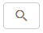 para definir los filtros
    necesarios para comprobar el historial de las instancias del ticket para la
    auditoría.

### Listado de ítems

1.  El(Los) siguiente (s) campo (s) de registro está (n) disponible (s) para facilitar al usuario la identificación de los elementos deseados en el listado default de la funcionalidad: **Descripción**, **Registradopor**, **Fecha**/**Hora**, **Origen**, **Contrato**, **Servicio**, **Situación**, **Responsable**, **SLA** y **Descripción**.

**Figura 62 - Pantalla de auditoría de ticket**

### Realizando auditoría del ticket

1.  En la pantalla de **Gestión de Ticket**, informe los filtros según su
    necesidad y haga clic en el icono de consulta para efectuar la operación.
    Después de eso, serán presentados los datos del ticket para auditoría.

Consulta avanzada
-----------------

### Cómo acceder

1.  En la pantalla de **Gestión de Tickets**, haga clic en el botón de menú , a
    continuación, haga clic en el ítem de *Búsqueda Avanzada*.

### Condiciones previas

1.  Posee llamados abiertos, en cualquier situación.

2.  Informe los contenidos abajo en los parámetros (ver conocimiento [Reglas de
    parametrización - ticket][24]):

    -   Parámetro 40;

    -   Parámetro 41;

    -   Parámetro 260: default 1-Lista sin restricción;

    -   Parámetro 261;

    -   Parámetro 343: default: "S";

3.  Configurar el parámetro 378 (ver conocimiento [Reglas de parametrización -
    sistema][30]).

!!! note "NOTA"

    Si el usuario indica el valor de 0 (cero), el sistema siempre se
    descargará en segundo plano. Si el usuario deja el campo en blanco, el
    sistema limita la descarga en segundo plano a cinco mil registros. Si el
    usuario coloca valor superior o inferior a cinco mil registros el sistema
    considera el valor informado por el usuario.

### Filtros

1.  Los siguientes filtros posibilitan al usuario restringir la participación de
    ítems en el listado default de la funcionalidad, facilitando la localización
    de los ítems deseados:

    -   **Fecha de apertura**: informar el período que desea comprobar los registros
    de ticket;

    -   **Fecha cierre**: informar el período de cierre del ticket para verificar
    los tickets que se cerraron en un período determinado;

    -   **Número**: indicar el número de identificación del ticket, si desea
    verificar un ticket específico;

    -   **Ordenación**: definir el orden en que se presentarán los tickets;

    -   **Contrato**: informar el contrato para verificar los tickets relacionados
    al mismo;

    -   **Catálogo**: informar el tipo de catálogo de servicios para verificar los
    tickets referentes;

    -   **Servicio/Servicio de Apoyo**: informar al servicio si desea verificar los
    tickets referentes al mismo;

    -   **Tipo de solicitación**: informar el tipo de ticket para verificación de
    los tickets;

    -   **Actividad (Solicitud/Incidente)**: informar al servicio si desea verificar
    los tickets referentes al mismo;

    -   **Considerar la Jerarquía**: marcar este campo si desea considerar la
    jerarquía del servicio;

    -   **Ítem de Configuración**: informar el ítem de configuración para verificar
    los tickets relacionados al mismo;

    -   **Situación**: informar la situación para verificar los tickets referentes;

    -   **Prioridad**: informar la prioridad para verificar los tickets referentes;

    -   **Grupo ejecutor/solucionador**: informar al grupo ejecutor para verificar
    los tickets que fueron dirigidos al mismo;

    -   **Fase**: informar la fase del ticket para verificar los tickets que se
    encuentran en la determinada fase;

    -   **Origen**: informar el origen del contacto del ticket para verificar los
    tickets relacionados;

    -   **Unidad**: informar la unidad deseada para verificar los tickets
    relacionados a la misma;

    !!! note "NOTA"

        En caso de que el parámetro "61 - Vincula contratos a unidad" esté
        habilitado, sólo estarán disponibles las unidades vinculadas al contrato al
        que tiene vínculo con los grupos en que pertenece.

    -   **Localidad**: informar a la localidad para verificar los tickets
    relacionados al mismo;

    -   **Palabra-clave**: informar la palabra clave para verificar los tickets
    relacionados con el mismo;

    -   **Solicitante**: informar al solicitante de servicios para verificar sus
    tickets;

    -   **Creada por**: informar al responsable que hizo el registro de ticket para
    verificar los tickets que fueron registrados por el mismo;

    -   **Responsable Actual**: informar al responsable de la atención del ticket
    para los tickets que fueron atendidos por el mismo;

    -   **¿Exhibir espacio de descripción en informe?**: marque este campo si desea
    que el contenido del campo "Descripción" del ticket aparezca en el informe;

    !!! info "IMPORTANTE"

        La eficacia de la investigación depende del seguimiento de algunas reglas de
        permiso por el filtro, tales como: ejecución, delegación, seguimiento,
        visualización, grupos de usuarios, vínculo con contrato, unidades y
        colaborador conectado .

    
    
    **Figura 63 - Consulta avanzada de tickets**

2.  Después de definir los filtros, haga clic en el botón *Consultar*. Hecho
    esto, se enumerarán los tickets, según los filtros elegidos.

3.  Realizada la consulta, elija uno de los formatos de archivo (PDF, XLS y CSV)
    para generar el informe. Después de elegir el formato, el sistema verificará
    el parámetro 261 y encontrar registro mayor que la cantidad permitida, el
    mensaje siguiente aparecerá:

    -   "La cantidad de registros encontrados supera la cantidad máxima permitida de
    visualización. Por favor, restablecer los filtros de consulta."

4.  Sin embargo, si la cantidad de registro devuelta de la consulta es menor que
    el limitado en el parámetro 261, entonces el sistema verifica la
    configuración del parámetro 378;

5.  Se verifica la cantidad de registros para generar el informe en segundo
    plano, si la cantidad es mayor que la cantidad parametrizada, el sistema
    muestra el siguiente mensaje:

    -   "El informe se está procesando. Una notificación se le enviará cuando esté
    listo."

6.  Si el archivo a ser generado es muy extenso, el sistema disparará una
    notificación en la pantalla principal, informando que la descarga del mismo
    está finalizando. Al finalizar, haga clic en el botón *Ver* y acceda al
    informe a través del enlace disponible.

7.  El sistema devuelve la cantidad de llamados encontrados arriba de la
    presentación de la consulta.

### Listado de itens

1.  El(Los) siguiente (s) campo (s) de registro está (n) disponible (s) para
    facilitar al usuario la identificación de los elementos deseados en el
    listado default de la funcionalidad: **ID, Servicio, Actividad
    (Solicitud/Incidente) Tipo, Solicitante, Creador, Fecha/hora apertura,
    Servicio de hora, Descripción, Solución/respuesta , Situación, Fecha/Hora
    límite Grupo, Fecha/hora encerramiento, Tiempo restante **y** Responsable
    actual**.

    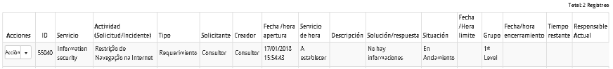
    
    **Figura 64 - Pantalla de lista de tickets**

2.  En cada ítem presentado en el resultado es posible realizar las siguientes
    acciones:

   -   Ver registro del ticket principal y volver a abrir, simplemente haga clic en
    el botón de *Acciones* y luego en *Reabrir Ticket*;

   -   Para consultar el historial del ticket (ocurrencias), basta con hacer clic
    en el botón de *Acciones* y luego en *Consultar histórico de el Ticket*;

   -   Para ver el registro del ticket, basta con hacer clic en el botón
    de *Acciones* y luego en *Ver Ticket*;

   -   Para ver los datos adjuntos del ticket, simplemente haga clic en el
    botón *Acciones* y, a continuación, en *Visualizar adjuntos*.

### Generación y exportación del resultado de la consulta avanzada

1.  Si desea generar un informe con información *resumida* de la encuesta que se
    realizó:

    -   haga clic en el botón *Generar PDF* para generar el informe en formato PDF;

    -   haga clic en el botón *Generar XLS* para generar el informe en formato
    Excel.

2.  Si desea generar un informe con información *detallada* de la consulta que
    se realizó:

    -   haga clic en el botón *Generar informe detallado PDF* para generar el
    informe detallado en formato PDF; o

    -   haga clic en el botón *Generar informe detallado XLS* para generar el
    informe detallado en formato Excel;

3.  Después de realizar la consulta avanzada el usuario inserta uno de los
    filtros obligatorios y puede hacer clic en el botón **Exportar CSV**.

!!! note "NOTA"

    Para exportar los datos en CSV, eliminando cualquier carácter especial, es
    necesario, al abrir el archivo en Excel, cambiar el origen del archivo que
    estará establecido en el modo de visualización europeo occidental (Windows)
    para el Unicode (UFT-8).

   
    
   **Figura 65 - Pantalla de configuración de modo de visualización del archivo**

4.  El sistema exporta el resultado en el formato deseado, con los siguientes
    campos:

    -   **Id Solicitud Servicio**: número de ticket abierto;

    -   **Servicio**: descripción del Servicio de Negocio;

    -   **Actividad (Solicitud/Incidente)**: descripción de la actividad;

    -   **Tipo**: asignación del ticket:

        -   Solicitud;

        -   Incidente;

        -   Procedimiento.

    -   **Solicitante**: nombre del usuario que solicitó la actividad;

    -   **Creador**: nombre del usuario que creó el ticket;

    -   **Fecha/hora de apertura**: fecha y hora en que se abrió el ticket;

    !!! note "NOTA"

        En el caso de que el SLA haya superado el tiempo de atención, el sistema
        contará de la apertura del llamado hasta el cierre y desconsiderará el
        calendario.

    -   **Fecha/Hora de captura**: fecha y hora en que el analista realizó la
    primera de la captura para atender el llamado;

    -   **Tiempo de captura**: plazo transcurrido entre la fecha/hora de apertura
    del llamante y la fecha/hora de la 1ª captura;

    -   **Plazo de captura (SLA)**: tiempo en horas o minutos insertado en el
    registro de tiempo de atención para captura del llamado;

    -   **Tiempo de atención**: tiempo transcurrido entre la fecha de cierre y la
    fecha y hora de apertura dentro del calendario;

     !!! info "IMPORTANTE"

         En el caso del SLA haber superado el tiempo de atención, el sistema
         contará de la apertura del llamado hasta el cierre y desconsiderará el
         calendario.

    -   **Descripción**: lo que se solicitó en la actividad;

    -   **Solución/respuesta**: lo que el técnico describió como respuesta al ticket
    solicitado;

    -   **Situación**: status del ticket;

    -   **Fecha/Hora límite**: tiempo establecido en el acuerdo de nivel de
    servicio;

    -   **Grupo**: grupo que es responsable o cerró la atención;

    -   **Fecha/hora de cierre**: en caso de que exista, devuelve la fecha y la hora
    que la solicitud de servicio se colocó como resuelta o cerrada;

    -   **Responsable actual**: nombre del técnico que está actuando en la solicitud
    o nombre del técnico que cerró la solicitud.

    -   **Origen del Contacto**: canal de atención por donde se inició la solicitud
    de servicio (por ejemplo, Teléfono, Internet, e-mail, etc.);

    -   **Fecha y hora de la suspensión**: fecha y hora de la última suspensión;

        -   Condición previa - el ticket deberá haber sido suspendido, de lo
            contrario no existe información en ese campo;

        -   Un ticket puede tener varias suspensiones a lo largo de su ciclo de
            vida, por lo que este campo devolver sólo datos de la última suspensión;

    -   **Fecha y hora de la reactivación**: fecha y hora de la última reactivación;

        -   Condición previa - el ticket deberá estar suspendido, de lo contrario no
            existe información en ese campo;

        -   Un ticket puede tener varias reactivaciones a lo largo de su ciclo de
            vida, por lo que este campo devolver sólo datos de la última
            reactivación;

    -   **Impacto**: refleja el nivel impulsado en el ticket,

        -   Los impactos pueden variar si el parámetro 104 - Calcular la prioridad
            de la solicitud mediante la fórmula registrada dinámicamente. (Ej: S o N
           - Default: 'N') esté activo;

        -   Los impactos pueden ser: Alto, Medio o Bajo (sin el parámetro 104);

        -   Los impactos pueden ser: Altísimo, Alto, Elevado, Medio, Bajo (con el
            parámetro 104);

    -   **Urgencia**: refleja cuánto para el usuario el ticket abierto necesita tratamiento inmediato;

        -   La urgencia también puede sufrir variación del parámetro 104;

        -   Las urgencias pueden ser: Alta, Media o Baja (sin el parámetro 104);

        -   Las urgencias pueden ser: Crítica, Alta, Media o Baja (con el parámetro 104);

    -   **Causa**: motivos que ocasionaron el reporte del ticket;

    -   **Detalle de la Causa**: descripción detallada sobre lo que ocasionó el
    reporte del ticket;

    -   **Categoría de la solución**: descripción de la Solución dada al cerrar un
    ticket.

    -   **Contrato**: devuelve el número del contrato que generó el ticket;

    -   **SLA**: tiempo de atención para la actividad abierta, conforme contrato;

    -   **Prioridad**: obtenido por el factor Impacto X Urgencia, la prioridad se
    representa en términos numéricos de 1 a 5 y es un umbral contenido al
    registrar el Tiempo de Atención;

    -   **SLA fuera (en tiempo)**: Plazo en HH: MM que el SLA está fuera del plazo establecido para atención;

         -  El SLA fuera del plazo es contado por la sustracción entre el tiempo de
            atención y el tiempo total de atención, recordando que si el SLA está
            fuera del plazo, el sistema desconsidera el calendario;

    -   **¿Dentro del SLA?**: Informa si el plazo de atención quedó dentro o fuera del acuerdo de nivel de servicio (SLA)

        -  Valores posibles: Sí o No;

    -   **Localidad**: lugar donde se abrió el ticket;

    -   **IC Principal**: lista de los Ítems de Configuración vinculados al ticket;

    -   **Teléfono del solicitante**: número del teléfono de contacto del solicitante:

        -  Este campo puede ser alterado en el momento del registro del ticket;

    -   **Ramal del solicitante**: número del interno del solicitante;

    -   **E-mail del solicitante**: información sobre la dirección de e-mail del solicitante;

        -  Este campo puede ser alterado en el momento del registro del ticket;

    -   **Unidad**: órgano al que pertenece el solicitante;

    -   **Justificación de SLA vencido**: descripción del motivo por el cual el tiempo de atención no fue suficiente;

         -  Si el tiempo de atención se ha excedido, ese campo es de relleno obligatorio;

    -   **Tipo de catálogo**: negocio/técnico;

    -   **Solicitud Padre (Sub-Solicitud)**: número del ticket principal (padre) del
    sub-ticket;

    -   **Solicitud Padre (Relacionada):** ;número del ticket principal (padre) del
    ticket relacionado que tuvo los datos descritos;

    -   **Cantidad de anexos**: número de archivos adjuntos que tienen el ticket;

        -   Esta cantidad puede ser incrementada o decrementada durante el ciclo de
            vida del ticket, por lo que debe reflejar la cantidad en el momento en
            que se imprime el informe.

Rehabilitación de ticket
------------------------

### Cómo acceder

1.  Haga clic en el botón de menú  y después de eso, haga clic en el ítem
    de *Búsqueda Avanzada*.

### Rehabilitando el ticket

1.  Se mostrará la pantalla de **Búsqueda de Tickets**;

2.  Realice la consulta del ticket que desea reabrir. Después de eso, haga clic
    en el botón *Acciones* y *Reabrir Ticket* del elemento deseado;

3.  Se mostrará un mensaje para confirmar la reapertura del ticket, simplemente
    haga clic en *Ok* para efectuar la operación;

4.  El ticket será reabierto y exhibido en la lista de ticket, como ejemplo
    ilustrado en la figura abajo:

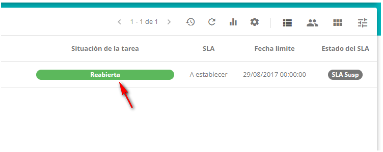

**Figura 66 - Ticket reabierta**

Registro de ticket via plantilla
--------------------------------

### Condiciones previas

1.  Tener las plantillas registradas para registrar una solicitud utilizando
    esta funcionalidad (ver conocimiento [Registro y consulta de plantillas de
    incidentes/solicitudes/procedimientos][32]);

2.  Tener permiso para registrar uno ticket (ver conocimiento [Registro y
    consulta de grupo][3]);

3.  Tener el grupo registrado (ver conocimiento [Registro y consulta de grupo][3]);

4.  Tener la unidad registrada (ver conocimiento [Registro y consulta de
    unidad][8]);

5.  Tener el contrato registrado (ver conocimiento [Registro y consulta de
    contrato][5]);

6.  Tener el portafolio con el servicio y las actividades de solicitudes e
    incidentes registrados (ver conocimientos [Registro del portafolio de
    servicios][9], [Registro de servicios][10], [Configuración de los atributos de
    servicio][11]);

7.  Tener el tiempo de atención de las actividades de solicitudes e incidentes
    definidas. (ver conocimiento [Registro y consulta del tiempo de atención][12]);

8.  Tener el contrato vinculado al servicio (ver conocimiento [Configuración de
    los atributos del servicio][11]);

9.  Tener las actividades de solicitud e incidente vinculadas al contrato del
    servicio (ver conocimiento [Configuraciones de los atributos del contrato
    del servicio][13]);

10. Tener el grupo vinculado al contrato (ver conocimiento [¿Cómo relacionar el
    grupo al contrato?][7]);

11. Tener la unidad vinculada al contrato (ver conocimiento [¿Cómo relacionar la
    unidad al contrato?][8]);

12. Tener el usuario vinculado a la unidad;

13. Tener el usuario vinculado al grupo.

### Registro del ticket via plantilla

1.  Haga clic en el botón de opciones  que se encuentra en la esquina inferior
    derecha de la pantalla, luego haga clic en el botón de registro a través de
    la plantilla  . Hecho esto, se mostrará la pantalla de plantillas que
    contiene las plantillas enumeradas, como se muestra en la figura siguiente:

    
    
    **Figura 67 - Pantalla de plantilla**

2.  Seleccione la plantilla deseada y se dirigirá a la pantalla de Registro de
    Ticket con los campos rellenados de acuerdo con la plantilla elegida.

3.  Rellene los campos con la información necesaria;

4.  Después de los datos informados, haga clic en el botón de opciones  y luego
    haga clic en el botón de grabación  para efectuar el registro, donde la
    fecha, hora y usuario se guardarán automáticamente para una futura
    auditoría.

[1]:/es-es/citsmart-platform-7/processes/tickets/permission.html
[2]:/es-es/citsmart-platform-7/additional-features/reports/create/smart-reports/configuration/generate-report.html
[3]:/es-es/citsmart-platform-7/initial-settings/access-settings/user/group.html
[4]:/es-es/citsmart-platform-7/initial-settings/access-settings/user/employee.html
[5]:/es-es/citsmart-platform-7/additional-features/contract-management/use/register-contract.html
[6]:/es-es/citsmart-platform-7/plataform-administration/region-and-language/register-unit.html
[7]:/es-es/citsmart-platform-7/processes/tickets/relate-group.html
[8]:/es-es/citsmart-platform-7/processes/tickets/relate-unit.html
[9]:/es-es/citsmart-platform-7/processes/portfolio-and-catalog/register.html
[10]:/es-es/citsmart-platform-7/processes/portfolio-and-catalog/services.html
[11]:/es-es/citsmart-platform-7/processes/portfolio-and-catalog/configure-service-attribute.html
[12]:/es-es/citsmart-platform-7/processes/service-level/time-attendance.html
[13]:/es-es/citsmart-platform-7/processes/portfolio-and-catalog/contract-attributes.html
[14]:/es-es/citsmart-platform-7/plataform-administration/parameters-list/parametrizaion-ticket.html
[15]:/es-es/citsmart-platform-7/workflow/workflow-management.html
[16]:/es-es/citsmart-platform-7/processes/configuration/IC-management.html
[17]:/es-es/citsmart-platform-7/processes/problem/register-problem.html
[18]:/es-es/citsmart-platform-7/processes/change/register-change.html
[19]:/es-es/citsmart-platform-7/processes/release/requisition.html
[20]:/es-es/citsmart-platform-7/processes/configuration/IC-management.html
[21]:/es-es/citsmart-platform-7/additional-features/project-management/use/project-management.html
[22]:/es-es/citsmart-platform-7/processes/knowledge/management.html
[23]:/es-es/citsmart-platform-7/processes/portfolio-and-catalog/contract.html
[24]:/es-es/citsmart-platform-7/plataform-administration/parameters-list/parametrizaion-ticket.html
[25]:/es-es/citsmart-platform-7/plataform-administration/parameters-list/parametrization-email.html
[26]:/es-es/citsmart-platform-7/processes/portfolio-and-catalog/cause-incident.html
[27]:/es-es/citsmart-platform-7/processes/portfolio-and-catalog/solution-category.html
[28]:/es-es/citsmart-platform-7/processes/portfolio-and-catalog/request-justification.html
[29]:/es-es/citsmart-platform-7/additional-features/automation-of-operation/configuration/periodic-activity-group.html
[30]:/es-es/citsmart-platform-7/plataform-administration/parameters-list/parametrization-system.html
[31]:https://www.significados.com.br/kanban/
[32]:/es-es/citsmart-platform-7/processes/tickets/template-incident.html

!!! tip "About"

    <b>Product/Version:</b> CITSmart | 8.00 &nbsp;&nbsp;
    <b>Updated:</b>09/19/2019 – Anna Martins
