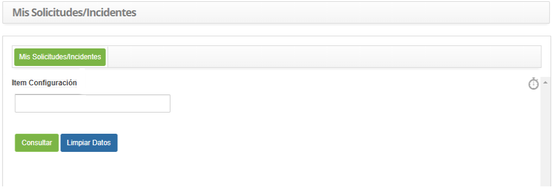
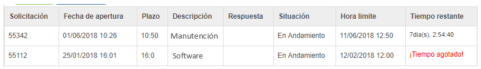

title: Verificación de mis tickets
Description: sta funcionalidad tiene como objetivo proporcionar un resumen de las solicitudes de servicios (tickets) realizadas por el usuario.

# Verificación de mis tickets

Esta funcionalidad tiene como objetivo proporcionar un resumen de las
solicitudes de servicios (tickets) realizadas por el usuario.

El acceso a las solicitudes del usuario también puede ser realizado en el Portal
de Servicios, haciendo la consulta más rápida sin tener que entrar en el
sistema.

Cómo acceder
------------

1.  Acceder a la funcionalidad de mis solicitudes a través de la navegación en
    el menú principal **Procesos ITIL > Gestión de Ticket > Mis
    Requerimientos**.

Condiciones previas
-------------------

1.  Tener un elemento de configuración registrado (ver conocimiento [Gestión de
    ítems de configuración][1] sección Registrando un nuevo ítem de configuración)
    y estar vinculado a una solicitud de servicio (ver conocimiento [Gestión de
    ticket (servicios)][2] sección Vinculación de ítems de configuración del
    solicitante);

2.  Tener solicitudes de servicio registradas (ver conocimiento [Gestión de
    ticket (servicios)][2] sección Registro de ticket).

Filtros
-------

1.  El siguiente filtro permite al usuario restringir la participación de ítems
    en el listado default de la funcionalidad, facilitando la localización de
    los ítems deseados, como se muestra en la figura siguiente:

    -   Ítem Configuración

2.  Se mostrará la pantalla de verificación de tickets, como se muestra en la
    figura siguiente:

    
    
    **Figura 1 - Pantalla de Filtros**

   -   Introduzca el ítem de configuración y haga clic en *Consultar*. Hecho esto,
    se enumeran los resúmenes de las solicitudes de servicio (tickets)
    relacionadas al ítem de configuración;

   -   Si desea comprobar todas las solicitudes de servicio (tickets), haga clic
    directamente en el botón *Consultar.*

!!! info "IMPORTANTE"

     En esta pantalla tiene un temporizador que, al activarse con un solo clic,
     presenta un cronómetro sobre el tiempo gastado y el tiempo restante para
     finalizar la atención de la solicitud en el campo Tiempo restante del
     listado de ítems.

Listado de ítems
----------------

1.  El(Los) siguiente (s) campo (s) de registro está (n) disponible (s) para
    facilitar al usuario la identificación de los elementos deseados en el
    listado default de la funcionalidad: **Solicitud, Fecha de apertura, Plazo,
    Descripción, Respuesta, Situación**, **Hora límite** y **Tiempo restante**.

**Figura 2 - Pantalla de ítems**

Completar los campos de registro
--------------------------------

1.  No se aplica.

[1]:/es-es/citsmart-platform-7/processes/configuration/IC-management.html
[2]:/es-es/citsmart-platform-7/processes/tickets/ticket-management.html

!!! tip "About"

    <b>Product/Version:</b> CITSmart | 8.00 &nbsp;&nbsp;
    <b>Updated:</b>09/19/2019 – Anna Martins
