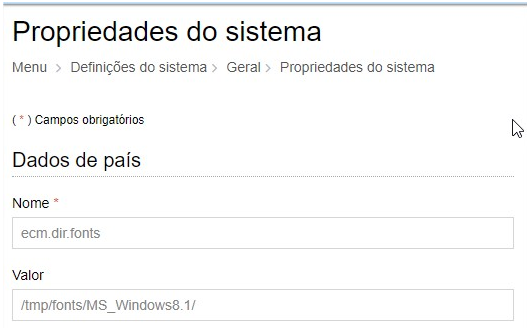

title: Documento de entrega GRP Docs 2.2.0.3 e COR 3.1.6.3
Description: Documento de entrega GRP Docs 2.2.0.3 e COR 3.1.6.3

# Documento de entrega GRP Docs 2.2.0.3 e COR 3.1.6.3

-   **Nome da Solução**: CITSmart Enterprise GRP Docs

-   **Versão**: 2.2.0.3

-   **Documento criado em**: 11/10/2018

-   **Versão entregue em**: 11/10/2018

-   **Última alteração em**: 11/10/2018 (publicação)

-   **Objetivos**:

    1.  antecipar a visão de escopo para que todos os stakeholders possam ter
        conhecimento do que se espera da versão.

    2.  levar ao conhecimento dos Agentes Autorizados (parceiros) as principais
        informações desta entrega, reduzindo o risco de problemas na atualização
        de versão no ambiente dos clientes.

**DOWNLOADS**

1.  **CITSmart Enterprise GRP Docs 2.2.0.3**

    -   [FTP](http://kb.citsmartcloud.com/entregas/papelzero/Enterprise/2.2.0.3/)

2.  **CITSmart Corporativo 3.1.6.3**

    -   [FTP](http://kb.citsmartcloud.com/entregas/corporativo/Enterprise/3.1.6.3/)

3.  **CITSmart ESI 4.0.1.2**

    -   [FTP](http://kb.citsmartcloud.com/entregas/neuro/4.0.1.2)

**ESCOPO**

| DEMANDA |                                           ASSUNTO / MÓDULO                                          | DESCRIÇÃO | CONHECIMENTO IMPACTADO |
|:-------:|:---------------------------------------------------------------------------------------------------:|:---------:|:----------------------:|
|  #15753 |                          CORREÇÃO] Erro de Formatação em Documentos Online                          |           |                        |
|  #16433 | [CORREÇÃO] Ao incluir um processo o sistema fixa uma classificação arquivista quando usa-se "Enter" |           |                        |
|  16042  |                            [REVISÃO] Ordenação dos documentos no processo                           |           |                        |
|  16046  |                           [REVISÃO] Cadastro de Processo com NUP informado                          |           |                        |
|  16139  |           [CORREÇÃO] Script para limpar tarjas de assinaturas não utilizadas pelo sistema           |           |                        |
|  16236  |                  [REVISÃO] Solicitar confirmação ao remover aba ou processo de aba                  |           |                        |
|  #16567 |                    [CORREÇÃO] Retorno de processos pelo web service ListProcessos                   |           |                        |

**IMPACTOS NOS MANUAIS DE INSTALAÇÃO/ATUALIZAÇÃO**

1.  Nenhum.

**ORIENTAÇÕES ESPECIAIS**

1.  Adicionar o parâmetro, **ecm.dir.fonts **,na tela de propriedades do sistema
    e configurar o caminho dos arquivos fontes, segue exemplo abaixo:

[Link para baixar os fontes](http://kb.citsmartcloud.com/entregas/papelzero/Enterprise/2.2.0.3/)

**SCRIPTS SQL**

-   **PostgreSQL**

    1.  Delete from docs_conteudo_tarja

       where id not in (select tarja.id from docs_documentoged doc inner join
       docs_conteudo_tarja tarja on doc.conteudotarja_id = tarja.id   
       UNION  
       select tarja.id from docs_assinatura ass inner join docs_conteudo_tarja
       tarja on ass.conteudotarja_id = tarja.id  
       );

    2.  UPDATE DOCS_UNIDADEPROCESSO SET STATUS_ID = 5389 WHERE STATUS_ID IS NULL AND
    CONCLUIDO IS NULL;

-   **MS-SQLServer**

    1.  Nenhum.

-   **Oracle**

    1.  Delete from docs_conteudo_tarja

       where id not in (select tarja.id from docs_documentoged doc inner join
      docs_conteudo_tarja tarja on doc.conteudotarja_id = tarja.id   
      UNION  
      select tarja.id from docs_assinatura ass inner join docs_conteudo_tarja
      tarja on ass.conteudotarja_id = tarja.id  
      );

    2.  UPDATE DOCS_UNIDADEPROCESSO SET STATUS_ID = 5389 WHERE STATUS_ID IS NULL AND
    CONCLUIDO IS NULL;

**ORIENTAÇÕES ANTERIORES QUE DEVEM SER OBSERVADAS NESTA ENTREGA**

1.  É recomendada uma análise detalhada dos seguintes itens encontrados no
    documento de **Entrega anterior**:

    -   Lista de conhecimentos impactados

    -   Seção de impactos nos manuais de instalação/configuração

    -   Seção de orientações especiais

**PRÁTICAS DE SEGURANÇA AO ATUALIZAR O PRODUTO**

1.  Realizar uma cópia de segurança (*backup*):

    -   da aplicação (war)

    -   do banco de dados

    -   do solr

2.  Executar os scripts conforme orientações contidas neste documento

3.  Salvar o log da execução dos scripts no banco de dados para que eventuais
    imprevistos possam ser devidamente tratados

!!! tip "About"

    <b>Product/Version:</b> CITSmart | 8.00 &nbsp;&nbsp;
    <b>Updated:</b>08/20/2019 – Anna Martins
