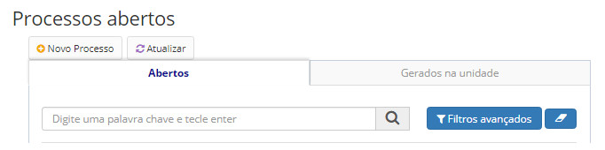
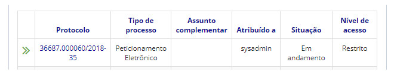
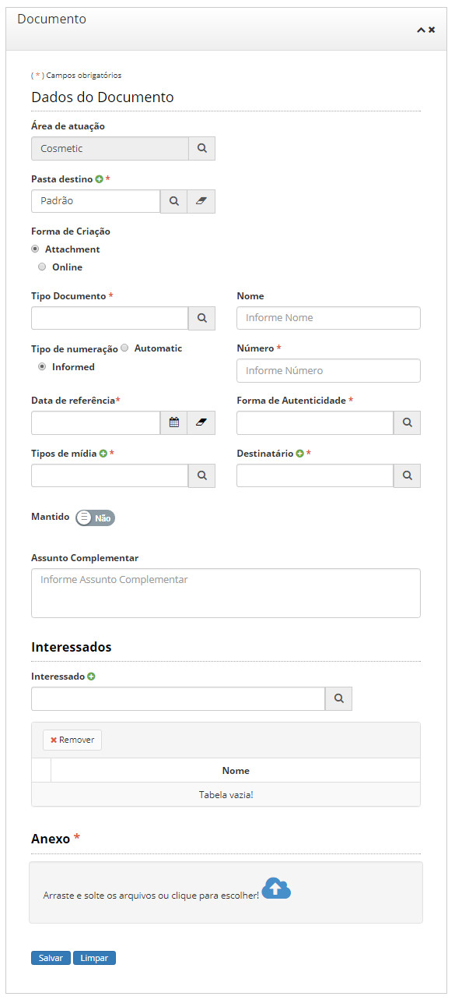

title: Incluindo um documento
Description: Poderão ser incluídos documentos em várias extensões no sistema.
# Incluindo um documento

Poderão ser incluídos documentos em várias extensões no sistema.

!!! info "IMPORTANTE"

    Não poderão ser inseridos documentos com nível de acesso inferior ao do processo.

Como acessar
----------------

1. Acesse a funcionalidade através do menu **Docs > Área de trabalho > Processos abertos**.

Pré-condições
-----------------

1. Não se aplica.

Filtros
-----------

1. O seguinte filtro possibilita ao usuário restringir a participação de itens na listagem padrão da funcionalidade, facilitando
a localização dos itens desejados:

- Palavra chave ou enter.

**Figura 1 - Tela de pesquisa de processos abertos**

Listagem de itens
--------------------

1. Os seguintes campos cadastrais estão disponíveis ao usuário para facilitar a identificação dos itens desejados na listagem
padrão da funcionalidade: **Protocolo, Tipo de processo, Assunto complementar, Atribuído a, Situação** e **Nível de acesso**.

**Figura 2 - Tela de listagem de processos abertos**

Preenchimento dos campos cadastrais
---------------------------------------

1. Selecione um processo, clique no botão *Incluir Documento* e a seguinte tela será apresenta:

    
    
    **Figura 3 - Tela de inclusão de documento**
    
2. Ao incluir um documento, deverão ser informados os metadados, que variam de acordo com a forma de criação, se online ou
anexo;

3. Lembrando que alguns tipos de documento só podem ser criados de forma online ou anexa, dependendo do que foi definido no 
cadastro daquele tipo de documento ([Mantendo tipos de documento](/pt-br/citsmart-docs/user-guide/operate/document-types.html));

!!! note "NOTA"

    Caso os documentos anexos existam na forma física, o campo “Mantido” deverá ser marcado como sim, e deverá também ser
    informada a sua localização em meio físico. Exemplo: Armário 3 Sala 2.
    
4. Documentos online deverão ser produzidos no editor de texto da ferramenta, seguindo o template definido no menu de modelos
de documentos ([Mantendo modelos de documentos](/pt-br/citsmart-docs/user-guide/operate/document-template.html));

5. Os documentos incluídos ficarão disponíveis para acesso através da paleta localizada no canto esquerdo da tela do processo;

!!! note "NOTA"

    Documentos cujo usuário não possuir permissão de acesso não serão exibidos.
    
6. Documentos online criados tem seu estado automaticamente definido como “Minuta”, até alteração que implique em mudança de
estado;

7. O número dos documentos online é gerado automaticamente pela aplicação;

    | Nível de acesso do processo | Poderá ter documentos:                                               |
    |-----------------------------|----------------------------------------------------------------------|
    | Público                     | 1. Públicos 2. Restritos 3. Reservados 4. Secretos 5. Ultrassecretos |
    | Restrito                    | 1. Restritos 2. Reservados 3. Secretos 4. Ultrassecretos             |
    | Reservado                   | 1. Reservados 2. Secretos 3. Ultrassecretos                          |
    | Secreto                     | 1. Secretos 2. Ultrassecretos                                        |
    | Ultrassecreto               | Ultrassecretos                                                       |

    **Tabela 1 - Restrições**
    
8. Após preencher todos os dados clique em *Salvar*.

!!! tip "About"

    <b>Product/Version:</b> CITSmart | 7.00 &nbsp;&nbsp;
    <b>Updated:</b>08/20/2019 – Larissa Lourenço

