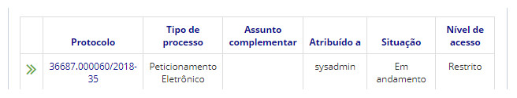
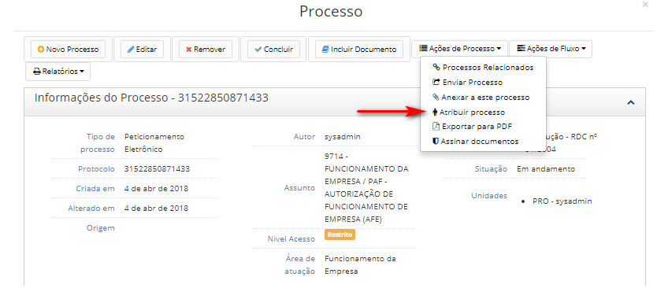
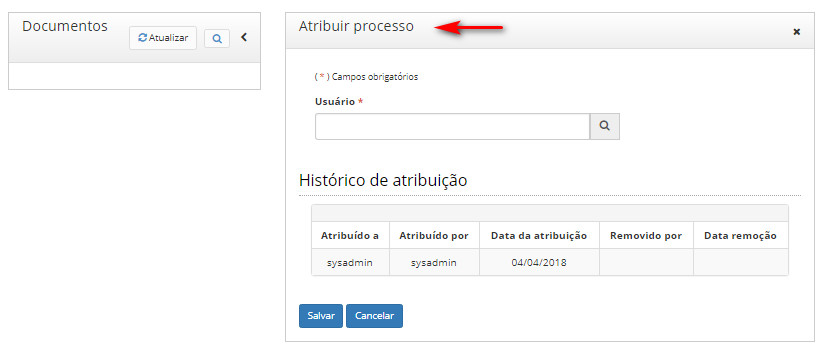

title: Atribuir processos
Description: Processo é atribuído a um usuário, significa que a responsabilidade do processo é transferida a este usuário.
# Atribuir processos

Quando um processo é atribuído a um usuário, significa que a responsabilidade do processo é transferida a este usuário. Com isso,
terá a possibilidade de executar as ações no processo.

Sempre que um processo é recebido/aberto em uma unidade, o mesmo não terá usuário atribuído naquela unidade, porém serão 
mantidos os usuários cujo processo está atribuído nas outras unidades.

Sempre no primeiro acesso a um processo, quando o mesmo não estiver atribuído a nenhum usuário naquela unidade, o usuário que
acessou o processo deverá capturar ou atribuir o processo a outros usuário, antes de ter acesso ao conteúdo do processo.

Como acessar
-----------------

1. Acesse a funcionalidade através da navegação no menu **Docs > Área de trabalho > Processos abertos**.

Pré-condições
-----------------

1. Não se aplica.

Filtros
----------

1. O seguinte filtro possibilita ao usuário restringir a participação de itens na listagem padrão da funcionalidade, facilitando
a localização dos itens desejados:

- Palavra chave

**Figura 1 - Tela de pesquisa de processos abertos**

Listagem de itens
--------------------

1. Os seguintes campos cadastrais estão disponíveis ao usuário para facilitar a identificação dos itens desejados na listagem
padrão da funcionalidade: **Protocolo, Tipo de processo, Assunto complementar, Atribuído a, Situação** e **Nível de acesso**.

**Figura 2 - Tela de listagem de processos abertos**

Preenchimento dos campos cadastrais
---------------------------------------

1. Não se aplica.

Atribuindo processos
------------------------

1. Clique no número do protocolo que deseja atribuir processo;

2. Clique no botão *Ações de Processo* e em seguida em *Atribuir processo*:

    !!! warning "ATENÇÃO"
    
        Um usuário de uma unidade não poderá atribuir o processo a um usuário de outra unidade.
        
    !!! info "IMPORTANTE"
    
        Um processo poderá ser atribuído a um usuário em cada unidade.
        
    !!! note "NOTA"
    
        O usuário cujo processo foi atribuído será notificado pelo sistema.
        
    
    
    **Figura 3 - Tela de atribuição de processo**
    
3. Clique no campo *Atribuir processo* e procure pelo processo escolhido:

**Figura 4 - Tela de atribuição de processo**

!!! tip "About"

    <b>Product/Version:</b> CITSmart | 7.00 &nbsp;&nbsp;
    <b>Updated:</b>08/20/2019 – Larissa Lourenço

