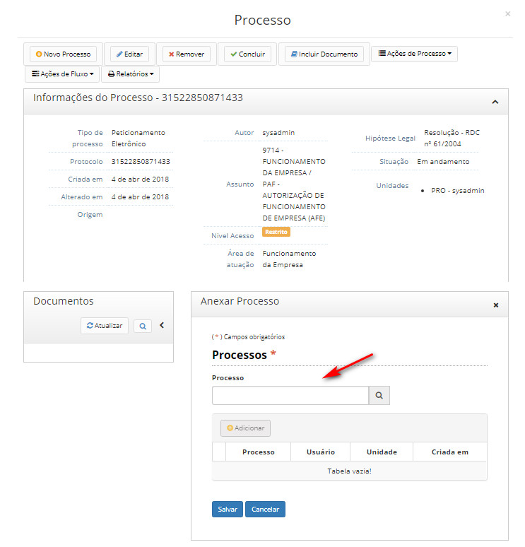

title: Anexação de processos
Description: A anexação de processos é uma funcionalidade que permite juntar de maneira permanente processos do mesmo tipo.
# Anexação de processos

A anexação de processos é uma funcionalidade que permite juntar de maneira permanente processos do mesmo tipo, com o mesmo
interessado e com o mesmo objetivo, uma vez verificado que as informações deveriam ou podem estar agregadas em um processo 
único.

Como acessar
---------------

1. Acesse a funcionalidade através da navegação no menu **Docs > Área de trabalho > Processos abertos**.

Pré-condições
---------------

1. Não se aplica.

Filtros
----------

1. O seguinte filtro possibilita ao usuário restringir a participação de itens na listagem padrão da funcionalidade, facilitando 
a localização dos itens desejados:

- Palavra chave

**Figura 1 - Tela de pesquisa de processos abertos**

Listagem de itens
--------------------

1. Os seguintes campos cadastrais estão disponíveis ao usuário para facilitar a identificação dos itens desejados na listagem
padrão da funcionalidade: **Protocolo, Tipo de processo, Assunto complementar, Atribuído a, Situação** e **Nível de acesso**.

**Figura 2 - Tela de listagem de processos abertos**

Preenchimento dos campos cadastrais
-------------------------------------

1. Não se aplica.

Anexando processos
---------------------

Para exemplificar:

- Em um cenário com 2 processos, anexando o processo 2 ao processo 1, o processo 2 e todos os seus documentos são anexados
(incorporados) ao processo. Com esta ação, o processo 2 é concluído, e todos os novos documentos estarão no processo 1.
- Com isso, não poderão ser inseridos mais documentos no processo 2, apenas no processo 1.

Importante:

- O processo 2 deve estar aberto apenas na unidade que está realizando a anexação;
- Caso o prazo de temporalidade do processo 2 seja mais longo que do processo 1, este último assumirá o prazo mais longo. Isso
vale inclusive para inclusão de documentos;
- Somente poderá haver anexação de um processo mais novo a um mais antigo;
- Não é possível anexar um processo a outro que já esteja anexado a um terceiro processo;

1. Clique no processo que deseja anexar outro;

2. Clique no botão *Ações de Processo* e em seguida em *Anexar a este processo*;

    

    **Figura 3 - Tela de informações de processo**

3. No campo *Anexar Processo*, busque pelo processo que será anexado, conforme figura abaixo:

**Figura 4 - Tela de anexação de processo**

!!! tip "About"

    <b>Product/Version:</b> CITSmart | 7.00 &nbsp;&nbsp;
    <b>Updated:</b>08/19/2019 – Larissa Lourenço

