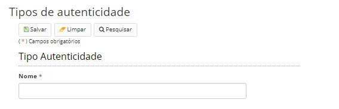

title: Mantendo tipos de autenticidade
Description: Tipos de autenticidade são os tipos de certificação dos documentos.
# Mantendo tipos de autenticidade

Tipos de autenticidade são os tipos de certificação dos documentos. Exemplo: trata-se de uma cópia ou do documento original?

Esse cadastro representa uma lista dos tipos de autenticidade possíveis para os documentos da instituição.

Como acessar
----------------

1. Acesse a funcionalidade através do menu **Docs > Administração Docs > Tipos de autenticidade**.

Pré-condições
----------------

1. Não se aplica.

Filtros
----------

1. O seguinte filtro possibilita ao usuário restringir a participação de itens na listagem padrão da funcionalidade, facilitando
a localização dos itens desejados:

- Palavra chave ou enter.

**Figura 1 - Tela de pesquisa de tipos de autenticidade**

Listagem de itens
--------------------

1. Os seguintes campos cadastrais estão disponíveis ao usuário para facilitar a identificação dos itens desejados na listagem
padrão da funcionalidade: **Nome** e **Padrão**.

**Figura 2 - Tela de listagem de tipos de autenticidade**

2. A coluna “Padrão” indica se o tipo de autenticidade é padrão do sistema ou se foi cadastrado pelo usuário.

Preenchimento dos campos cadastrais
---------------------------------------

1. Para alterar um tipo de autenticidade já cadastrado, selecione-o e clique em *Editar*;

2. Para cadastrar um novo tipo de autenticidade, clique no botão *Cadastrar*:

**Figura 3 - Tela de cadastro/edição de um tipo de autenticidade**

!!! tip "About"

    <b>Product/Version:</b> CITSmart | 7.00 &nbsp;&nbsp;
    <b>Updated:</b>08/20/2019 – Larissa Lourenço

