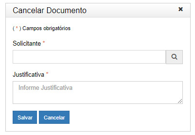

title: Cancelando documentos
Description: Documentos que não podem ser excluídos poderão ser cancelados.
# Cancelando documentos

Documentos que não podem ser excluídos poderão ser cancelados. O cancelamento não implica na sua exclusão do sistema, porém 
impossibilita sua visualização e edição.

Como acessar
---------------

1. A Assinatura de documentos pode ser acessada através do menu **Docs > Área de trabalho > Processos abertos**.

Pré-condições
----------------

1. O processo precisa estar tramitado.

Filtros
---------

1. O seguinte filtro possibilita ao usuário restringir a participação de itens na listagem padrão da funcionalidade, facilitando
a localização dos itens desejados:

- Palavra chave ou enter.

**Figura 1 - Tela de pesquisa de processos abertos**

Listagem de itens
--------------------

1. Os seguintes campos cadastrais estão disponíveis ao usuário para facilitar a identificação dos itens desejados na listagem
padrão da funcionalidade: **Protocolo, Tipo de processo, Assunto complementar, Atribuído a, Situação** e **Nível de acesso**.

    
    
    **Figura 2 - Tela de listagem de processos abertos**
    
2. É apresentado então uma tela com as listagens dos processos abertos. Clique no número de protocolo do processo aberto
desejado. Logo após, será aberto uma aba com as informações do processo.

Preenchimento dos campos cadastrais
-------------------------------------

1. Não se aplica.

Cancelando documentos
-------------------------

1. No campo *Documentos*, clique no botão **Ações > Cancelar**;

2. A justificativa do cancelamento poderá ser visualizada através das ações do documento cancelado;

3. Qualquer documento oficial (após ter tramitado), esteja ele assinado ou não, mesmo que possua assinaturas de usuários de 
várias unidades, somente poderá ser cancelado pela unidade geradora, ainda que o processo esteja aberto em várias unidades ao
mesmo tempo. Dessa forma, a opção de cancelamento apenas fica visível por usuários da unidade geradora do documento.

    
    
    **Figura 3 - Cancelar documento**
    
4. Preencha os campos de solicitante e justificativa de cancelamento, clique em *Salvar*:

**Figura 4 - Tela de justificativa de cancelamento**

!!! tip "About"

    <b>Product/Version:</b> CITSmart | 7.00 &nbsp;&nbsp;
    <b>Updated:</b>08/20/2019 – Larissa Lourenço

