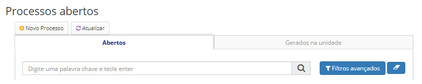
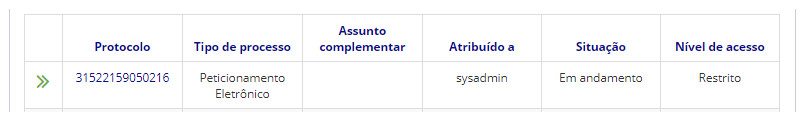
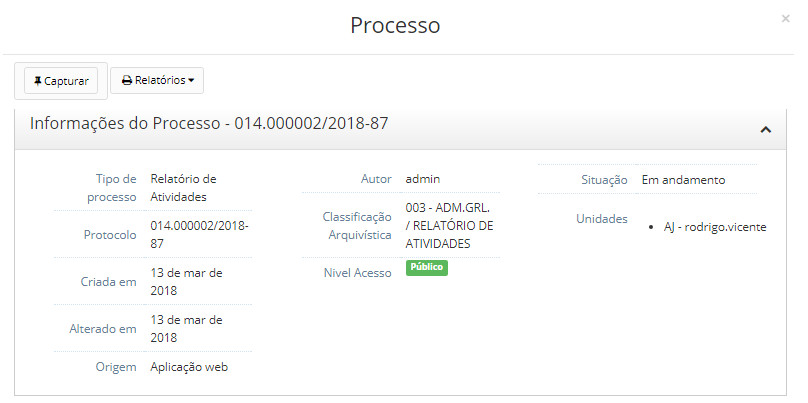

title: Capturar processos
Description: A captura de um processo por um usuário é uma forma de se auto atribuir o processo.
# Capturar processos

A captura de um processo por um usuário é uma forma de se auto atribuir o processo.

Quando um processo é atribuído a um usuário, significa que a responsabilidade do processo é transferida a este usuário. Com isso,
terá a possibilidade de executar as ações no processo.

Esta é uma maneira do processo ser atribuído para aquele usuário naquela unidade, podendo o mesmo processo estar atribuído a 
outros usuários de outras unidades.

Como acessar
---------------

1. Acesse a funcionalidade através da navegação no menu **Docs > Área de trabalho > Processos abertos**.

Pré-condições
-------------------

1. Ter no mínimo dois usuários cadastrados na mesma unidade.

Filtros
---------

1. O seguinte filtro possibilita ao usuário restringir a participação de itens na listagem padrão da funcionalidade, facilitando
a localização dos itens desejados:

- Palavra chave ou enter.

**Figura 1 - Tela de pesquisa de processos abertos**

Listagem de itens
--------------------

1. Os seguintes campos cadastrais estão disponíveis ao usuário para facilitar a identificação dos itens desejados na listagem 
padrão da funcionalidade: **Protocolo, Tipo de processo, Assunto complementar, Atribuído a, Situação** e **Nível de acesso**.

**Figura 2 - Tela de listagem de processos abertos**

Preenchimento dos campos cadastrais
-------------------------------------

1. Não se aplica.

Capturando processos
------------------------

1. Clique no número do protocolo que deseja atribuir processo;

2. Clique no botão *Capturar*.

**Figura 3 - Opção de capturar processo no menu superior**

!!! tip "About"

    <b>Product/Version:</b> CITSmart | 7.00 &nbsp;&nbsp;
    <b>Updated:</b>08/20/2019 – Larissa Lourenço

