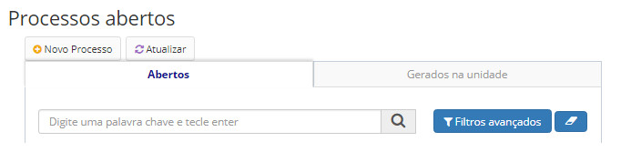
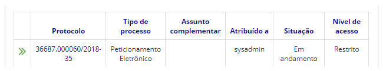
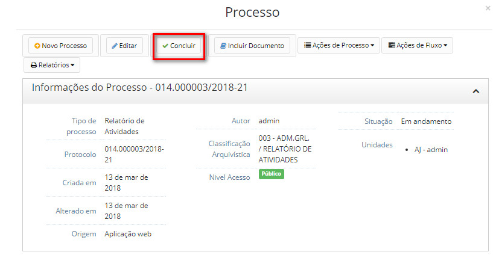

title: Concluir processos
Description: A conclusão de processos por um usuário acarreta na sua conclusão naquela unidade.
# Concluir processos

A conclusão de processos por um usuário acarreta na sua conclusão naquela unidade, ou seja, o processo continuará aberto nas
demais unidades em que ele estiver.

A contagem da temporalidade para destinação final só acontece uma vez que o processo esteja concluído em todas as unidades nas
quais foi tramitado.

Após a conclusão, não será possível executar mais nenhuma ação no processo ou em seus documentos, a não ser a reabertura do
processo ( Solicitando a reabertura de um processo ).

Processos concluídos em todas as unidades são redirecionados para a tela de processos arquivados (Visualizando todos os 
processos arquivados).

Como acessar
---------------

1. Acesse a funcionalidade através da navegação no menu **Docs > Área de trabalho > Processos abertos**.

Pré-condições
-----------------

1. É necessário incluir ao menos um documento no processo para concluir o mesmo.

Filtros
---------

1. O seguinte filtro possibilita ao usuário restringir a participação de itens na listagem padrão da funcionalidade, facilitando
a localização dos itens desejados:

- Palavra chave.

**Figura 1 - Tela de pesquisa de processos abertos**

Listagem de itens
---------------------

1. Os seguintes campos cadastrais estão disponíveis ao usuário para facilitar a identificação dos itens desejados na listagem
padrão da funcionalidade: **Protocolo, Tipo de processo, Assunto complementar, Atribuído a, Situação** e **Nível de acesso**.

**Figura 2 - Tela de listagem de processos abertos**

Preenchimento dos campos cadastrais
---------------------------------------

1. Não se aplica.

Concluindo processos
------------------------

1. Clique sobre o número do protocolo a ser concluído;

2. Clique no botão *Concluir*, conforme figura abaixo:

**Figura 3 - Tela para concluir processo**

!!! tip "About"

    <b>Product/Version:</b> CITSmart | 7.00 &nbsp;&nbsp;
    <b>Updated:</b>08/20/2019 – Larissa Lourenço

