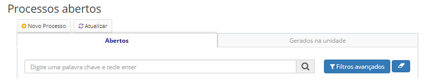
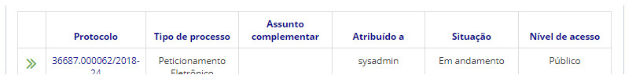
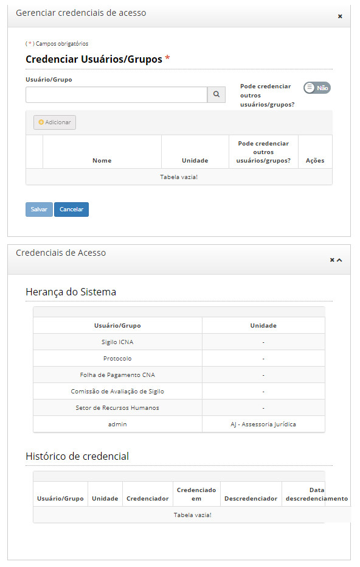

title: Gerenciar credenciais de acesso
Description: Gerenciar as credenciais consiste em: Atribuir e Retirar acesso ao processo/documento.
# Gerenciar credenciais de acesso

Gerenciar as credenciais consiste em: **Atribuir** e **Retirar** acesso ao processo/documento.

Receber credenciais de acesso a um processo/documento significa que o usuário poderá visualizar e executar as ações disponíveis
para processos e documentos.

Como acessar
---------------

1. Acesse a funcionalidade através da navegação no menu **Docs > Área de trabalho > Processos abertos**.

Pré-condições
-----------------

1. Não se aplica.

Filtros
-----------

1. O seguinte filtro possibilita ao usuário restringir a participação de itens na listagem padrão da funcionalidade, facilitando
a localização dos itens desejados:

- Palavra chave ou enter.

**Figura 1 - Tela de pesquisa de processos abertos**

Listagem de itens
---------------------

1. Os seguintes campos cadastrais estão disponíveis ao usuário para facilitar a identificação dos itens desejados na listagem
padrão da funcionalidade: **Protocolo, Tipo de processo, Assunto complementar, Atribuído a, Situação** e **Nível de acesso**.

**Figura 2 - Tela de listagem de processos abertos**

Preenchimento dos campos cadastrais
--------------------------------------

1. Clique no número do protocolo a ser gerenciado a credencial de acesso;

2. Clique no botão **Ações de Processo > Gerenciar Credenciais de Acesso**.

3. Existem duas formas de credenciar um usuário: forma automática e forma manual:

    - **Automática**: quando é criado um processo ou documento sigiloso, automaticamente são geradas credenciais para os
    grupos que possuem permissões nestes níveis de acesso;
    - **Manual**: quando um usuário que já possui credencial de acesso ao processo/documento credencia outro **usuário ou 
    grupo** para ter acesso ao processo/documento.
    
4. Ao atribuir uma credencial de acesso a um usuário/grupo, deve ser informado se o usuário poderá atribuir credencial de 
acesso a outros usuários/grupos ou não.

5. Um usuário poderá receber credenciais de acesso a alguns documentos do processo, sem ter credencial de acesso ao próprio
processo e aos demais documentos do processo.

6. Ao gerar credenciais de acesso manualmente a um processo, automaticamente o usuário que recebeu a credencial de acesso ao 
processo, receberá credencial também a todos os seus documentos. Da mesma forma, ao remover as credenciais do processo
manualmente, as credenciais dos documentos também serão perdidas.

7. Caso o usuário deseje remover credenciais de acesso a um documento específico do processo, será possível fazê-lo através
do menu de ações do documento, sem causar prejuízo às credenciais de acesso aos demais documentos e ao próprio processo.

8. A credencial de acesso concedida a um documento Ultrassecreto por exemplo, não implica na permissão de acesso a outros
documentos, mesmo que os demais possuam níveis de sigilo menores.

9. Ressalta-se que as credenciais de acesso são de uso exclusivo de documentos e processos sigilosos, portanto, caso haja um
documento sigiloso em um processo público, a opção de gerenciar credenciais de acesso aparecerá apenas para o documento 
sigiloso, pois o processo, por natureza já é acessível por qualquer usuário do sistema.

10. Caso um usuário credenciado **manualmente** possua acesso a um documento de um processo Secreto, e esse documento tenha
seu nível de acesso alterado para um nível de sigilo menor ou maior, o usuário não perderá sua credencial, a não ser que 
alguém retire suas credenciais manualmente.

11. Já no caso de credenciais **herdadas**, usuários poderão perder ou adquirir credenciais automaticamente à medida que o 
nível de sigilo do processo/documento for alterado.

12. Poderão retirar as credenciais de acesso do usuário/grupo (inseridas **manualmente**):

    - Quem que atribuiu as credenciais do processo/documento ao usuário/grupo (usuário autor da atribuição);
    - Usuários que pertencem aos grupos de acesso a documentos sigilosos;
    - O próprio usuário que recebeu a credencial.
    
13. Se for retirada credencial de um grupo, todos os usuários do grupo perderão acesso.

**Figura 3 - Tela de gerenciamento de credenciais de acesso**

!!! tip "About"

    <b>Product/Version:</b> CITSmart | 7.00 &nbsp;&nbsp;
    <b>Updated:</b>08/20/2019 – Larissa Lourenço

