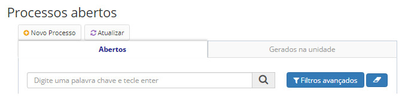
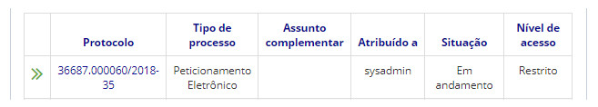
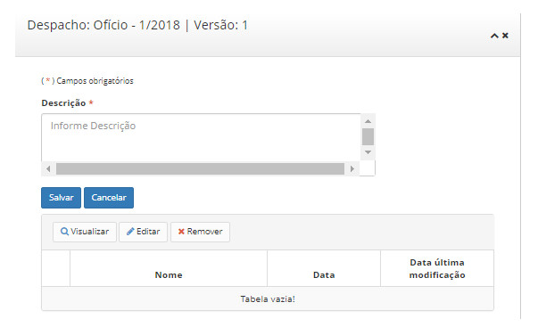

title: Despachando documentos
Description: A solução possibilita vincular despachos a um documento do processo.
# Despachando documentos

A solução possibilita vincular despachos a um documento do processo. Um despacho é uma informação relacionada ao documento, na
qual um gestor ou autoridade informa as ações que devem ser tomadas referentes ao documento. É possível vincular vários
despachos a um documento.

Como acessar
----------------

1. A funcionalidade pode ser acessada através do menu **Docs > Área de trabalho > Processos Abertos**.

Pré-condições
------------------

1. Não se aplica.

Filtros
----------

1. O seguinte filtro possibilita ao usuário restringir a participação de itens na listagem padrão da funcionalidade, facilitando 
a localização dos itens desejados:

- Palavra chave o enter.

**Figura 1 - Tela de pesquisa de processos abertos**

Listagem de itens
--------------------

1. Os seguintes campos cadastrais estão disponíveis ao usuário para facilitar a identificação dos itens desejados na listagem
padrão da funcionalidade: **Protocolo, Tipo de processo, Assunto complemetar, Atribuído a, Situação** e **Nível de acesso**.

**Figura 2 - Tela de listagem de processos abertos**

Preenchimento dos campos cadastrais
--------------------------------------

1. Caso o processo não esteja aberto em outras unidades, um despacho apenas poderá ser editado pelo autor;

2. Uma vez que a edição for bloqueada pelo motivo descrito acima, a edição não poderá mais ocorrer de forma alguma, mesmo que
o processo não esteja mais aberto em outras unidades;

3. Despachos poderão ser visualizados através das ações do documento;

4. É apresentado então uma tela com as listagens dos processos abertos. Clique no número de protocolo do processo aberto 
desejado. Logo após, será aberto uma aba com as informações do processo. Na seção de Documentos, clique em **Ações >
Despachar**;

5. Preencha o campo Descrição e em seguida no botão *Salvar*:

**Figura 3 - Despachar documento**

!!! tip "About"

    <b>Product/Version:</b> CITSmart | 7.00 &nbsp;&nbsp;
    <b>Updated:</b>08/20/2019 – Larissa Lourenço

