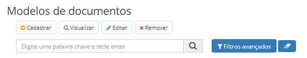
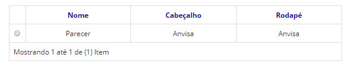
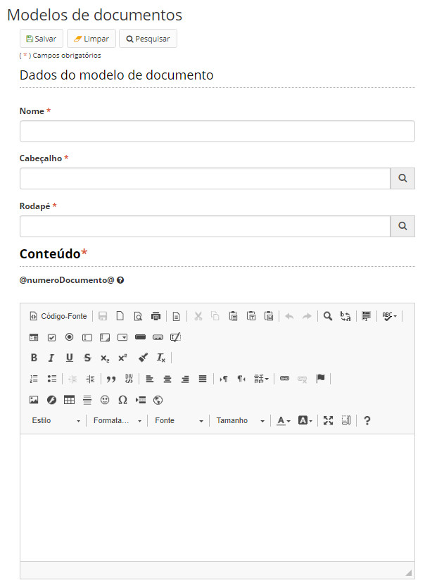

title: Mantendo modelos de documentos
Description: Modelos de documentos são os templates que poderão ser utilizados na criação de documentos.
# Mantendo modelos de documentos

Modelos de documentos são os templates que poderão ser utilizados na criação de documentos através do editor de texto da 
aplicação.

Como acessar
---------------

1. Acesse a funcionalidade através do menu **Docs > Administração Docs > Modelos de documentos**.

Pré-condições
-----------------

1. Não se aplica.

Filtros
----------

1. O seguinte filtro possibilita ao usuário restringir a participação de itens na listagem padrão da funcionalidade, facilitando
a localização dos itens desejados:

- Palavra chave ou enter.

**Figura 1 - Tela de pesquisa de modelos de documentos**

Listagem de itens
---------------------

1. Os seguintes campos cadastrais estão disponíveis ao usuário para facilitar a identificação dos itens desejados na listagem
padrão da funcionalidade: **Nome, Cabeçalho** e **Rodapé**.

**Figura 2 - Tela de listagem de modelos de documentos**

Preenchimento dos campos cadastrais
--------------------------------------

1. Os modelos de documentos são compostos de:

    - Cabeçalho: é cadastrado no menu de cabeçalhos (Mantendo cabeçalhos). Os cabeçalhos podem ser reaproveitados em diversos
    tipos de documento.
    - Conteúdo: é cadastrado na própria tela de modelos de documentos. Este é o template do corpo do documento.
    - Rodapé: é cadastrado no menu de rodapés (Mantendo as informações do rodapé). Os rodapés também podem ser reaproveitados 
    em diversos tipos de documento.
    
2. Os modelos de documentos podem conter campos dinâmicos que são preenchidos com variáveis do documento. Atualmente, está 
disponível a variável @numeroDocumento@, que, ao referenciada no modelo, será substituída dinamicamente pelo número do 
documento que está sendo editado;

3. Os modelos de documentos são apresentados quando criados documentos que possuam o tipo de documento associado àquele 
modelo (tela de cadastro de tipos de documento);

4. Para editar selecione um modelo e clique em *Editar*, faça as alterações necessárias e depois clique no botão *Salvar*;

5. Para cadastrar um novo modelo de documento clique no botão *Cadastrar*, preencha os campos e depois clique no botão 
*Salvar*:

    
    
    **Figura 3 - Tela de cadastro/edição de modelos de documentos**
    
!!! tip "About"

    <b>Product/Version:</b> CITSmart | 7.00 &nbsp;&nbsp;
    <b>Updated:</b>08/20/2019 – Larissa Lourenço

