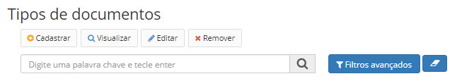
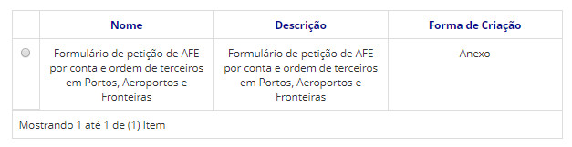
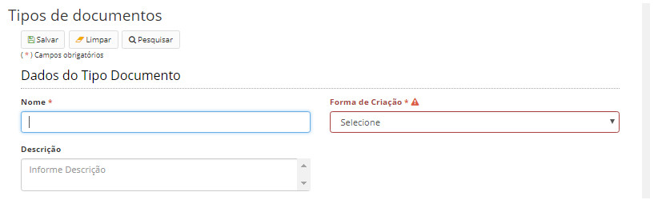
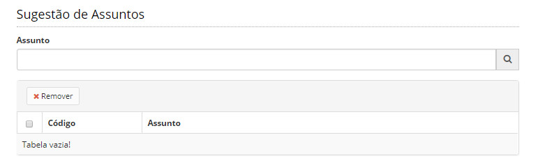

title: Mantendo tipos de documento
Description: Os documentos, quando criados, precisam ser classificados em tipos.
# Mantendo tipos de documento

Os documentos, quando criados, precisam ser classificados em tipos.

Os tipos de documentos são uma forma de agrupar os documentos criados de acordo com as necessidades da instituição.

Como acessar
---------------

1. Acesse a funcionalidade através do menu **Docs > Administração Docs > Tipos de documentos**.

Pré-condições
-----------------

1. Não se aplica.

Filtros
---------

1. O seguinte filtro possibilita ao usuário restringir a participação de itens na listagem padrão da funcionalidade, facilitando
a localização dos itens desejados:

- Palavra chave.

**Figura 1 - Tela de pesquisa de tipos de documentos**

Listagem de itens
--------------------

1. Os seguintes campos cadastrais estão disponíveis ao usuário para facilitar a identificação dos itens desejados na listagem
padrão da funcionalidade: **Nome, Descrição** e **Forma de Criação**.

**Figura 2 - Tela de listagem de tipos de documentos**

Preenchimento dos campos cadastrais
-----------------------------------------

!!! note "NOTA"

    Ao criar um tipo de documento, você deverá definir quais são os níveis de acesso permitidos para o mesmo.
    
1. Para se criar um novo tipo de documento, clique no botão *Cadastrar* e a seguinte tela aparecerá:

    
    
    **Figura 3 - Tela de cadastro de tipo de documento**
    
2. Preencha os campos conforme o tipo de documento a ser criado:

    - **Nome**: informe o nome do tipo de documento;
    - **Forma de criação**: define como o mesmo poderá ser inserido na aplicação. Existem 3 diferentes formas de criação de
    tipo de documento, quando se seleciona uma os campos de preenchimento mudam:
        - **Anexo**: documentos que apenas serão anexados na aplicação:
            - Descrição: descreva sobre o tipo de documento que está sendo criado.
        - **Online**: documentos que só poderão ser criados no editor de texto da própria ferramenta:
            - **Forma de numeração**: define como será gerado o código do documento criado daquele tipo. Poderá ser 
            sequencial por ano, sendo esse sequencial zerado no início de cada ano, ou sequencial único para todos os
            documentos independente do ano de criação.
            - **Template**: é o modelo de documento pré-cadastrado que será utilizado para criar documentos daquele tipo. Este 
            modelo é mantido no menu de Modelos de documentos ([Mantendo modelos de documentos][1]);
            - **Descrição**: descreva sobre o tipo de documento que está sendo criado.
        - **Ambos**: documentos que poderão ser criados de ambas as formas
        
    !!! note "NOTA"
    
        Tanto a numeração gerada quanto o template, refletem apenas nos documentos criados na Forma Online, ou seja, no 
        próprio editor de texto do sistema. O nível de acesso segue uma lógica de hierarquia. Caso um tipo de documento possa 
        ser classificado em um nível de acesso mais alto, todos os níveis de acesso abaixo deles também serão passíveis de 
        classificação. Exemplo: Um tipo de documento que pode ser classificado no nível de acesso Secreto, automaticamente 
        também poderá ser classificado nos níveis menores (Reservado, Restrito e Público).
        
    - Os documentos criados com esse tipo Online, só poderão ser classificados nos níveis de acesso selecionados.
    
    - Público;
    - Restrito;
    - Sigiloso:
        - Reservado;
        - Secreto;
        - Ultrassecreto.
    
    - Há também a possibilidade de se fazer **Sugestões de Assuntos** relacionados àquele tipo de documento. O objetivo dessa
    função é auxiliar o usuário na escolha de um assunto, respeitando o plano de classificação, temporalidade e destinação. 
    Como o próprio nome diz, são apenas indicadas sugestões, não sendo obrigatório o usuário selecionar algum dos assuntos 
    sugeridos no momento da criação de um documento daquele tipo:
    

**Figura 4 - Tela de sugestões de assuntos**

!!! tip "About"

    <b>Product/Version:</b> CITSmart | 7.00 &nbsp;&nbsp;
    <b>Updated:</b>08/21/2019 – Larissa Lourenço

            
            
            
[1]:/pt-br/citsmart-docs/user-guide/operate/document-template.html

