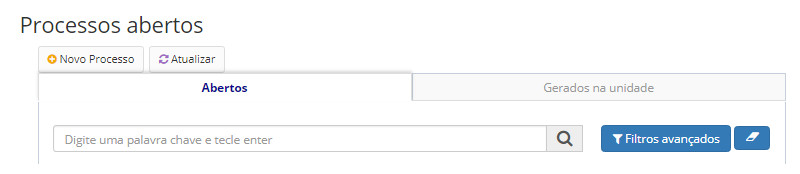
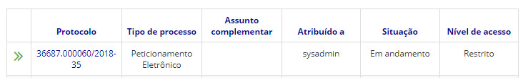
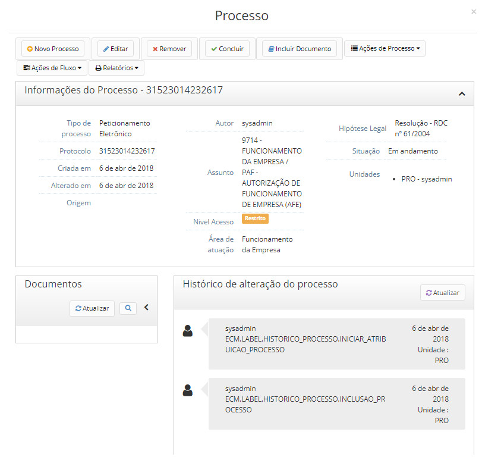
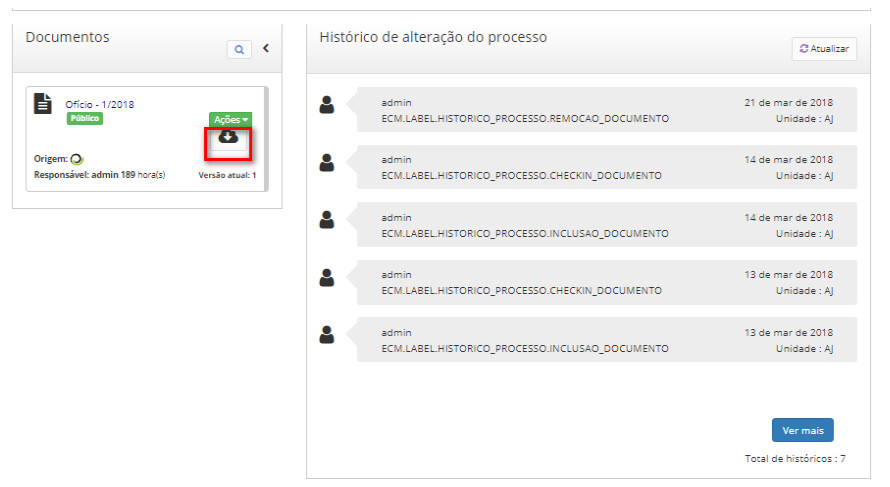

title: Fazendo download de documentos
Description: É possível fazer o download dos documentos incluídos no processo.
# Fazendo download de documentos

É possível fazer o download dos documentos incluídos no processo.

Documentos criados no editor de texto do sistema serão baixados em PDF. Quando é feito o download de um documento externo que 
foi assinado, será baixado também o arquivo de assinatura correspondente.

Como acessar
----------------

1. Acesse a funcionalidade através da navegação no menu **Docs > Área de trabalho > Processos abertos**.

Pré-condições
----------------

1. Não se aplica.

Filtros
----------

1. O seguinte filtro possibilita ao usuário restringir a participação de itens na listagem padrão da funcionalidade, facilitando
a localização dos itens desejados:

- Palavra chave

**Figura 1 - Tela de pesquisa de processos abertos**

Listagem de itens
-------------------

1. Os seguintes campos cadastrais estão disponíveis ao usuário para facilitar a identificação dos itens desejados na listagem
padrão da funcionalidade: **Protocolo, Tipo de processo, Assunto complementar, Atribuído a, Situação** e **Nível de acesso**.

**Figura 2 - Tela de listagem de processos abertos**

Preenchimento dos campos cadastrais
--------------------------------------

1. Não se aplica.

Fazendo download de documentos
----------------------------------

1. Clique no número do protocolo a fazer o download do documento e a seguinte tela aparecerá:

    
    
    **Figura 3 - Tela de informações do processo**
    
2. No campo Documentos, clique no campo indicado abaixo:

**Figura 4 - Opção de download de documento abaixo do menu ações**

!!! tip "About"

    <b>Product/Version:</b> CITSmart | 7.00 &nbsp;&nbsp;
    <b>Updated:</b>08/20/2019 – Larissa Lourenço

