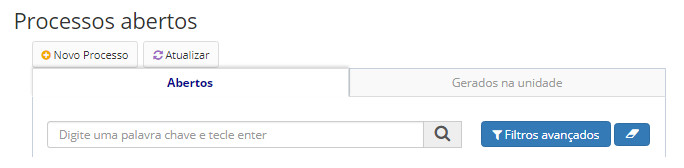

title: Editando documentos
Description: Esta funcionalidade tem por objetivo a edição de documentos.
# Editando documentos

Esta funcionalidade tem por objetivo a edição de documentos.

Os documentos poderão ser editados tanto a nível de metadados quanto a nível de conteúdo do documento. No caso de documentos 
anexados, os anexos poderão ser substituídos por novas versões.

Para editar um documento cujo processo estiver concluído na unidade, o usuário deverá reabrir ([Solicitando a reabertura de um 
processo](/pt-br/citsmart-docs/user-guide/operate/reopen.html)) o processo.

!!! warning "ATENÇÃO"

    Não é possível editar documentos que já foram assinados.
    
Como acessar
----------------

1. A funcionalidade pode ser acessada através do menu **Docs > Área de trabalho > Processos Abertos**.

Pré-condições
----------------

1. Não se aplica.

Filtros
---------

1. O seguinte filtro possibilita ao usuário restringir a participação de itens na listagem padrão da funcionalidade, 
facilitando a localização dos itens desejados:

- Palavra chave.

**Figura 1 - Tela de pesquisa de processos abertos**

Listagem de itens
--------------------

1. Os seguintes campos cadastrais estão disponíveis ao usuário para facilitar a identificação dos itens desejados na listagem 
padrão da funcionalidade: **Protocolo, Tipo de processo, Assunto complemetar, Atribuído a, Situação** e **Nível de acesso**.

    
    
    **Figura 2 - Tela de listagem de processos abertos**
    
2. Após acessar a funcionalidade, será apresentada então uma tela com as listagens dos processos abertos. Clique no número de 
protocolo do processo aberto desejado.

Preenchimento dos campos cadastrais
--------------------------------------

1. Não se aplica.

Edição de documentos
-----------------------

1. Na seção Documentos, clique em **Ações > Editar**, conforme ilustrado na figura abaixo:

    
    
    **Figura 3 - Tela de documentos**
    
2. Será apresentada a tela de edição de documento, conforme ilustrado na figura abaixo:

    
    
    **Figura 4 - Editar documentos**
    
3. Preencha os campos;

4. Clique em *Salvar* para armazenar os dados do documento.

!!! tip "About"

    <b>Product/Version:</b> CITSmart | 7.00 &nbsp;&nbsp;
    <b>Updated:</b>08/20/2019 – Larissa Lourenço

