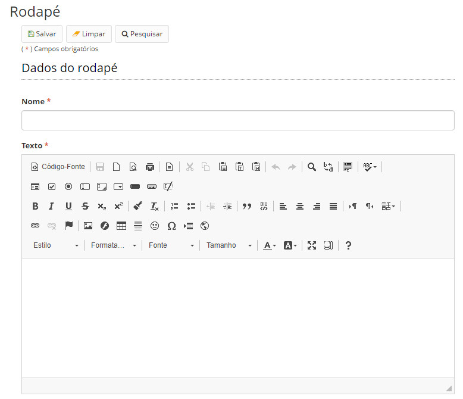

title: Mantendo as informações do rodapé
Description: Nesta tela é possível cadastrar os rodapés que farão parte dos modelos de documentos cadastrados.
# Mantendo as informações do rodapé

Nesta tela é possível cadastrar os rodapés que farão parte dos modelos de documentos cadastrados.

Os rodapés são confeccionados no editor de texto do sistema.

Como acessar
----------------

1. Acesse a funcionalidade através do menu **Docs > Administração Docs > Rodapé**.

Pré-condições
----------------

1. Não se aplica.

Filtros
----------

1. O seguinte filtro possibilita ao usuário restringir a participação de itens na listagem padrão da funcionalidade, facilitando 
a localização dos itens desejados:

- Palavra chave.

**Figura 1 - Tela de pesquisa de rodapés**

Listagem de itens
---------------------

1. Os seguintes campos cadastrais estão disponíveis ao usuário para facilitar a identificação dos itens desejados na listagem
padrão da funcionalidade: **Nome**.

**Figura 2 - Tela de listagem de rodapés**

Preenchimento dos campos cadastrais
----------------------------------------

1. Para cadastrar um rodapé clique no botão *Cadastrar*, conforme a figura 1;

2. Será apresentada a tela de cadastro de rodapé, conforme ilustrado na figura abaixo:

    
    
    **Figura 3 - Tela de cadastro/edição de rodapés**
    
3. Preencha os campos;

4. Clique em *Salvar* para armazenar o rodapé.

!!! tip "About"

    <b>Product/Version:</b> CITSmart | 7.00 &nbsp;&nbsp;
    <b>Updated:</b>08/20/2019 – Larissa Lourenço

