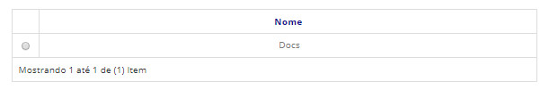
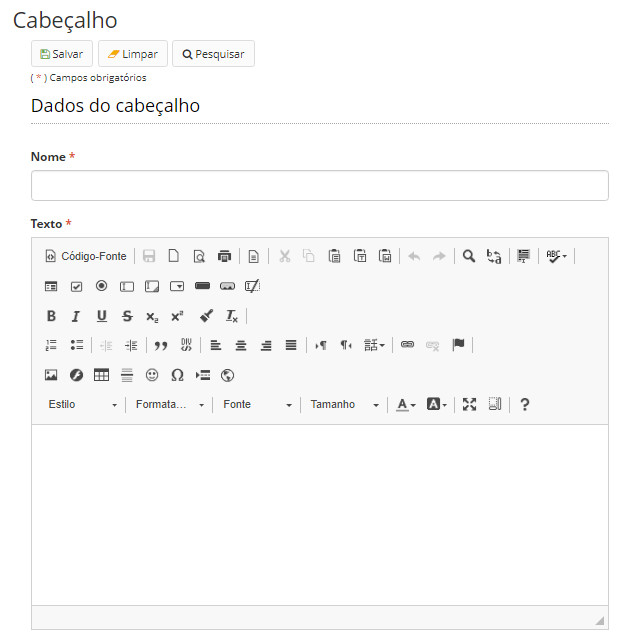

title: Mantendo cabeçalhos
Description: Esta funcionalidade tem por objetivo cadastrar os cabeçalhos que farão parte dos modelos de documentos cadastrados.

Como acessar
---------------

1. Acesse a funcionalidade através da navegação no menu principal **Docs > Administração Docs > Cabeçalho**.

Pré-condições
----------------

1. Não se aplica.

Filtros
---------

1. O seguinte filtro possibilita ao usuário restringir a participação de itens na listagem padrão da funcionalidade, facilitando
a localização dos itens desejados:

- Palavra chave ou enter.

**Figura 1 - Tela de pesquisa de cabeçalhos**

Listagem de itens
--------------------

1. O seguinte campo cadastral está disponível ao usuário para facilitar a identificação dos itens desejados na listagem padrão
da funcionalidade: **Nome**.

**Figura 2 - Tela de listagem de cabeçalhos**

Preenchimento dos campos cadastrais
---------------------------------------

1. Para editar um item criado, selecione o item desejado, clique em *Editar*, faças as alterações, e acione *Salvar*;

2. Para registrar um novo cabeçalho, clique em *Cadastrar*. Será apresentada a tela de cadastro de cabeçalho, conforme
ilustrada na figura abaixo:

    
    
    **Figura 3 - Tela de cadastro/edição de cabeçalhos**
    
3. Para visualizar um item, selecione o mesmo e clique em *Visualizar*.

4. Para remover um item criado, selecione o item desejado, clique em remover e confirme a exclusão.

5. Depois de feito cadastro clique em *Salvar*.

!!! tip "About"

    <b>Product/Version:</b> CITSmart | 7.00 &nbsp;&nbsp;
    <b>Updated:</b>08/20/2019 – Larissa Lourenço

