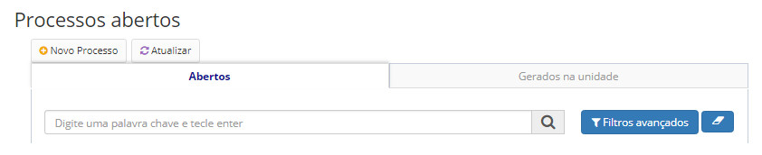
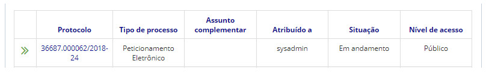
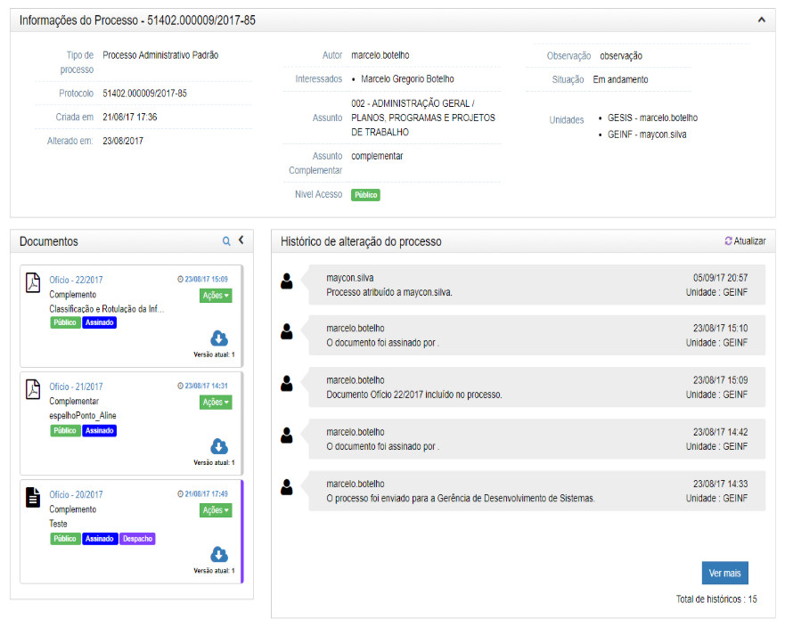

title: Acessando as informações de um processo
Description: Ao acessar um processo, serão exibidas as suas informações, juntamente aos documentos contidos no mesmo.
# Acessando as informações de um processo

Ao acessar um processo, serão exibidas as suas informações, juntamente aos documentos contidos no mesmo.

Como acessar
--------------

1. Acesse a funcionalidade através da navegação no menu principal **Docs > Área de trabalho > Processos abertos**.

Pré-condições
-----------------

1. Não se aplica.

Filtros
----------

1. O seguinte filtro possibilita ao usuário restringir a participação de itens na listagem padrão da funcionalidade, facilitando 
a localização dos itens desejados:

- Palavra chave ou enter.

**Figura 1 - Tela de pesquisa de processos abertos**

Listagem de itens
--------------------

1. Os seguintes campos cadastrais estão disponíveis ao usuário para facilitar a identificação dos itens desejados na listagem
padrão da funcionalidade: **Protocolo, Tipo de processo, Assunto complementar, Atribuído a, Situação** e **Nível de Acesso**.

**Figura 2 - Tela de listagem de processos abertos**

Preenchimento dos campos cadastrais
--------------------------------------

1. Não se aplica.

Acessando informações
-------------------------

!!! info "IMPORTANTE"

    Dependendo do nível de acesso do usuário autenticado, alguns documentos restritos ou sigilosos poderão ser ocultados.
    
1. Entendendo mais sobre os níveis de acesso:

    - **Processos e documentos restritos**: podem ser acessados apenas pela unidade na qual o processo ou documento está
    aberto/foi tramitado.
    - **Processos e documentos sigilosos**: podem ser reservados, secretos ou ultrassecretos. Só podem ser acessados por 
    usuários que possuam a credencial de acesso ao processo ou documento.
    
2. Existe um prazo em que o documento ou processo é considerado sigiloso. Caso o prazo não seja prorrogado, o objeto se 
tornará público

    - **Reservado**: prazo padrão de sigilo é de **5 anos** a partir da data de criação;
    - **Secreto**: prazo padrão de sigilo é de **15 anos** a partir da data de criação;
    - **Ultrassecreto**: prazo padrão de sigilo é de **25 anos** a partir da data de criação.
    
3. O sistema registra todo o histórico de alterações que ocorreram no processo. É possível visualizá-lo na parte inferior da
tela.

**Figura 3 - Tela informações de um processo**

!!! tip "About"

    <b>Product/Version:</b> CITSmart | 7.00 &nbsp;&nbsp;
    <b>Updated:</b>08/19/2019 – Larissa Loure

    

