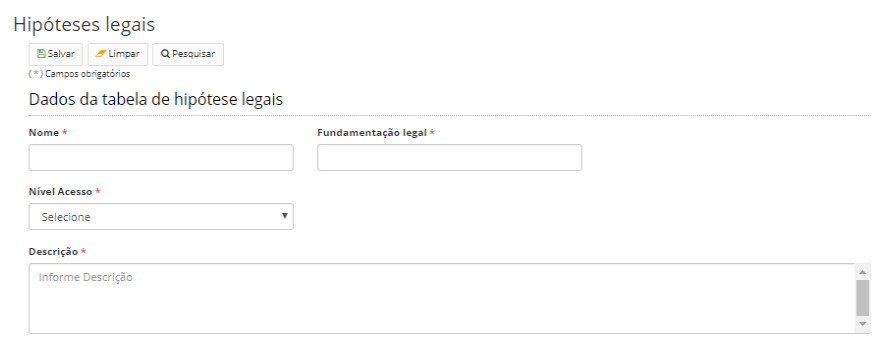

title: Mantendo hipóteses legais
Description: Esta funcionalidade tem por objetivo cadastrar hipóteses legais.
# Mantendo hipóteses legais

Esta funcionalidade tem por objetivo cadastrar **hipóteses legais** que, por sua vez, se referem à leis que fundamentam a 
classificação de um processo ou documento em um nível restrito ou sigiloso.

Como acessar
---------------

1. Acesse a funcionalidade através da navegação no menu principal **Docs > Administração Docs > Hipóteses legais**.

Pré-condições
----------------

1. Não se aplica.

Filtros
----------

1. O seguinte filtro possibilita ao usuário restringir a participação de itens na listagem padrão da funcionalidade, facilitando
a localização dos itens desejados:

- Palavra chave.

**Figura 1 - Tela de pesquisa de hipóteses legais**

Listagem de itens
-------------------

1. Os seguintes campos cadastrais estão disponíveis ao usuário para facilitar a identificação dos itens desejados na listagem
padrão da funcionalidade: Criada em, Nome e Nível de Acesso.

**Figura 2 - Tela de listagem de hipóteses legais**

Preenchimento dos campos cadastrais
---------------------------------------

Sempre que um processo ou documento for cadastrado com o nível de acesso restrito ou sigiloso (reservado, secreto ou 
ultrassecreto), o usuário deverá informar a hipótese legal que fundamenta e justifica tal classificação.

Para isso, o sistema permite a manutenção do cadastro de hipóteses legais, referenciando a lei originária da hipótese 
cadastrada.

1. Para registrar uma nova hipótese legal, clique em *Cadastrar*. Será apresentada a tela de cadastro de hipótese legal, 
conforme ilustrada na figura abaixo:

    
    
    **Figura 3 - Tela de cadastro/edição de hipóteses legais**
    
2. Preencha os campos conforme orientações abaixo:

    - **Nome**: informe o nome da hipótese legal;
    - **Fundamentação legal**: informe a fundamentação legal;
    - **Nível Acesso**: informe o nível de acesso do processo ou documento cadastrado:
        - Restrito;
        - Sigiloso;
    - **Descrição**: descrição textual sobre a hipótese legal.
    
3. Clique em *Salvar* para armazenar os dados da hipótese legal. Clique em *Pesquisar* para voltar para a tela anterior.

!!! tip "About"

    <b>Product/Version:</b> CITSmart | 7.00 &nbsp;&nbsp;
    <b>Updated:</b>08/20/2019 – Larissa Lourenço

