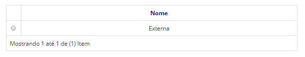
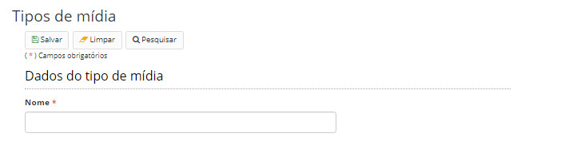

title: Mantendo tipos de mídia
Description: Esta funcionalidade tem por objetivo cadastrar tipos de mídia.
# Mantendo tipos de mídia

Esta funcionalidade tem por objetivo cadastrar tipos de mídia que são os locais nos quais os documentos são armazenados de forma
física.

Quando um documento for incluído no sistema, deverá ser informado o tipo de mídia em que o mesmo se encontra, se o este existir 
de forma física.

Como acessar
----------------

1. Acesse a funcionalidade através da navegação no menu principal **Docs > Administração Docs > Tipos de mídia**.

Pré-condições
-----------------

1. Não se aplica.

Filtros
----------

1. O seguinte filtro possibilita ao usuário restringir a participação de itens na listagem padrão da funcionalidade, facilitando
a localização dos itens desejados:

- Palavra chave ou enter.

**Figura 1 - Tela de pesquisa de tipos de mídia**

Listagem de itens
----------------------

1. O seguinte campo cadastral está disponível ao usuário para facilitar a identificação dos itens desejados na listagem 
padrão da funcionalidade: **Nome**.

**Figura 2 - Tela de listagem de tipos de mídia**

Preenchimento dos campos cadastrais
---------------------------------------

1. Para editar um item criado, selecione o item desejado, clique em *Editar*, faça as alterações e acione o botão *Salvar*;

2. Para visualizar um item, selecione o mesmo e clique em *Visualizar*;

3. Para remover um item criado, selecione o item desejado, clique em *Remover* e confirme a exclusão;

4. Para registrar novos tipos de mídia, clique em *Cadastrar*. Será apresentada a tela de cadastro de tipos de mídia,
conforme ilustrada na figura abaixo:

    
    
    **Figura 3 - Tela de cadastro/edição de tipos de mídia**
    
5. Informe o nome do tipo de mídia.

6. Clique em *Salvar* para armazenar os dados do tipo de mídia. Clique em *Pesquisar* para voltar para a tela anterior.

!!! tip "About"

    <b>Product/Version:</b> CITSmart | 7.00 &nbsp;&nbsp;
    <b>Updated:</b>08/20/2019 – Larissa Lourenço

