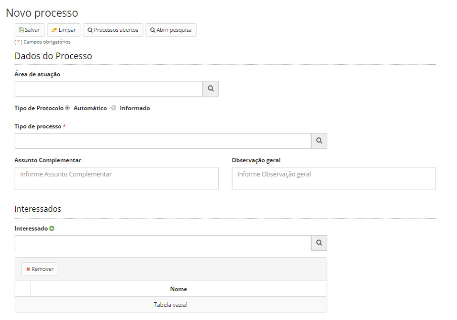
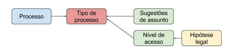

title: Criando um novo processo
Description: Esta funcionalidade tem por objetivo a criação de um novo processo.
# Criando um novo processo

Esta funcionalidade tem por objetivo a criação de um novo processo.

Como acessar
---------------

1. Acesse a funcionalidade através da navegação no menu principal **Docs > Área de trabalho > Novo processo**.

Pré-condições
----------------

1. Não se aplica.

Filtros
----------

1. Não se aplica.

Listagem de itens
--------------------

1. Não se aplica.

Preenchimento dos campos cadastrais
--------------------------------------

A solução não contempla o conceito de documentos avulsos, ou seja, para que um documento seja inserido no sistema, o mesmo
deverá estar contido em um processo. Sendo assim, um processo funciona como um agrupador de documentos.

1. Ao acessar a funcionalidade, será apresentada a tela de cadastro de um novo processo, conforme ilustrado na figura abaixo:

    
    
    **Figura 1 - Tela de criação de processos**
    
2. Preencha os campos conforme orientações abaixo:

    - **Área de atuação**: selecione a área de atuação do processo;
    - **Protocolo**: o protocolo é o identificador único do processo. Este pode ser gerado automaticamente pelo sistema ou 
    pode ser informado (quando for trazido de outra solução).
        - No segundo caso, deverá ser informada a data de referência do protocolo informado, que é a data que o mesmo foi
        criado na outra plataforma.
    - **Tipo de processo**: o tipo de processo (Mantendo tipos de processo) é um metadado que deve ser cadastrado previamente 
    na tela de cadastro de tipos de processos.
        - Quando o tipo de processo é selecionado, o sistema carregará as definições do tipo selecionado. A imagem abaixo ilustra o funcionamento:

        
    
        **Figura 2 - Esquema**
    
        - De acordo com o tipo de processo selecionado, são herdadas as sugestões de assuntos e os níveis de acesso 
        permitidos para aquele tipo de processo. À partir do nível de acesso selecionado, são herdadas as hipóteses legais
        daquele nível.
    - **Assunto complementar**: abaixo do campo “Assunto”, é apresentada uma caixa de seleção com sugestões que foram 
    cadastradas para o tipo de processo selecionado, porém, não é obrigatória a seleção de um item da lista de sugestões. 
    Lembrando que os assuntos são cadastrados no plano de classificação, temporalidade e destinação (Mantendo um plano de 
    classificação, temporalidade e destinação).
    - **Observações**: campo não obrigatório onde o usuário pode cadastrar observações que considera relevante ao processo.
    - **Interessados**: os interessados são pessoas cadastradas no sistema que possuam alguma relação com o processo. Este 
    campo é meramente informativo e não realiza nenhum tipo de comportamento que influencie na pessoa interessada.
    
3. Clique em *Salvar* para armazenar o processo.

4. Assim que um processo for cadastrado, este ficará acessível na tela de Processos abertos (Executando processos).

!!! tip "About"

    <b>Product/Version:</b> CITSmart | 7.00 &nbsp;&nbsp;
    <b>Updated:</b>08/20/2019 – Larissa Lourenço

