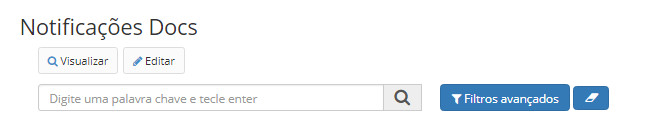
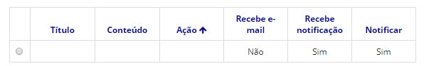
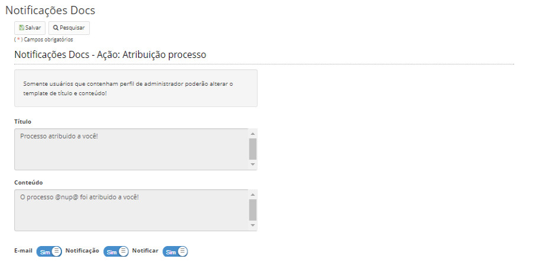

title: Configurando as notificações
Description: Esta tela refere-se à configuração de notificações pré-definidas no sistema.
# Configurando as notificações

Esta tela refere-se à configuração de notificações pré-definidas no sistema.

As notificações são orientadas a ações, podendo o usuário customizar o conteúdo de cada uma telas, utilizando de variáveis 
dinâmicas como: NUP, número do documento, usuário e unidade.

Poderá ser definido se o alerta será enviado via sistema (notificação), via e-mail ou ambos.

Como acessar
---------------

1. Acesse a funcionalidade através do menu **Docs > Administração Docs > Notificações Docs**.

Pré-condições
----------------

1. Não se aplica.

Filtros
-----------

1. O seguinte filtro possibilita ao usuário restringir a participação de itens na listagem padrão da funcionalidade, facilitando
a localização dos itens desejados:

- Palavra chave ou enter.

**Figura 1 - Tela de pesquisa de notificações Docs**

Listagem de itens
-------------------

1. Os seguintes campos cadastrais estão disponíveis ao usuário para facilitar a identificação dos itens desejados na listagem 
padrão da funcionalidade: **Título, Conteúdo, Ação, Recebe e-mail, Recebe Notificação** e **Notificar**.

**Figura 2 - Tela de listagem de notificações Docs**

Preenchimento dos campos cadastrais
---------------------------------------

1. Não se aplica.

Configurando notificações
----------------------------

1. Selecione um item, é possível apenas visualizar ou editar uma notificação;

2. Clique no botão *Visualizar*, para ver mais detalhes da notificação;

3. Clique no botão Editar caso queira modificar alguma informação da notificação:

**Figura 3 - Tela de edição de notificações**

!!! tip "About"

    <b>Product/Version:</b> CITSmart | 7.00 &nbsp;&nbsp;
    <b>Updated:</b>08/20/2019 – Larissa Lourenço

