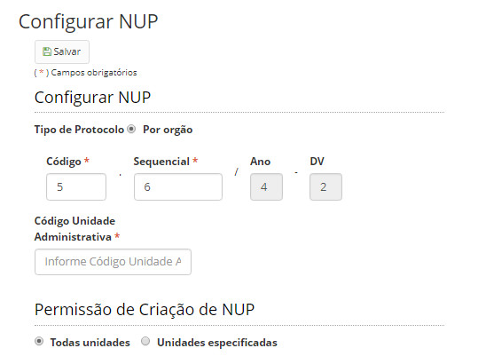

title: Configurando a forma de geração do NUP (Número Único de Protocolo)
Description: Todo processo gerado pelo sistema precisa de um NUP (Número Único de Protocolo).
# Configurando a forma de geração do NUP (Número Único de Protocolo)

Todo processo gerado pelo sistema precisa de um NUP (Número Único de Protocolo). Através dessa funcionalidade, é possível 
configurar a forma de geração do NUP.

Atualmente, é possível configurar o NUP por órgão.

Como acessar
----------------

1. Acesse a funcionalidade através do menu **Docs > Administração Docs > Configurar NUP**.

Configurando a forma de geração do NUP
--------------------------------------------

1. Será apresentado a tela de configuração de NUP, conforme ilustrada na figura abaixo:

    
    
    **Figura 1 - Tela de configuração da geração do NUP (Número Único de Protocolo)**
    
2. Preencha os campos conforme orientações abaixo

    - **Código**: constituído de 5 dígitos, deve representar o número SISG ou código referente à unidade protocolizadora. Obs: 
    As unidades da estrutura organizacional que não possuem número SISG devem poder utilizar o número SISG da unidade 
    hierarquicamente superior.
    - **Sequencial**: este número deve ser sequencial constituído de 6 dígitos para cada sequência do primeiro grupo, devendo 
    reiniciar a cada ano. É separado do primeiro grupo por um ponto.
    - **Ano**: constituído por 4 dígitos e representa o ano no qual o NUP foi constituído. Este é separado do segundo grupo por 
    uma barra.
    - **DV**: é constituído por 2 dígitos, sendo separado do terceiro grupo por hífen. Indica os dígitos verificadores 
    calculados com base nos grupos anteriores.
    
3. Clique no botão *Salvar* para efetuar o registro, onde a data, hora e usuário serão gravados automaticamente para uma
futura auditoria.

!!! tip "About"

    <b>Product/Version:</b> CITSmart | 7.00 &nbsp;&nbsp;
    <b>Updated:</b>08/20/2019 – Larissa Lourenço

