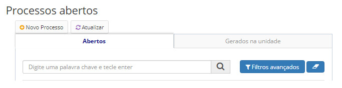
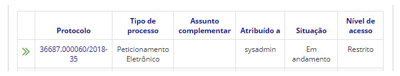
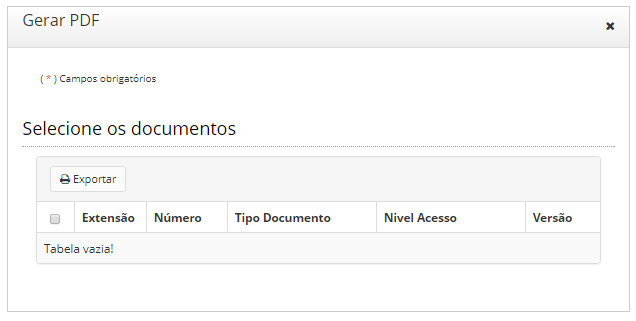

title: Exportar para PDF
Description: O sistema permite a exportação de documentos em um lote em formato PDF.
# Exportar para PDF

O sistema permite a exportação de documentos em um lote em formato PDF. Os metadados do processo e dos documentos também serão 
exportados.

!!! warning "ATENÇÃO"

    Apenas documentos assinados poderão ser exportados.

Os documentos que foram anexados ao processo exportado, também serão exportados, visto que passaram a fazer parte processo após
o procedimento de anexação.

Quando um processo for exportado, somente a **última versão** dos seus documentos será exportada.

Ao exportar um processo ou documento que contenha hipótese legal vinculada (Mantendo hipóteses legais), também será exportada a
fundamentação legal da hipótese legal nos metadados.

Como acessar
--------------

1. Acesse a funcionalidade através da navegação no menu **Docs > Área de trabalho > Processos abertos**.

Pré-condições
----------------

1. Não se aplica.

Filtros
-----------

1. O seguinte filtro possibilita ao usuário restringir a participação de itens na listagem padrão da funcionalidade, 
facilitando a localização dos itens desejados

- Palavra chave ou enter.

**Figura 1 - Tela de pesquisa de processos abertos**

Listagem de itens
-------------------

1. Os seguintes campos cadastrais estão disponíveis ao usuário para facilitar a identificação dos itens desejados na listagem
padrão da funcionalidade: **Protocolo, Tipo de processo, Assunto complementar, Atribuído a, Situação** e **Nível de acesso**.

**Figura 2 - Tela de listagem de processos abertos**

Preenchimento dos campos cadastrais
--------------------------------------

1. Não se aplica.

Exportando para PDF
----------------------

1. Clique no número do protocolo a ser exportado;

2. Clique no botão *Ações de Processo > Exportar para PDF*.

**Figura 3 - Opção de gerar PDF com os documentos do processo**

!!! tip "About"

    <b>Product/Version:</b> CITSmart | 7.00 &nbsp;&nbsp;
    <b>Updated:</b>08/20/2019 – Larissa Lourenço

