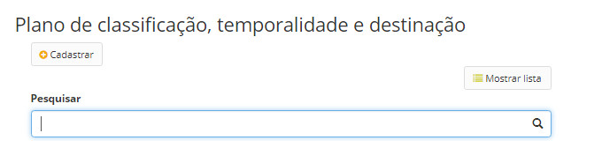
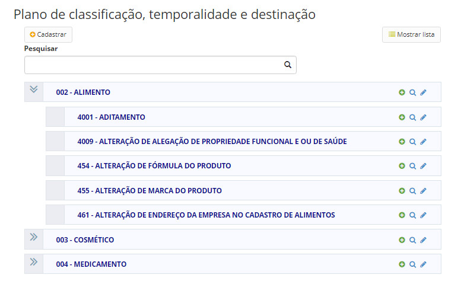
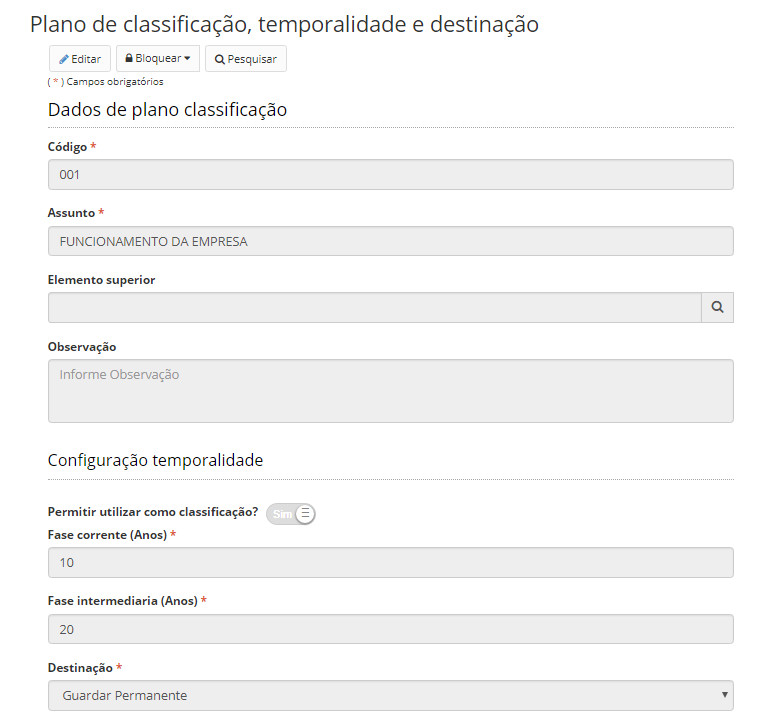
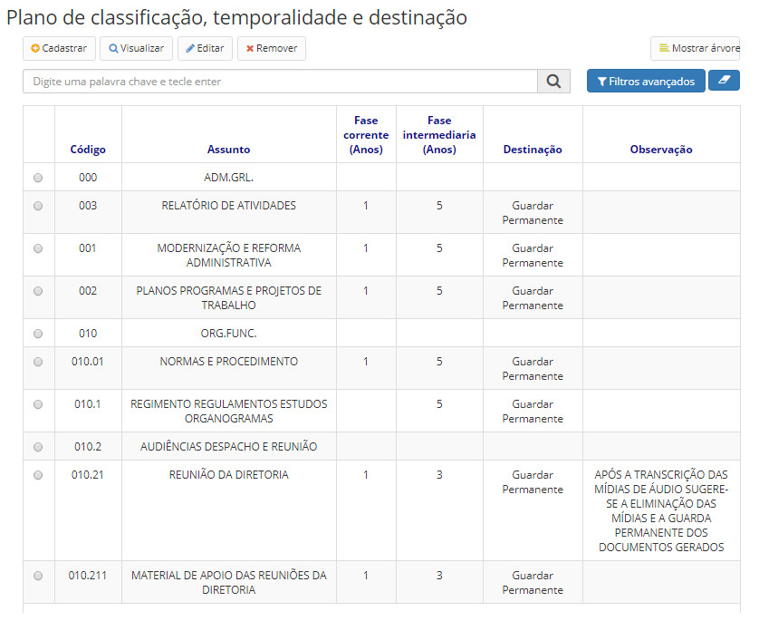
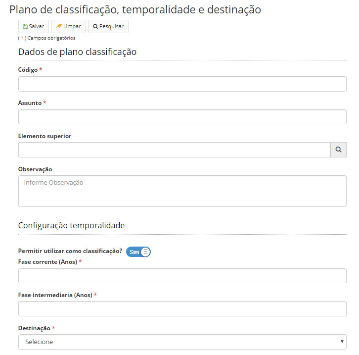

title: Mantendo um plano de classificação, temporalidade e destinação
Description: O plano de classificação, temporalidade e destinação é o mecanismo que a instituição tem para organizar processos.
# Mantendo um plano de classificação, temporalidade e destinação

O plano de classificação, temporalidade e destinação é o mecanismo que a instituição/organização tem para organizar e 
classificar seus processos e documentos de arquivo em assuntos.

Este plano é organizado em uma estrutura hierárquica, na qual um elemento pai pode possuir um ou vários elementos filhos, sem
limite de replicação. O mesmo plano de classificação será utilizado por toda a organização.

Cada item do plano de classificação, temporalidade e destinação é chamado de elemento. Cada elemento possui, no mínimo, um 
código e um assunto. O código é um facilitador para identificar o elemento da árvore.

Cada elemento criado pode ou não possuir um elemento pai, que é o denominado elemento superior. Sendo assim, é possível criar
um elemento pai, um elemento filho, e um elemento neto, sem nenhum prejuízo na aplicação.

Além disso, cada elemento pode ou não ser utilizado como classificação, ou seja, você poderá definir se o elemento é um 
elemento fim ou apenas um agrupador.

Como acessar
--------------

1. Acesse a funcionalidade através do menu **Docs > Administração Docs > Plano de classificação, temporalidade e destinação**.

Filtros
----------

1. O seguinte filtro possibilita ao usuário restringir a participação de itens na listagem padrão da funcionalidade, facilitando
a localização dos itens desejados:

- Pesquisar

**Figura 1 - Tela de pesquisa de plano de classificação, temporalidade e destinação**

Mantendo plano de classificação, temporalidade e destinação
---------------------------------------------------------------

*Visão hierárquica (em árvore) do plano de classificação, temporalidade e destinação*

1. Pode ser que o elemento pai 000 – ADMINISTRAÇÃO GERAL seja um item de classificação ou apenas um agrupador. Se for um item 
de classificação, quando for criado um processo ou um documento, este elemento poderá ser escolhido como Assunto. Caso seja 
um agrupador, o elemento não aparecerá no campo Assunto. Da mesma forma, um elemento usado como classificação, deverá, 
obrigatoriamente, possuir uma temporalidade e destinação.

    
    
    **Figura 2 - Exemplo de plano de classificação**
    
2. Ao clicar em um elemento pai, se tem a seguinte tela:

    
    
    **Figura 3 - Tela de visualização e edição de um plano**
    
3. A Configuração da temporalidade é calculada com base na Fase corrente e a Fase intermediária (em anos).

    - **Fase corrente (Primeira idade)**: Segundo o Dicionário de Terminologia Arquivística (D.T.A.) de 1996, página 6, é o 
    “conjunto de documentos estritamente vinculados aos objetivos imediatos para os quais foram produzidos e recebidos no 
    cumprimento de atividades fim e meio e que se conservam junto aos órgãos produtores em razão de sua vigência e da 
    freqüência com que são por eles consultados”. Essa idade corresponde a produção do documento, sua tramitação, a 
    finalização do seu objetivo e a sua guarda.
    - **Fase Intermediária (Segunda idade)**: “Conjunto de documentos originários de arquivo corrente, com uso pouco 
    freqüente, que aguardam, em depósito de armazenamento temporário, sua destinação final” (D.T.A. 1996, p. 7). Os 
    documentos são ainda conservados por razões administrativas, legais ou financeiras. É uma fase de retenção temporária que
    se dá por razões de precaução. (Fonte: https://pt.wikipedia.org/wiki/Arquivo adaptado)
    
4. A fórmula para este cálculo é: se FC < TVP então (FC-TVP) = 0

    - TVP = Tempo de Vida do Processo antes de sua conclusão em todas as unidades
    - FC = Tempo previsto para a fase corrente
    - FI = Tempo previsto para a fase intermediária
    - TTG = Tempo total de guarda após conclusão em todas as unidades
    - TTG = (FC-TVP) + FI
    
5. Por último, deverá ser informada a destinação. A destinação define o que acontecerá com o processo/documento quando sua
temporalidade for atingida. Poderá ser:

- **Eliminação**: os artefatos serão eliminados permanentemente.
- **Guarda permanente**: os artefatos serão guardados permanentemente no servidor de guarda de documentos.

*Visão em lista do plano de classificação, temporalidade e destinação*

1. Clicando no botão  localizado no lado direito superior, o plano poderá ser visualizado da 
seguinte forma:

    
    
    **Figura 4 - Visão em lista do plano de classificação, temporalidade e destinação**
    
2. É possível inserir novo plano, clique no botão *Cadastrar*:

    
    
    **Figura 5 - Tela de cadastro de um elemento do plano de classificação, temporalidade e destinação**
    
3. É possível editar um plano, apenas selecionando-o e clicando no botão *Editar*.

!!! tip "About"

    <b>Product/Version:</b> CITSmart | 7.00 &nbsp;&nbsp;
    <b>Updated:</b>08/21/2019 – Larissa Lourenço

