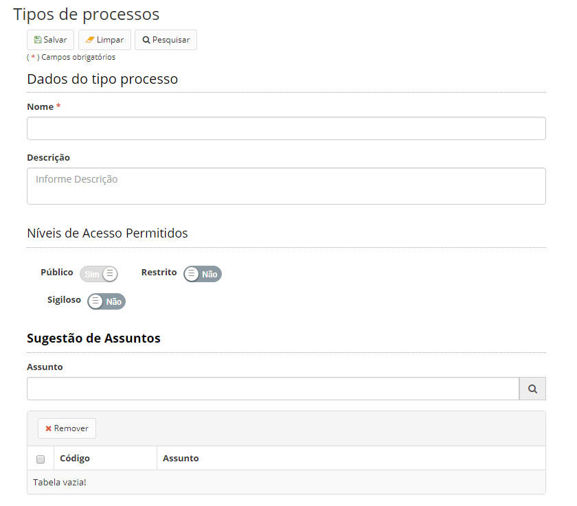

title: Mantendo tipos de processo
Description: Esta funcionalidade tem por objetivo cadastrar tipos de processo.
# Mantendo tipos de processo

Esta funcionalidade tem por objetivo cadastrar tipos de processo. Os processos, quando criados, precisam ser classificados em
tipos.

Os tipos de processo são uma forma de agrupar os processos criados de acordo com as necessidades da instituição.

Como acessar
--------------

1. Acesse a funcionalidade através da navegação no menu principal **Docs > Administração Docs > Tipos de processos**.

Pré-condições
------------------

1. Não se aplica.

Filtros
----------

1. O seguinte filtro possibilita ao usuário restringir a participação de itens na listagem padrão da funcionalidade, facilitando
a localização dos itens desejados:

- Palavra chave ou enter.

**Figura 1 - Tela de pesquisa de tipos de processos**

Listagem de itens
---------------------

1. Os seguintes campos cadastrais estão disponíveis ao usuário para facilitar a identificação dos itens desejados na listagem padrão da funcionalidade: **Nome** e **Descrição**.

**Figura 2 - Tela de listagem de tipo de processos**

Preenchimento dos campos cadastrais
----------------------------------------

1. Para registrar um novo tipo de processo, clique em *Cadastrar*. Será apresentada a tela de cadastro de tipo de processo, 
conforme ilustrada na figura abaixo:

    
    
    **Figura 3 - Tela de cadastro/edição de tipos de processos**
    
2. Preencha os campos conforme orientações abaixo:

    - **Nome**: informe o nome do tipo de processo;
    - **Descrição**: descrição textual sobre o tipo de processo;
    - **Níveis de Acesso Permitidos**: ao criar um tipo de processo, você deverá definir quais são os níveis de acesso permitidos para o mesmo.
    
    !!! info "IMPORTANTE"
    
    O nível de acesso segue uma lógica de hierarquia. Caso um tipo de processo possa ser classificado em um nível de
    acesso mais alto, todos os níveis de acesso abaixo deles também serão passíveis de classificação. Exemplo: Um tipo
    de processo que pode ser classificado no nível de acesso Secreto, automaticamente também poderá ser classificado
    nos níveis menores (Reservado, Restrito e Público).
        
        - Os processos criados com esse tipo, só poderão ser classificados nos níveis de acesso selecionados.
    
    - Sugestão de assuntos: há também a possibilidade de se fazer sugestões de assuntos relacionados àquele tipo de processo.
    
        - O objetivo dessa função é auxiliar o usuário na escolha de um assunto, respeitando o plano de classificação, 
        temporalidade e destinação.
        - Como o próprio nome diz, são apenas indicadas sugestões, não sendo obrigatório o usuário selecionar algum dos 
        assuntos sugeridos no momento da criação de um processo daquele tipo.
        
3. Clique em *Salvar* para armazenar os dados do tipo de processo. Clique em *Pesquisar* para voltar para a tela anterior.

Tipos de processo
--------------------

1. Ao acessar a funcionalidade, será apresentada a tela de **Cadastro e/ou Edição de Tipos de processos**, conforme ilustrada 
na figura 1.

2. Para editar um item criado, selecione o item desejado, clique em *Editar*, faça as alterações e acione o botão *Salvar*.

3. Para visualizar um item, selecione o mesmo e clique em *Visualizar*.

4. Para remover um item criado, selecione o item desejado, clique em *Remover* e confirme a exclusão.

!!! tip "About"

    <b>Product/Version:</b> CITSmart | 7.00 &nbsp;&nbsp;
    <b>Updated:</b>08/21/2019 – Larissa Lourenço

    
   

