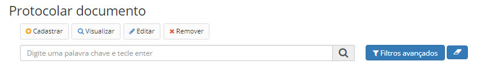
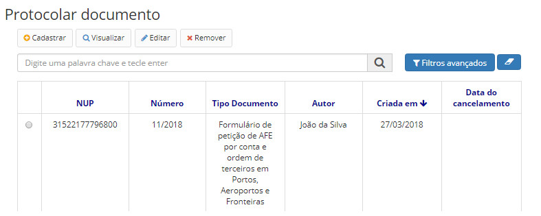
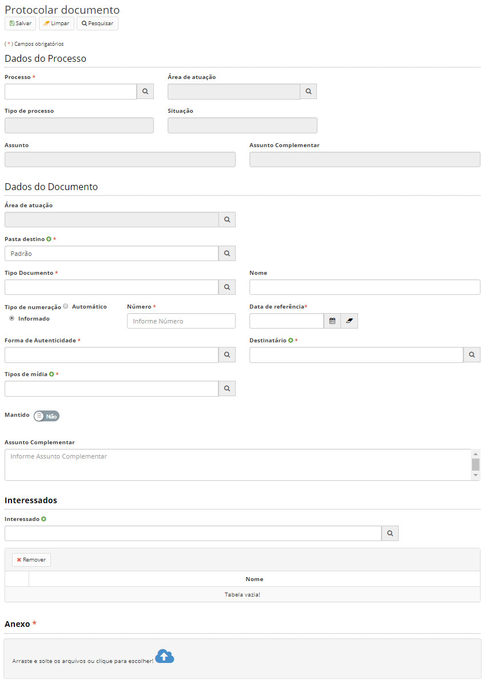

title: Protocolando os documentos
Description: Protocolar documentos é uma forma de incluir documentos nos processos de forma ágil.
# Protocolando os documentos

Protocolar documentos é uma forma de incluir documentos nos processos de forma ágil.

Esta funcionalidade normalmente é utilizada por usuários do Protocolo. As regras são quase idênticas em relação à inclusão
tradicional de documentos. A diferença é que neste caso, apenas poderão ser inseridos anexos.

Como acessar
---------------

1. Acesse a funcionalidade através do menu **Docs > Arquivo/Protocolo > Protocolar documento**.

Pré-condições
---------------

1. Não se aplica.

Filtros
-----------

1. O seguinte filtro possibilita ao usuário restringir a participação de itens na listagem padrão da funcionalidade, facilitando
a localização dos itens desejados:

- Palavra chave ou enter

**Figura 1 - Tela de pesquisa de documentos protocolados**

Listagem de itens
---------------------

1. Os seguintes campos cadastrais estão disponíveis ao usuário para facilitar a identificação dos itens desejados na listagem
padrão da funcionalidade: **NUP, Número, Tipo Documento, Autor, Criada em** e **Data do cancelamento**.

**Figura 2 - Tela de listagem de documentos protocolados**

Preenchimento dos campos cadastrais
--------------------------------------

1. Para se criar novo protocolo de documento basta clicar no botão *Cadastrar* e a seguinte tela se apresentará:

**Figura 3 - Tela de protocolar documento**

!!! tip "About"

    <b>Product/Version:</b> CITSmart | 7.00 &nbsp;&nbsp;
    <b>Updated:</b>08/21/2019 – Larissa Lourenço

