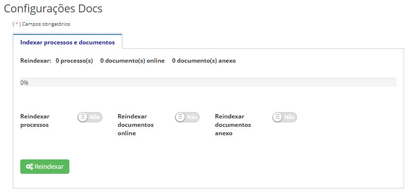

title: Reindexando processos e documentos
Description: Funcionalidade referente à reindexação de processos e documentos na base SOLR..
# Reindexando processos e documentos

Funcionalidade referente à reindexação de processos e documentos na base SOLR.

A reindexação tem o intuito de recuperar o conteúdo dos documentos e dos processos em uma base SOLR. Poderá ser utilizado quando
se tem a base de dados e o repositório de documentos mas se perdeu a base SOLR.

!!! abstract "SAIBA MAIS"

    Para saber mais sobre Apache SOLR: http://lucene.apache.org/solr/

Como acessar
---------------

1. Acesse a funcionalidade através do menu **Docs > Configurações Docs > Configurações Docs**.

Reindexando documentos
--------------------------

1. Para reindexar, selecione entre Processos, Documentos online e Documentos anexo, clique no botão *Reindexar*:

**Figura 1 - Tela de reindexação de processos e documentos**

!!! tip "About"

    <b>Product/Version:</b> CITSmart | 7.00 &nbsp;&nbsp;
    <b>Updated:</b>08/21/2019 – Larissa Lourenço

