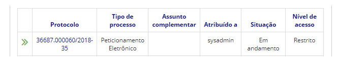

title: Relacionar processos
Description: A funcionalidade relacionar/apensar processos, é utilizada para agrupar processos que possuam alguma ligação.
# Relacionar processos

A funcionalidade relacionar/apensar processos, é utilizada para agrupar processos que possuam alguma ligação entre si
(informações complementares, por exemplo), porém, se mantendo independentes.

Como acessar
---------------

1. A funcionalidade pode ser acessada através do menu **Docs > Área de trabalho > Processos Abertos**.

Pré-condições
-----------------

1. Não se aplica.

Filtros
------------

1. O seguinte filtro possibilita ao usuário restringir a participação de itens na listagem padrão da funcionalidade, facilitando
a localização dos itens desejados:

- Palavra chave ou enter.

**Figura 1 - Tela de pesquisa de processos abertos**

Listagem de itens
--------------------

1. Os seguintes campos cadastrais estão disponíveis ao usuário para facilitar a identificação dos itens desejados na listagem
padrão da funcionalidade: **Protocolo, Tipo de processo, Assunto complemetar, Atribuído a, Situação** e **Nível de acesso**.

**Figura 2 - Tela de listagem de processos abertos**

Prenchimento dos campos cadastrais
--------------------------------------

1. Não se aplica.

Processos relacionados
-------------------------

1. O relacionamento de processos é bilateral, ou seja, da mesma forma que um processo A está relacionado a um processo B, um
processo B está relacionado ao processo A.

2. É possível relacionar diversos processos a um determinado processo, porém, não poderão ser relacionados dois processos 
concluídos, pelo menos um deles deverá estar aberto.

3. Além disso, o processo principal (que se está trabalhando), deverá estar aberto na unidade do usuário que está executando
a ação de apensação (relacionamento).

4. A qualquer momento um relacionamento poderá ser anulado.

5. Clique no **número de protocolo** do processo aberto desejado. Logo após, será aberto uma aba com as informações do
processo.

6. Clique no botão Ações de Processo (localizado no canto superior direito da tela) e selecione Processos Relacionados:

7. Clique em *Salvar*;

8. Clique no ícone [simbolo](images/simb-quebrar.jpg) para remover a relação.

!!! tip "About"

    <b>Product/Version:</b> CITSmart | 7.00 &nbsp;&nbsp;
    <b>Updated:</b>08/21/2019 – Larissa Lourenço

