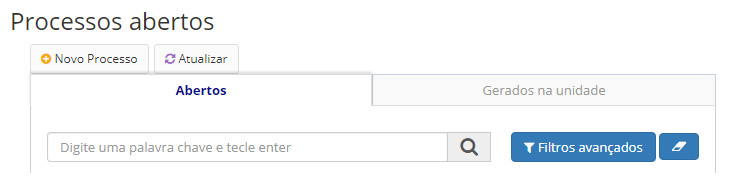
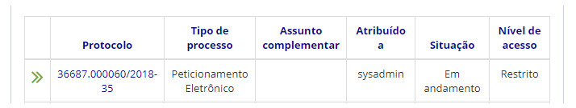
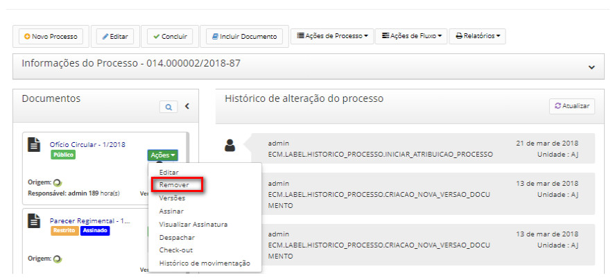
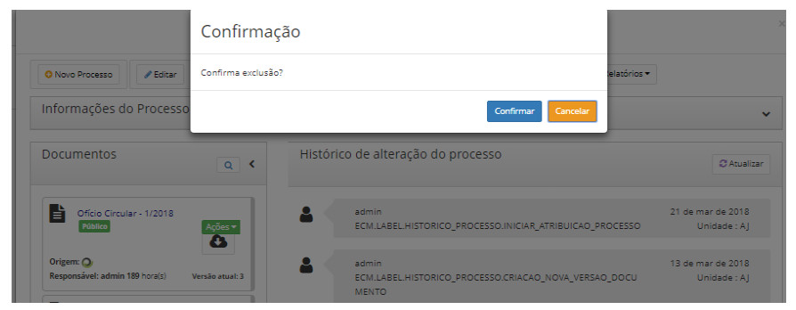

title: Removendo documentos
Description: Ao remover um documento do processo, o mesmo será excluído permanentemente.
# Removendo documentos

Ao remover um documento do processo, o mesmo será excluído permanentemente.

Apenas é possível excluir documentos que ainda não foram assinados ou cujo processo não foi enviado (tramitado) para outra 
unidade.

Nesses casos, o documento apenas poderá ser cancelado (Cancelando documentos).

Como acessar
--------------

1. A funcionalidade pode ser acessada através do menu **Docs > Área de trabalho > Processos abertos**.

Pré-condições
----------------

1. É preciso realizar o check in (no campo Documentos botão Ações) do documento para seja possível removê-lo.

Filtros
---------

1. O seguinte filtro possibilita ao usuário restringir a participação de itens na listagem padrão da funcionalidade, facilitando
a localização dos itens desejados:

- Palavra chave ou enter.

**Figura 1 - Tela de pesquisa de processos abertos**

Listagem de itens
---------------------

1. Os seguintes campos cadastrais estão disponíveis ao usuário para facilitar a identificação dos itens desejados na listagem
padrão da funcionalidade: **Protocolo, Tipo de processo, Assunto complementar, Atribuído a, Situação** e **Nível de acesso**.

    
    
    **Figura 2 - Tela de listagem de processos abertos**
    
2. É apresentado então uma tela com as listagens dos processos abertos. Clique no número de protocolo do processo aberto
desejado.

Preenchimento dos campos cadastrais
--------------------------------------

1. Não se aplica.

Removendo documentos
----------------------

1. Logo após, será aberto uma aba com as informações do processo. Clique no botão *Opções* no campo Documentos e em seguida no 
botão *Remover*, conforme figura abaixo:

    
    
    **Figura 3 - Remover documento**
    
2. Será apresentada de confirmação de exclusão de documento, clique em *Confirmar*:

**Figura 4 - Confirmar exclusão**

!!! tip "About"

    <b>Product/Version:</b> CITSmart | 7.00 &nbsp;&nbsp;
    <b>Updated:</b>08/21/2019 – Larissa Lourenço

