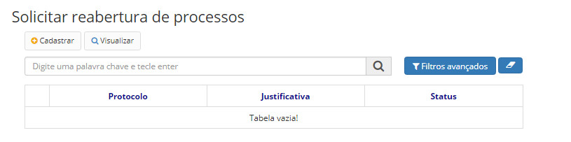
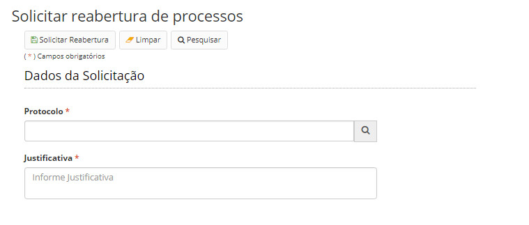

title: Solicitando a reabertura de um processo
Description: Processos que foram concluídos em todas as unidades poderão ser reabertos.
# Solicitando a reabertura de um processo

Processos que foram concluídos em todas as unidades poderão ser reabertos.

Como acessar
--------------

1. Acesse a funcionalidade através da navegação no menu **Docs > Área de trabalho > Solicitar reabertura de processos**.

Pré-condições
-----------------

1. Não se aplica.

Filtros
----------

1. O seguinte filtro possibilita ao usuário restringir a participação de itens na listagem padrão da funcionalidade, facilitando
a localização dos itens desejados:

- Palavra chave ou enter.

**Figura 1 - Tela de pesquisa de processos**

Listagem de itens
--------------------

1. Os seguintes campos cadastrais estão disponíveis ao usuário para facilitar a identificação dos itens desejados na listagem 
padrão da funcionalidade: **Protocolo, Justificativa** e **Status**.

**Figura 2 - Tela de listagem de processos**

Solicitando a reabertura de processo
---------------------------------------

1. A solicitação poderá ser feita clicando no botão *Cadastrar*, então a seguinte tela aparecerá:

    
    
    **Figura 3 - Solicitação de reabertura**
    
2. A solicitação de uma reabertura exige justificativa do usuário solicitante.

3. A rejeição de uma solicitação de reabertura, exige justificativa do usuário avaliador.

4. Os processos reabertos deverão ter sua contagem de tempo de guarda para destinação final reiniciados, devendo voltar a 
contar após sua nova conclusão em todas as unidades.

!!! tip "About"

    <b>Product/Version:</b> CITSmart | 7.00 &nbsp;&nbsp;
    <b>Updated:</b>08/21/2019 – Larissa Lourenço

