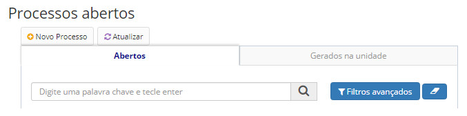
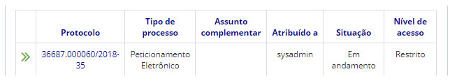

title: Executando processos
Description: Esta funcionalidade tem por objetivo executar processos.
# Executando processos

Como acessar
---------------

1. A funcionalidade pode ser acessada através do menu **Docs > Área de trabalho > Processos Abertos**.

Pré-condições
---------------

1. Não se aplica.

Filtros
---------

1. O seguinte filtro possibilita ao usuário restringir a participação de itens na listagem padrão da funcionalidade, facilitando
a localização dos itens desejados:

- Palava chave.

**Figura 1 - Tela de pesquisa de processos abertos**

2. Os processos são agrupados em duas guias:

    - **Aberto**: todos os processos abertos na unidade do usuário. Ambos os processos gerados pela unidade e os processos
    recebidos pela unidade são exibidos.
    - **Gerado na unidade**: processos gerados pela unidade do usuário. Somente os processos gerados pela unidade do usuário
    serão exibidos, pois o usuário pode pertencer a várias unidades. Você pode visualizar a unidade do usuário no menu superior
    do aplicativo.

3. Os processos podem ser pesquisados ​​por palavras-chave ou filtros avançados.

Listagem de itens
--------------------

1. Os seguintes campos cadastrais estão disponíveis ao usuário para facilitar a identificação dos itens desejados na listagem
padrão da funcionalidade: **Protocolo, Tipo de processo, Assunto complementar, Atribuído a, Situação** e **Nível de acesso**.

    
    
    **Figura 2 - Tela de listagem de processos abertos**
    
2. É apresentado então uma tela com as listagens dos processos abertos. Clique no número de protocolo do processo aberto
desejado. Logo após, será aberto uma aba com as informações do processo.

Preenchimento dos campos cadastrais
-------------------------------------

1. Não se aplica.

Executando processos
-----------------------

1. Nesta tela, os processos em execução são exibidos na unidade do usuário.

!!! note "NOTA"

    É importante notar que somente os processos cujos usuários tenham permissão ou credenciais de acesso serão exibidos.
    
2. De acordo com o nível de acesso do usuário autenticado, alguns documentos restritos ou confidenciais podem estar ocultos.

3. Compreenda mais sobre os níveis de acesso:

    - **Processos/documentos restritos**: pode ser acessado apenas pela unidade no qual o processo ou documento está sendo 
    executado.
    - **Processos/documentos sigilosos**: pode ser reservado, secreto ou ultrassecreto. Só podem ser acessados pelos usuários
    que possuem a credencial de acesso ao processo ou documento.
    
4. Há um período em que o documento ou processo é considerado sigiloso. Se o prazo não for prorrogado, o objeto será tornado
público:

    - **Reservado**: 5 anos a partir da data de criação;
    - **Segredo**: 15 anos a partir da data de criação;
    - **Ultrassecreto**: 25 anos a partir da data de criação.
    
5. O sistema registra todo o histórico de mudanças que ocorreu no processo. Você pode vê-lo na parte inferior da tela 
(que será apresentada quando clicar no número de protocolo do processo desejado).

!!! tip "About"

    <b>Product/Version:</b> CITSmart | 7.00 &nbsp;&nbsp;
    <b>Updated:</b>08/20/2019 – Larissa Lourenço

