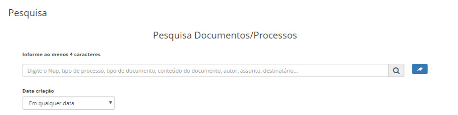
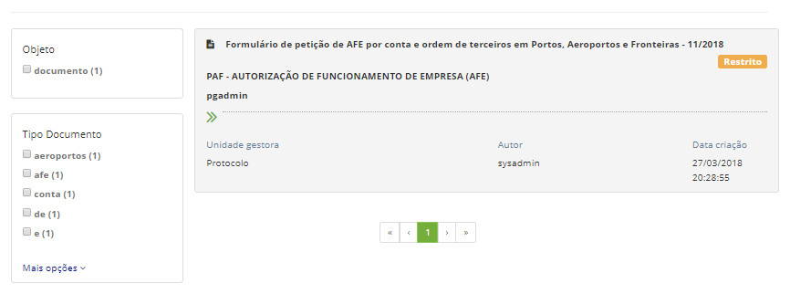

title: Pesquisando todos os processos e os documentos
Description: Esta funcionalidade tem por objetivo a pesquisa de documentos e processos.
# Pesquisando todos os processos e os documentos

Esta funcionalidade tem por objetivo a pesquisa de documentos e processos. A tela de pesquisa de documentos e processos é a 
forma mais eficaz de se encontrar o conteúdo desejado dentro do sistema.

Como acessar
--------------

1. Acesse a funcionalidade através da navegação no menu principal **Docs > Área de trabalho > Pesquisa**.

Filtros
-----------

1. O seguinte filtro possibilita ao usuário restringir a participação de itens na listagem padrão da funcionalidade, facilitando
a localização dos itens desejados:

    - Pesquisa.

    
    
    **Figura 1 - Tela de pesquisa de documentos e processos**
    
2. A pesquisa pode ser feita por protocolo, tipo de processo, tipo de documento, conteúdo textual do documento, autor, assunto,
destinatário, entre outros.

Pesquisa
-----------

1. Ao digitar um conteúdo para ser pesquisado, é exibido um painel à esquerda que permite que os itens de pesquisa sejam
filtrados, conforme ilustrado na figura abaixo:

    
    
    **Figura 2 - Exemplo de resultado de pesquisa**
    
2. Os filtros serão exibidos apenas se existirem itens que correspondam a eles.

3. Os filtros poderão ser desmarcados a qualquer momento pelo usuário que está realizando a pesquisa.

4. Os itens são retornados na pesquisa de acordo com a permissão do usuário autenticado.

!!! info "IMPORTANTE"

    Itens sigilosos só aparecerão na pesquisa se o usuário possuir credencial de acesso ao mesmo.
    
!!! tip "About"

    <b>Product/Version:</b> CITSmart | 7.00 &nbsp;&nbsp;
    <b>Updated:</b>08/21/2019 – Larissa Lourenço

